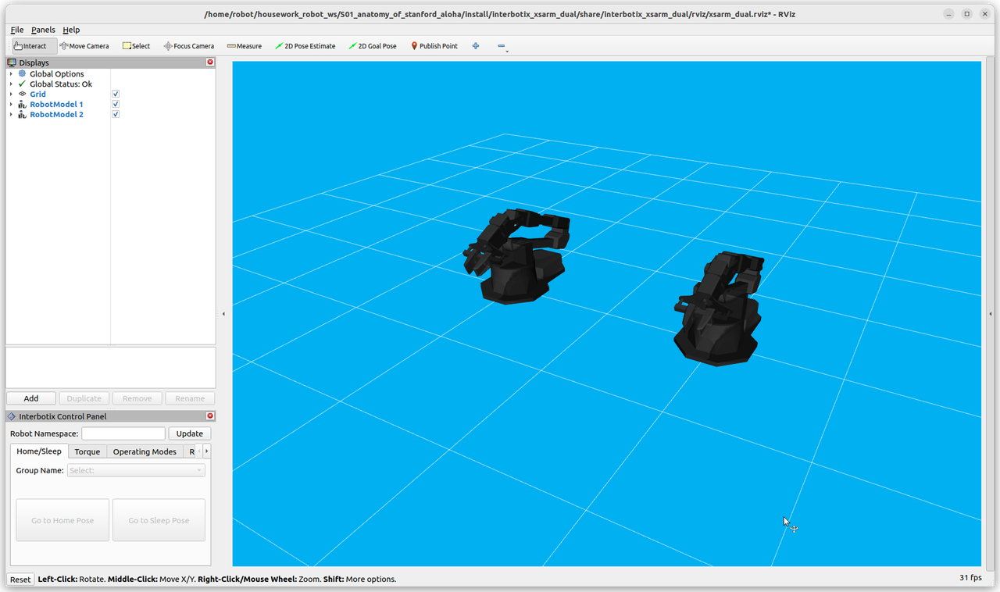

# Manipulate interbotix robotic arm with rviz2
SO1E02, 2024.02.25

# 1. Objective

[Stanford mobile aloha housework robot](https://github.com/MarkFzp/mobile-aloha?tab=readme-ov-file#software-selection----os) uses 2 pairs of robotic arms, which are provided by [Trossen Robotics](https://docs.trossenrobotics.com/interbotix_xsarms_docs/)

It is helpful to learn how to use Interbotix robotic arms, before diving into Stanford aloha robot.

To reduce the learning difficulty, we start to learn interbotix arm using simulatin with [rviz2](https://github.com/ros2/rviz). After then, we use [the physical arms](https://docs.trossenrobotics.com/interbotix_xsarms_docs/).  

The goal of this episode is to use rviz to simulate 2 pairs interbotix arms, each pair consists of one master arm and one puppet arm. We manually predefine a series of actions to control the 2 master arms, and ask the 2 puppet arms to automatically follow their masters. 

# 2. Install ROS2/Humble and Interbotix

Follow [the instruction of S01E01](https://github.com/housework-robot/main/blob/main/S01_anatomy_of_stanford_aloha/S01E01_migration.md), to install ROS2/Humble and Interbotix toolkit. 

~~~
$ sudo apt install curl
$ curl 'https://raw.githubusercontent.com/Interbotix/interbotix_ros_manipulators/main/interbotix_ros_xsarms/install/amd64/xsarm_amd64_install.sh' > xsarm_amd64_install.sh
$ chmod +x xsarm_amd64_install.sh
$ ./xsarm_amd64_install.sh -d humble -p /home/robot/interbotix_ws

$ source /opt/ros/humble/setup.bash
$ source /home/robot/interbotix_ws/install/setup.bash

$ ros2 pkg list | grep interbotix
interbotix_common_modules
interbotix_common_sim
interbotix_common_toolbox
interbotix_moveit_interface
interbotix_moveit_interface_msgs
interbotix_perception_modules
interbotix_perception_msgs
interbotix_perception_pipelines
interbotix_perception_toolbox
interbotix_ros_xsarms
interbotix_ros_xsarms_examples
interbotix_ros_xseries
interbotix_tf_tools
interbotix_xs_driver
interbotix_xs_modules
interbotix_xs_msgs
interbotix_xs_ros_control
interbotix_xs_rviz
interbotix_xs_sdk
interbotix_xs_toolbox
interbotix_xsarm_control
interbotix_xsarm_descriptions
interbotix_xsarm_dual
interbotix_xsarm_joy
interbotix_xsarm_moveit
interbotix_xsarm_moveit_interface
interbotix_xsarm_perception
interbotix_xsarm_ros_control
interbotix_xsarm_sim
~~~

Notice that interbotix_xsarm_descriptions and interbotix_xsarm_dual are in the list of packages. 

# 3. Get started with interbotix_xsarm_descriptions

Let us play around with rviz2 and interbotix robotic arm. 

Following [interbotix video tutorial: Getting Started With The X-Series Arm](https://www.youtube.com/watch?v=5tH0fmUuCuE&list=PL8X3t2QTE54sMTCF59t0pTFXgAmdf0Y9t&index=5)'s instruction at 1:21, the rviz window will pop up with an interbotix arm. 

~~~
$ ros2 launch interbotix_xsarm_descriptions xsarm_description.launch.py robot_model:=vx300s use_joint_pub_gui:=true
[INFO] [launch]: All log files can be found below /home/robot/.ros/log/2024-02-25-09-28-20-662472-robot-test-1234903
[INFO] [launch]: Default logging verbosity is set to INFO
[INFO] [robot_state_publisher-1]: process started with pid [1234924]
[INFO] [joint_state_publisher_gui-2]: process started with pid [1234926]
[INFO] [rviz2-3]: process started with pid [1234928]
~~~

# 4. Study dual arms package interbotix_xsarm_dual

Following [interbotix video tutorial: Working with multiple arms](https://www.youtube.com/watch?v=DnjbNXxBE_8&list=PL8X3t2QTE54sMTCF59t0pTFXgAmdf0Y9t&index=10)'s instruction at at 6:48, we ran interbotix_xsarm_dual package to let 2 arms working together. 

Open two terminals, in the first one, launch the interbotix_xsarm_dual package. 
~~~
$ source /opt/ros/humble/setup.bash
$ source /home/robot/interbotix_ws/install/setup.bash

$ cd /home/robot/interbotix_ws/
$ rosdep install --from-paths src --ignore-src -y -c    # This step is not mandatory.

$ ros2 launch interbotix_xsarm_dual xsarm_dual.launch.py use_dual_rviz:=true  use_sim:=true
[INFO] [launch]: All log files can be found below /home/robot/.ros/log/2024-02-27-22-36-31-570039-robot-test-1455379
[INFO] [launch]: Default logging verbosity is set to INFO
[INFO] [xs_sdk_sim.py-1]: process started with pid [1455401]
[INFO] [robot_state_publisher-2]: process started with pid [1455403]
[INFO] [xs_sdk_sim.py-3]: process started with pid [1455405]
[INFO] [robot_state_publisher-4]: process started with pid [1455407]
[INFO] [static_transform_publisher-5]: process started with pid [1455409]
[INFO] [static_transform_publisher-6]: process started with pid [1455411]
[INFO] [rviz2-7]: process started with pid [1455413]
[static_transform_publisher-5] [WARN] [1709044592.054890976] []: Old-style arguments are deprecated; see --help for new-style arguments
[static_transform_publisher-6] [WARN] [1709044592.056908492] []: Old-style arguments are deprecated; see --help for new-style arguments
[static_transform_publisher-5] [INFO] [1709044592.065522545] [robot_1_transform_broadcaster]: Spinning until stopped - publishing transform
[static_transform_publisher-5] translation: ('0.000000', '-0.250000', '0.000000')
[static_transform_publisher-5] rotation: ('0.000000', '0.000000', '0.000000', '1.000000')
[static_transform_publisher-5] from '/world' to '/arm_1/base_link'
[static_transform_publisher-6] [INFO] [1709044592.067838465] [robot_2_transform_broadcaster]: Spinning until stopped - publishing transform
[static_transform_publisher-6] translation: ('0.000000', '0.250000', '0.000000')
[static_transform_publisher-6] rotation: ('0.000000', '0.000000', '0.000000', '1.000000')
[static_transform_publisher-6] from '/world' to '/arm_2/base_link'
[xs_sdk_sim.py-3] Unknown tag "ros2_control" in /robot[@name='wx200']
[xs_sdk_sim.py-1] Unknown tag "ros2_control" in /robot[@name='wx200']
[xs_sdk_sim.py-3] [INFO] [1709044592.362476243] [interbotix_xs_sdk.xs_sdk_sim]: Loaded motor configs from `/home/robot/interbotix_ws/install/interbotix_xsarm_control/share/interbotix_xsarm_control/config/wx200.yaml`.
[xs_sdk_sim.py-3] [INFO] [1709044592.363442824] [interbotix_xs_sdk.xs_sdk_sim]: Loaded mode configs from `/home/robot/interbotix_ws/install/interbotix_xsarm_dual/share/interbotix_xsarm_dual/config/modes_2.yaml`.
[xs_sdk_sim.py-3] [INFO] [1709044592.363646936] [interbotix_xs_sdk.xs_sdk_sim]: The operating mode for the 'all' group was changed to 'position'.
[xs_sdk_sim.py-3] [INFO] [1709044592.363812213] [interbotix_xs_sdk.xs_sdk_sim]: The operating mode for the 'arm' group was changed to 'position'.
[xs_sdk_sim.py-3] [INFO] [1709044592.370096123] [interbotix_xs_sdk.xs_sdk_sim]: Interbotix 'xs_sdk_sim' node is up!
[xs_sdk_sim.py-1] [INFO] [1709044592.373569747] [interbotix_xs_sdk.xs_sdk_sim]: Loaded motor configs from `/home/robot/interbotix_ws/install/interbotix_xsarm_control/share/interbotix_xsarm_control/config/wx200.yaml`.
[xs_sdk_sim.py-1] [INFO] [1709044592.374507981] [interbotix_xs_sdk.xs_sdk_sim]: Loaded mode configs from `/home/robot/interbotix_ws/install/interbotix_xsarm_dual/share/interbotix_xsarm_dual/config/modes_1.yaml`.
[xs_sdk_sim.py-1] [INFO] [1709044592.374719185] [interbotix_xs_sdk.xs_sdk_sim]: The operating mode for the 'all' group was changed to 'position'.
[xs_sdk_sim.py-1] [INFO] [1709044592.374882373] [interbotix_xs_sdk.xs_sdk_sim]: The operating mode for the 'arm' group was changed to 'position'.
[xs_sdk_sim.py-1] [INFO] [1709044592.381391772] [interbotix_xs_sdk.xs_sdk_sim]: Interbotix 'xs_sdk_sim' node is up!

~~~

In the secondary terminal, run xsarm_dual.py. 

~~~
$ source /opt/ros/humble/setup.bash
$ source /home/robot/interbotix_ws/install/setup.bash

$ cd /home/robot/interbotix_ws/
$ rosdep install --from-paths src --ignore-src -y -c    # This step is not mandatory.
$ cd /home/robot/interbotix_ws/src/interbotix_ros_manipulators/interbotix_ros_xsarms/examples/interbotix_xsarm_dual/demos/

$ python3 xsarm_dual.py 
[INFO] [1709044652.836164680] [arm_1.robot_manipulation]: 
        Robot Name: arm_1
        Robot Model: wx200
[INFO] [1709044652.836364354] [arm_1.robot_manipulation]: Initialized InterbotixRobotXSCore!
[INFO] [1709044652.838042881] [arm_1.robot_manipulation]: 
        Arm Group Name: arm
        Moving Time: 2.00 seconds
        Acceleration Time: 0.30 seconds
        Drive Mode: Time-Based-Profile
[INFO] [1709044652.838206496] [arm_1.robot_manipulation]: Initialized InterbotixArmXSInterface!
[INFO] [1709044653.340617131] [arm_1.robot_manipulation]: 
        Gripper Name: gripper
        Gripper Pressure: 50.0%
[INFO] [1709044653.341213526] [arm_1.robot_manipulation]: Initialized InterbotixGripperXSInterface!
[INFO] [1709044653.873589022] [arm_2.robot_manipulation]: 
        Robot Name: arm_2
        Robot Model: wx200
[INFO] [1709044653.874243449] [arm_2.robot_manipulation]: Initialized InterbotixRobotXSCore!
[INFO] [1709044653.878449430] [arm_2.robot_manipulation]: 
        Arm Group Name: arm
        Moving Time: 2.00 seconds
        Acceleration Time: 0.30 seconds
        Drive Mode: Time-Based-Profile
[INFO] [1709044653.880321962] [arm_2.robot_manipulation]: Initialized InterbotixArmXSInterface!
[INFO] [1709044654.387733508] [arm_2.robot_manipulation]: 
        Gripper Name: gripper
        Gripper Pressure: 50.0%
[INFO] [1709044654.388837393] [arm_2.robot_manipulation]: Initialized InterbotixGripperXSInterface!
~~~

