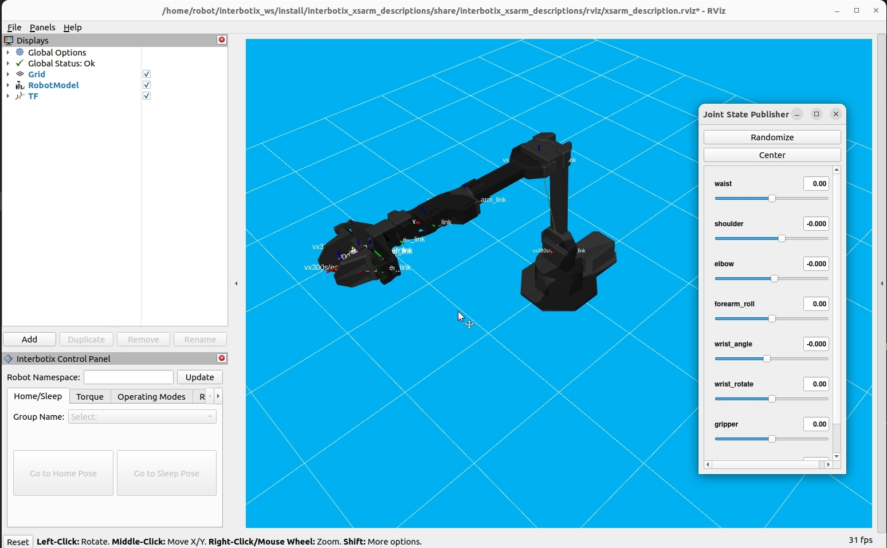

# Manipulate interbotix robotic arm with rviz2
SO1E02, 2024.02.25

# 1. Objective

[Stanford mobile aloha housework robot](https://github.com/MarkFzp/mobile-aloha?tab=readme-ov-file#software-selection----os) uses 2 pairs of robotic arms, which are provided by [Trossen Robotics](https://docs.trossenrobotics.com/interbotix_xsarms_docs/)

It is helpful to learn how to use Interbotix robotic arms, before diving into Stanford aloha robot.

To reduce the learning difficulty, we start to learn interbotix arm using simulatin with [rviz2](https://github.com/ros2/rviz). After then, we use [the physical arms](https://docs.trossenrobotics.com/interbotix_xsarms_docs/).  

The goal of this episode is to use rviz to simulate 2 pairs interbotix arms, each pair consists of one master arm and one puppet arm. We manually predefine a series of actions to control the 2 master arms, and ask the 2 puppet arms to automatically follow their masters. 

# 2. Installation

Follow [the instruction of S01E01](https://github.com/housework-robot/main/blob/main/S01_anatomy_of_stanford_aloha/S01E01_migration.md), to install ROS2/Humble and Interbotix toolkit. 

~~~
$ sudo apt install curl
$ curl 'https://raw.githubusercontent.com/Interbotix/interbotix_ros_manipulators/main/interbotix_ros_xsarms/install/amd64/xsarm_amd64_install.sh' > xsarm_amd64_install.sh
$ chmod +x xsarm_amd64_install.sh
$ ./xsarm_amd64_install.sh -d humble -p /home/robot/interbotix_ws

$ source /opt/ros/humble/setup.bash
$ source /home/robot/interbotix_ws/install/setup.bash
$ ros2 pkg list | grep interbotix
~~~

# 3. Get started with interbotlix robotic arm and rviz2

Let us play around with rviz2 and interbotix robotic arm. 

Following [interbotix video tutorial: Getting Started With The X-Series Arm](https://www.youtube.com/watch?v=5tH0fmUuCuE&list=PL8X3t2QTE54sMTCF59t0pTFXgAmdf0Y9t&index=5)'s instruction at 1:21, the rviz window will pop up with an interbotix arm. 

~~~
$ ros2 launch interbotix_xsarm_descriptions xsarm_description.launch.py robot_model:=vx300s use_joint_pub_gui:=true
[INFO] [launch]: All log files can be found below /home/robot/.ros/log/2024-02-25-09-28-20-662472-robot-test-1234903
[INFO] [launch]: Default logging verbosity is set to INFO
[INFO] [robot_state_publisher-1]: process started with pid [1234924]
[INFO] [joint_state_publisher_gui-2]: process started with pid [1234926]
[INFO] [rviz2-3]: process started with pid [1234928]
~~~

# 4. Try dual arms

Following [interbotix video tutorial: Working with multiple arms](https://www.youtube.com/watch?v=DnjbNXxBE_8&list=PL8X3t2QTE54sMTCF59t0pTFXgAmdf0Y9t&index=10)'s instruction at at 6:48, we executed the following command, but failed. 

~~~
$ ros2 launch interbotix_xsarm_dual xsarm_dual.launch use_dual_rviz:=true
Package 'interbotix_xsarm_dual' not found: "package 'interbotix_xsarm_dual' not found, 
searching: ['/home/robot/apriltag_ws/install/apriltag_ros', 
'/home/robot/interbotix_ws/install/interbotix_ros_xsarms_examples', 
'/home/robot/interbotix_ws/install/interbotix_xsarm_moveit_interface', 
'/home/robot/interbotix_ws/install/interbotix_moveit_interface', 
'/home/robot/interbotix_ws/install/moveit_visual_tools', 
'/home/robot/interbotix_ws/install/interbotix_ros_xsarms', 
...
~~~

It looks like for the new version of interbotix toolkit, the 'interbotix_xsarm_dual' old package doesn't exist any more. Also, it looks like that 'interbotix_ros_xsarms_examples' package might be the replacement of the old 'interbotix_xsarm_dual' package. 

~~~
$ ros2 launch interbotix_ros_xsarms_examples xsarm_dual.launch use_dual_rviz:=true
file 'xsarm_dual.launch' was not found in the share directory of package 'interbotix_ros_xsarms_examples' which is at '/home/robot/interbotix_ws/install/interbotix_ros_xsarms_examples/share/interbotix_ros_xsarms_examples'

$ ros2 launch interbotix_ros_xsarms_examples xsarm_dual.launch.py use_dual_rviz:=true
file 'xsarm_dual.launch.py' was not found in the share directory of package 'interbotix_ros_xsarms_examples' which is at '/home/robot/interbotix_ws/install/interbotix_ros_xsarms_examples/share/interbotix_ros_xsarms_examples'
~~~

We looked into the directory of '/home/robot/interbotix_ws/install/interbotix_ros_xsarms_examples/share/interbotix_ros_xsarms_examples', noticed that it didn't contain the 'launch' subdirectory. 

~~~
$ ls -l /home/robot/interbotix_ws/install/interbotix_ros_xsarms_examples/share/interbotix_ros_xsarms_examples
总计 56
drwxrwxr-x 2 robot robot 4096  2月 25 00:07 cmake
drwxrwxr-x 2 robot robot 4096  2月 25 00:07 environment
drwxrwxr-x 2 robot robot 4096  2月 25 00:07 hook
-rw-r--r-- 1 robot robot 1594  2月 25 00:07 local_setup.bash
-rw-r--r-- 1 robot robot  141  2月 25 00:07 local_setup.dsv
-rw-r--r-- 1 robot robot 5074  2月 25 00:07 local_setup.sh
-rw-r--r-- 1 robot robot 1957  2月 25 00:07 local_setup.zsh
-rw-rw-r-- 1 robot robot 1410  2月 25 00:07 package.bash
-rw-r--r-- 1 robot robot  512  2月 25 00:07 package.dsv
-rw-rw-r-- 1 robot robot 3289  2月 25 00:07 package.ps1
-rw-rw-r-- 1 robot robot 2920  2月 25 00:07 package.sh
-rw-r--r-- 1 robot robot 1188  2月 25 00:06 package.xml
-rw-rw-r-- 1 robot robot 1694  2月 25 00:07 package.zsh
~~~

Therefore, in order to run xsarm_dual, we need to modify interbolix source code and recompile. 

