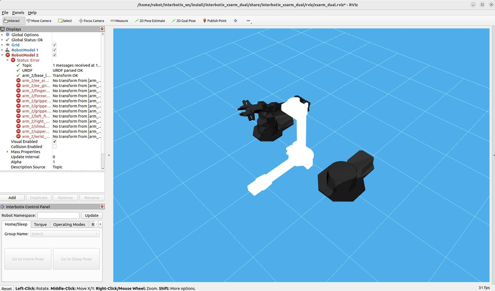

# Interbotix physical arm
SO1E03, 2024.03.16

# 1. Objective

[Stanford mobile aloha housework robot](https://github.com/MarkFzp/mobile-aloha?tab=readme-ov-file#hardware-installation) uses 2 pairs of robotic arms.
In last episode, we worked with the [rviz2](https://github.com/ros2/rviz) simulation, and this time, we used the physical interbotix robotic arms, which were shipped to our lab a few days ago. 

First we used one interbotix arm, to execute a series of actions. Then we used two arms to move simultaneously. The purpose was to learn the usage of interbotix robotic arms, but not yet the action learning algorithms. Therefore, in both scenarios, the series of actions were hard-coded in our python programs. 

# 2. Preparation

Step 1. We took an Interbotix vx300 robotic arm out of the box, and connected it to a computer USB port. We used a linux desktop with GPU, [Lamdba Tensorbook](https://lambdalabs.com/deep-learning/laptops/tensorbook/specs).
![Interbotix robotic arm, connected to a Lambda Tensorbook]]"./image/physical_arm_20240315_1.jpeg">

Step 2. Following the suggestion of [Stanford aloha project](https://github.com/MarkFzp/mobile-aloha?tab=readme-ov-file#hardware-installation), downloaded and installed [dynamixel wizard](https://emanual.robotis.com/docs/en/software/dynamixel/dynamixel_wizard2/).

# 3. Single arm manipulation

Step 1. Detect the USB port

Open the dynamixel wizard, go into "options" page, and configure the options as following. 

   ~~~
   Protocal 2.0
   All ports
   1000000 bps
   ID range from 0-10
   ~~~

After then, hit "Scan" button, the dynamixel wizard detects that the Interbotix vx300 robotic arm was connected to a USB port, e.g. USB0 port. 

Step 2. Change the configurations

Double-check whether the modes.yaml and vx300.yaml are configured with the right port, e.g. ttyUSB0. You can refer to [the src of this repo](https://github.com/housework-robot/main/tree/main/S01_anatomy_of_stanford_aloha/src/interbotix_ros_manipulators/interbotix_ros_xsarms/interbotix_xsarm_control/config) for the functional settings. 

~~~
$ gedit /home/robot/interbotix_ws/install/interbotix_xsarm_control/share/interbotix_xsarm_control/config/vx300.yaml

"""
# Set the port to USB0, by adding the following content to the first line. 
port: /dev/ttyUSB0
"""

$ gedit /home/robot/interbotix_ws/install/interbotix_xsarm_control/share/interbotix_xsarm_control/config/modes.yaml

"""
# Remove the port setting, which usually appeared in the first line of the file.
"""
~~~

Step 3.  Launch the xsarm_control node

Open a terminal, execute the following commands,

~~~
$ ros2 launch interbotix_xsarm_control xsarm_control.launch.py robot_model:=vx300
[INFO] [launch]: All log files can be found below /home/robot/.ros/log/2024-03-16-21-40-40-156452-robot-test-20901
[INFO] [launch]: Default logging verbosity is set to INFO
[INFO] [xs_sdk-1]: process started with pid [20922]
[INFO] [robot_state_publisher-2]: process started with pid [20924]
[INFO] [rviz2-3]: process started with pid [20926]
[xs_sdk-1] [INFO] Using Interbotix X-Series Driver Version: 'v0.3.3'.
[xs_sdk-1] [INFO] Using logging level 'INFO'.
[xs_sdk-1] [INFO] Loaded mode configs from '/home/robot/interbotix_ws/install/interbotix_xsarm_control/share/interbotix_xsarm_control/config/modes.yaml'.
[xs_sdk-1] [INFO] Loaded motor configs from '/home/robot/interbotix_ws/install/interbotix_xsarm_control/share/interbotix_xsarm_control/config/vx300.yaml'.
[xs_sdk-1] [INFO] Pinging all motors specified in the motor_config file. (Attempt 1/3)
[xs_sdk-1] [INFO]         Found DYNAMIXEL ID:  7, Model: 'XM430-W350', Joint Name: 'wrist_rotate'.
[xs_sdk-1] [INFO]         Found DYNAMIXEL ID:  6, Model: 'XM430-W350', Joint Name: 'wrist_angle'.
[xs_sdk-1] [INFO]         Found DYNAMIXEL ID:  5, Model: 'XM430-W350', Joint Name: 'elbow_shadow'.
[xs_sdk-1] [INFO]         Found DYNAMIXEL ID:  4, Model: 'XM430-W350', Joint Name: 'elbow'.
[xs_sdk-1] [INFO]         Found DYNAMIXEL ID:  2, Model: 'XM430-W350', Joint Name: 'shoulder'.
[xs_sdk-1] [INFO]         Found DYNAMIXEL ID:  8, Model: 'XL430-W250', Joint Name: 'gripper'.
[xs_sdk-1] [INFO]         Found DYNAMIXEL ID:  3, Model: 'XM430-W350', Joint Name: 'shoulder_shadow'.
[xs_sdk-1] [INFO]         Found DYNAMIXEL ID:  1, Model: 'XM430-W350', Joint Name: 'waist'.
[xs_sdk-1] [WARN] Writing startup register values to EEPROM. This only needs to be done once on a robot if using a default motor config file, or after a motor config file has been modified. Can set `write_eeprom_on_startup` to false from now on.
[xs_sdk-1] [INFO] The operating mode for the 'arm' group was changed to 'position' with profile type 'time'.
[xs_sdk-1] [INFO] The operating mode for the 'gripper' joint was changed to 'pwm' with profile type 'velocity'.
[xs_sdk-1] [INFO] Interbotix X-Series Driver is up!
[xs_sdk-1] [INFO] [1710596442.089388846] [interbotix_xs_sdk.xs_sdk]: InterbotixRobotXS is up!
[xs_sdk-1] [WARN] [1710596478.708552669] [interbotix_xs_sdk.xs_sdk]: Trajectory rejected since joints are still moving.
[xs_sdk-1] [WARN] [1710596483.193403905] [interbotix_xs_sdk.xs_sdk]: Trajectory rejected since joints are still moving.
[xs_sdk-1] [WARN] [1710596490.214750053] [interbotix_xs_sdk.xs_sdk]: Trajectory rejected since joints are still moving.
[xs_sdk-1] [WARN] [1710596493.724603018] [interbotix_xs_sdk.xs_sdk]: Trajectory rejected since joints are still moving.
[xs_sdk-1] [INFO] [1710596517.516226022] [rclcpp]: signal_handler(signum=2)
[INFO] [robot_state_publisher-2]: process has finished cleanly [pid 20924]
[INFO] [rviz2-3]: process has finished cleanly [pid 20926]
[INFO] [xs_sdk-1]: process has finished cleanly [pid 20922]
~~~

It should automatically open the rviz simulator.

Step 4. Run a series of predefined actions

Open another terminal, execute the following command,

~~~
$ cd /home/robot/interbotix_ws/src/interbotix_ros_manipulators/interbotix_ros_xsarms/interbotix_xsarm_control/demos/python_ros2_api

$ gedit bartender.py
# Change the robot_model from wx250 to vx300.

$ python3 bartender.py 
[INFO] [1710596469.466258201] [robot_manipulation]: 
        Robot Name: vx300
        Robot Model: vx300
[INFO] [1710596469.466468220] [robot_manipulation]: Initialized InterbotixRobotXSCore!
>> andy.nyu: group_info, 
  [group_info]: interbotix_xs_msgs.srv.RobotInfo_Response(mode='position', profile_type='time', joint_names=['waist', 'shoulder', 'elbow', 'wrist_angle', 'wrist_rotate'], joint_ids=[1, 2, 4, 6, 7], joint_lower_limits=[-3.141582727432251, -1.884955644607544, -2.1467549800872803, -1.7453292608261108, -3.141582727432251], joint_upper_limits=[3.141582727432251, 1.9896754026412964, 1.6057028770446777, 2.1467549800872803, 3.141582727432251], joint_velocity_limits=[3.1415927410125732, 3.1415927410125732, 3.1415927410125732, 3.1415927410125732, 3.1415927410125732], joint_sleep_positions=[0.0, -1.7999999523162842, 1.5499999523162842, 0.800000011920929, 0.0], joint_state_indices=[0, 1, 2, 3, 4], num_joints=5, name=['arm']) 

[INFO] [1710596469.470199764] [robot_manipulation]: 
        Arm Group Name: arm
        Moving Time: 2.00 seconds
        Acceleration Time: 0.30 seconds
        Drive Mode: Time-Based-Profile
[INFO] [1710596469.470370802] [robot_manipulation]: Initialized InterbotixArmXSInterface!
[INFO] [1710596469.975860357] [robot_manipulation]: 
        Gripper Name: gripper
        Gripper Pressure: 50.0%
[INFO] [1710596469.976468017] [robot_manipulation]: Initialized InterbotixGripperXSInterface!
~~~

Now the Interbotix physical vx300 arm should start moving. It is recommended to have someone hold the robotic arm with their hands, and be careful not to get injured by the robotic arm.

# 4. Dual arms manipulation

Now we challenge ourselves with two robotic arms moving simultaneously. 

Step 1. Detect the USB port

Following the same instruction of " 3. Single arm manipulation -> Step 1 "， we found that in our scenario, the ws250 arm used USB0, and the vx300 arm used USB2 to connect the laptop Lambda Tensorbook. 

Step 2. Change the configurations

Double-check whether the modes_1.yaml and modes_2.yaml are configured with the right ports, e.g. ttyUSB0 for the first arm wx250, ttyUSB2 for the second arm vx300. You can refer to [the src of this repo](https://github.com/housework-robot/main/tree/main/S01_anatomy_of_stanford_aloha/src/interbotix_ros_manipulators/interbotix_ros_xsarms/examples/interbotix_xsarm_dual/config) for the functional settings. 

~~~
$ gedit /home/robot/interbotix_ws/src/interbotix_ros_manipulators/interbotix_ros_xsarms/examples/interbotix_xsarm_dual/config/modes_1.yaml

# Set the port to USB0, by adding the following content to the first line. 
port: /dev/ttyUSB0

$ gedit /home/robot/interbotix_ws/src/interbotix_ros_manipulators/interbotix_ros_xsarms/examples/interbotix_xsarm_dual/config/modes_2.yaml

# Set the port to USB0, by adding the following content to the first line. 
port: /dev/ttyUSB2
~~~

Step 3.  Launch the xsarm_dual node

Open the first terminal, execute the following commands,
   
~~~
$ ros2 launch  interbotix_xsarm_dual xsarm_dual.launch.py robot_model_1:=wx250 robot_name_1:=arm_1 robot_model_2:=vx300 robot_name_2:=arm_2 use_dual_rviz:=true
~~~

It should automatically open the rviz simulator.

Step 4. Run a series of predefined actions

Modify the xsarm_dual.py code, if needed, take a look of [the src of this repo](https://github.com/housework-robot/main/blob/main/S01_anatomy_of_stanford_aloha/src/interbotix_ros_manipulators/interbotix_ros_xsarms/examples/interbotix_xsarm_dual/demos/xsarm_dual.py) for reference. 

Open another terminal, execute the following command, 

~~~
$ cd ~/interbotix_ws/src/interbotix_ros_manipulators/interbotix_ros_xsarms/examples/interbotix_xsarm_dual/demos/

$ gedit xsarm_dual.py 
"""
...
def main():
    # robot_1 is the "node owner", meaning that it controls the state of rclpy.
    robot_1 = InterbotixManipulatorXS(
        robot_model='wx250',
        robot_name='arm_1',
        moving_time=MOVING_TIME_S,
        node_owner=True,
    )

    # Because robot_1 is the node owner, we set this one's node_owner arg to False.
    robot_2 = InterbotixManipulatorXS(
        robot_model='vx300',
        robot_name='arm_2',
        moving_time=MOVING_TIME_S,
        node_owner=False,
    )
...
"""

$ python3 xsarm_dual.py 
~~~

# 5. Trouble shooting.

## 1. Misconnection of USB port

If you encounter the following error with rviz, it means the USB connection from the computer to the robotic arms is disfunctional. 

A possible solution is to, 

1. Unplug and plug again the cable to the USB port of the computer, as well as the robotic arm, 

2. Detect the USB port, by following the instruction of " 3. Single arm manipulation -> Step 1 " and " 4. Dual arms manipulation -> Step 1 ",

3. Change the configurations if necessary, following the instruction of " 3. Single arm manipulation -> Step 2 " and " 4. Dual arms manipulation -> Step 2 ".

## 2. Symlink port binding

In addition, you can bind each robotic arm to a fixed symlink port, to deal with the issue that the port connecting to the robotic arm is changing over time. 

1. Use dynamixel to find the port that the robotic arm is currently binding to, e.g. "ttyUSB0",

2. Run the following command to find the ID_SERIAL_SHORT of that USB port, e.g. "FT891LKI",

   ~~~
   $ udevadm info --name=/dev/ttyUSB0 --attribute-walk | grep -i serial
    SUBSYSTEMS=="usb-serial"
    ATTRS{interface}=="USB <-> Serial Converter"
    ATTRS{product}=="USB <-> Serial Converter"
    ATTRS{serial}=="FT891LKI"
    ATTRS{serial}=="0000:00:14.0"
   ~~~

3. Add the mapping to the system file "/etc/udev/rules.d/99-fixed-interbotix-udev.rules", with a self-defined "ttyDXL_my_robot_name"

   ~~~
   $ gedit /etc/udev/rules.d/99-fixed-interbotix-udev.rules

   # Add the following line to the end of the file. 
   SUBSYSTEM=="tty", ATTRS{serial}=="FT891LKI", ENV{ID_MM_DEVICE_IGNORE}="1", ATTR{device/latency_timer}="1", SYMLINK+="ttyDXL_my_robot_name"
   ~~~

4. Apply the change by executing the following command,

   ~~~
   $ sudo udevadm control --reload && sudo udevadm trigger
   ~~~

5. Double-check whether the symlink is functional,

   ~~~
   $ ls -l /dev/ttyDXL*
      lrwxrwxrwx 1 root root 7 Mar 17 01:08 /dev/ttyDXL -> ttyUSB1
      lrwxrwxrwx 1 root root 7 Mar 16 21:28 /dev/ttyDXL_master_right -> ttyUSB0
      lrwxrwxrwx 1 root root 7 Mar 17 01:08 /dev/ttyDXL_puppet_right -> ttyUSB1
   ~~~

6. If the above doesn't work, reboot the ubuntu.

   ~~~
   $ sudo reboot now
   ~~~
   

## 3. Motor disfunctional

If you encounter the following error, it means some motors of the robotic arms are not funcational. 

~~~
$ ros2 launch interbotix_xsarm_control xsarm_control.launch.py robot_model:=wx250
[INFO] [launch]: All log files can be found below /home/robot/.ros/log/2024-03-16-21-32-56-298965-robot-test-20324
[INFO] [launch]: Default logging verbosity is set to INFO
[INFO] [xs_sdk-1]: process started with pid [20345]
[INFO] [robot_state_publisher-2]: process started with pid [20347]
[INFO] [rviz2-3]: process started with pid [20349]
[xs_sdk-1] [INFO] Using Interbotix X-Series Driver Version: 'v0.3.3'.
[xs_sdk-1] [INFO] Using logging level 'INFO'.
[xs_sdk-1] [INFO] Loaded mode configs from '/home/robot/interbotix_ws/install/interbotix_xsarm_control/share/interbotix_xsarm_control/config/modes.yaml'.
[xs_sdk-1] [INFO] Loaded motor configs from '/home/robot/interbotix_ws/install/interbotix_xsarm_control/share/interbotix_xsarm_control/config/wx250.yaml'.
[xs_sdk-1] [INFO] Pinging all motors specified in the motor_config file. (Attempt 1/3)
[xs_sdk-1] [INFO]         Found DYNAMIXEL ID:  7, Model: 'XM430-W350', Joint Name: 'wrist_rotate'.
[xs_sdk-1] [INFO]         Found DYNAMIXEL ID:  6, Model: 'XM430-W350', Joint Name: 'wrist_angle'.
[xs_sdk-1] [ERROR]         Can't find DYNAMIXEL ID:  5, Joint Name: 'elbow_shadow':
[xs_sdk-1]                 '[RxPacketError] Hardware error occurred. Check the error at Control Table (Hardware Error Status)!'
[xs_sdk-1] [INFO]         Found DYNAMIXEL ID:  4, Model: 'XM430-W350', Joint Name: 'elbow'.
[xs_sdk-1] [ERROR]         Can't find DYNAMIXEL ID:  2, Joint Name: 'shoulder':
[xs_sdk-1]                 '[RxPacketError] Hardware error occurred. Check the error at Control Table (Hardware Error Status)!'
[xs_sdk-1] [INFO]         Found DYNAMIXEL ID:  8, Model: 'XL430-W250', Joint Name: 'gripper'.
[xs_sdk-1] [ERROR]         Can't find DYNAMIXEL ID:  3, Joint Name: 'shoulder_shadow':
[xs_sdk-1]                 '[RxPacketError] Hardware error occurred. Check the error at Control Table (Hardware Error Status)!'
[xs_sdk-1] [INFO]         Found DYNAMIXEL ID:  1, Model: 'XM430-W350', Joint Name: 'waist'.
[xs_sdk-1] [INFO] Pinging all motors specified in the motor_config file. (Attempt 2/3)
[xs_sdk-1] [INFO]         Found DYNAMIXEL ID:  7, Model: 'XM430-W350', Joint Name: 'wrist_rotate'.
[xs_sdk-1] [INFO]         Found DYNAMIXEL ID:  6, Model: 'XM430-W350', Joint Name: 'wrist_angle'.
[xs_sdk-1] [ERROR]         Can't find DYNAMIXEL ID:  5, Joint Name: 'elbow_shadow':
[xs_sdk-1]                 '[RxPacketError] Hardware error occurred. Check the error at Control Table (Hardware Error Status)!'
[xs_sdk-1] [INFO]         Found DYNAMIXEL ID:  4, Model: 'XM430-W350', Joint Name: 'elbow'.
[xs_sdk-1] [ERROR]         Can't find DYNAMIXEL ID:  2, Joint Name: 'shoulder':
[xs_sdk-1]                 '[RxPacketError] Hardware error occurred. Check the error at Control Table (Hardware Error Status)!'
[xs_sdk-1] [INFO]         Found DYNAMIXEL ID:  8, Model: 'XL430-W250', Joint Name: 'gripper'.
[xs_sdk-1] [ERROR]         Can't find DYNAMIXEL ID:  3, Joint Name: 'shoulder_shadow':
[xs_sdk-1]                 '[RxPacketError] Hardware error occurred. Check the error at Control Table (Hardware Error Status)!'
[xs_sdk-1] [INFO]         Found DYNAMIXEL ID:  1, Model: 'XM430-W350', Joint Name: 'waist'.
[xs_sdk-1] [INFO] Pinging all motors specified in the motor_config file. (Attempt 3/3)
[xs_sdk-1] [INFO]         Found DYNAMIXEL ID:  7, Model: 'XM430-W350', Joint Name: 'wrist_rotate'.
[xs_sdk-1] [INFO]         Found DYNAMIXEL ID:  6, Model: 'XM430-W350', Joint Name: 'wrist_angle'.
[xs_sdk-1] [ERROR]         Can't find DYNAMIXEL ID:  5, Joint Name: 'elbow_shadow':
[xs_sdk-1]                 '[RxPacketError] Hardware error occurred. Check the error at Control Table (Hardware Error Status)!'
[xs_sdk-1] [INFO]         Found DYNAMIXEL ID:  4, Model: 'XM430-W350', Joint Name: 'elbow'.
[xs_sdk-1] [ERROR]         Can't find DYNAMIXEL ID:  2, Joint Name: 'shoulder':
[xs_sdk-1]                 '[RxPacketError] Hardware error occurred. Check the error at Control Table (Hardware Error Status)!'
[xs_sdk-1] [INFO]         Found DYNAMIXEL ID:  8, Model: 'XL430-W250', Joint Name: 'gripper'.
[xs_sdk-1] [ERROR]         Can't find DYNAMIXEL ID:  3, Joint Name: 'shoulder_shadow':
[xs_sdk-1]                 '[RxPacketError] Hardware error occurred. Check the error at Control Table (Hardware Error Status)!'
[xs_sdk-1] [INFO]         Found DYNAMIXEL ID:  1, Model: 'XM430-W350', Joint Name: 'waist'.
[xs_sdk-1] [FATAL] Failed to find all motors. Shutting down...
[xs_sdk-1] [FATAL] [1710595977.786931052] [interbotix_xs_sdk.xs_sdk]: InterbotixDriverXS initialization failed: 'Failed to find all motors.'.
[xs_sdk-1] [FATAL] [1710595977.787167509] [interbotix_xs_sdk.xs_sdk]: For troubleshooting, please see 'https://docs.trossenrobotics.com/interbotix_xsarms_docs/troubleshooting.html'.
[ERROR] [xs_sdk-1]: process has died [pid 20345, exit code 1, cmd '/home/robot/interbotix_ws/install/interbotix_xs_sdk/lib/interbotix_xs_sdk/xs_sdk --ros-args -r __node:=xs_sdk -r __ns:=/wx250 --params-file /tmp/launch_params_ouxc2wvj'].
^C[WARNING] [launch]: user interrupted with ctrl-c (SIGINT)
[INFO] [robot_state_publisher-2]: process has finished cleanly [pid 20347]
^C[WARNING] [launch]: user interrupted with ctrl-c (SIGINT) again, ignoring...
[ERROR] [rviz2-3]: process has died [pid 20349, exit code -2, cmd '/opt/ros/humble/lib/rviz2/rviz2 -d /home/robot/interbotix_ws/install/interbotix_xsarm_descriptions/share/interbotix_xsarm_descriptions/rviz/xsarm_description.rviz --ros-args -r __node:=rviz2 -r __ns:=/wx250 --params-file /tmp/launch_params_xu4i7zcq'].
~~~

A possible solution is to, 

1. Unplug and plug again the cable to the USB port of the computer, as well as the robotic arm.

2. Run the dynamixel wizard, and click the "Reboot" radio button to reset the robotic arm, especially those joints which are not connected well.

