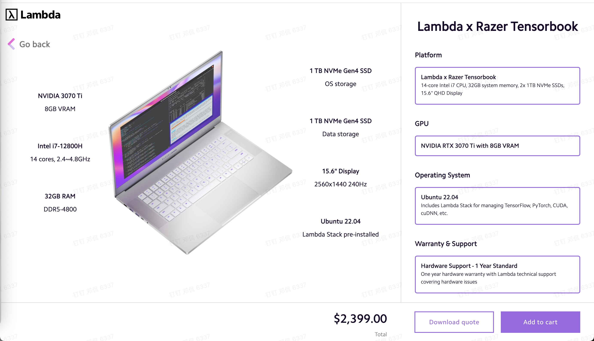

# Simulate and train robotic arm with robosuite and robomimic
SO1E03, 2024.03.09

# 1. Objective

Stanford aloha project used multiple robotic arm manipulation algorithms. In order to compare the performances of those algorithms, Stanford aloha project team took [two approaches](https://github.com/MarkFzp/act-plus-plus?tab=readme-ov-file#imitation-learning-algorithms-and-co-training-for-mobile-aloha), 1. used the physical robot, 2. used simulation software. 

For the simulation, Stanford aloha project used [robomimic](https://robomimic.github.io/docs/introduction/overview.html), which is a framework for robot learning from demonstration. It offers a broad set of demonstration datasets collected on robot manipulation domains and offline learning algorithms to learn from these datasets.

In this episode, we learned how to use robomimic, and use [R2D2 Residential Robot Demonstration Dataset](https://github.com/snasiriany/r2d2/tree/robomimic-eval?tab=readme-ov-file) as training dataset to test various action planning algorithms. 

# 2. Install Nvidia driver and Pytorch

Following Stanford aloha project, we used [Lambda Tensorbook with RTX 3070Ti GPU](https://shop.lambdalabs.com/deep-learning/laptops/tensorbook/customize?_gl=1*gmxhat*_ga*OTQyNjk2NTU1LjE3MDUyMDA1MDk.*_ga_43EZT1FM6Q*MTcwOTk3ODUyNy45LjEuMTcwOTk3OTI5Ni41MS4wLjA). 

The lambda tensorbook we received did not pre-install CUDA and Pytorch as expected, so we installed them by ourselves. 

Following [How to Install CUDA on Ubuntu 22.04 Step-by-Step](https://www.cherryservers.com/blog/install-cuda-ubuntu), we installed CUDA on the Lambda tensorbook with Ubuntu 22.04 preinstalled.

~~~
$ nvidia-smi
NVIDIA-SMI has failed because it couldn't communicate with the NVIDIA driver. Make sure that the latest NVIDIA driver is installed and running.

$ sudo apt update
$ sudo apt install ubuntu-drivers-common

$ sudo ubuntu-drivers devices
== /sys/devices/pci0000:00/0000:00:01.0/0000:01:00.0 ==
modalias : pci:v000010DEd000024E0sv00001A58sd0000201Bbc03sc00i00
vendor   : NVIDIA Corporation
driver   : nvidia-driver-515 - third-party non-free
driver   : nvidia-driver-525 - third-party non-free
driver   : nvidia-driver-525-server - distro non-free
driver   : nvidia-driver-520 - third-party non-free
driver   : nvidia-driver-545 - third-party non-free
driver   : nvidia-driver-535 - third-party non-free
driver   : nvidia-driver-535-server-open - distro non-free
driver   : nvidia-driver-550 - third-party non-free recommended
driver   : nvidia-driver-470-server - distro non-free
driver   : nvidia-driver-525-open - distro non-free
driver   : nvidia-driver-545-open - distro non-free
driver   : nvidia-driver-470 - distro non-free
driver   : nvidia-driver-550-open - third-party non-free
driver   : nvidia-driver-535-server - distro non-free
driver   : nvidia-driver-535-open - distro non-free
driver   : xserver-xorg-video-nouveau - distro free builtin
~~~

Notice that the system recommended nvidia-driver-550, hence, we installed it. 

~~~
$ sudo apt install nvidia-driver-550
~~~

After installing the above, we rebooted the tensorbook laptop, then the nvidia driver is ready to use. 

~~~
$ sudo reboot now

$ nvidia-smi
Sat Mar  2 16:39:55 2024       
+-----------------------------------------------------------------------------------------+
| NVIDIA-SMI 550.54.14              Driver Version: 550.54.14      CUDA Version: 12.4     |
|-----------------------------------------+------------------------+----------------------+
| GPU  Name                 Persistence-M | Bus-Id          Disp.A | Volatile Uncorr. ECC |
| Fan  Temp   Perf          Pwr:Usage/Cap |           Memory-Usage | GPU-Util  Compute M. |
|                                         |                        |               MIG M. |
|=========================================+========================+======================|
|   0  NVIDIA GeForce RTX 3070 ...    Off |   00000000:01:00.0 Off |                  N/A |
| N/A   44C    P8             12W /   80W |     171MiB /   8192MiB |      0%      Default |
|                                         |                        |                  N/A |
+-----------------------------------------+------------------------+----------------------+
                                                                                         
+-----------------------------------------------------------------------------------------+
| Processes:                                                                              |
|  GPU   GI   CI        PID   Type   Process name                              GPU Memory |
|        ID   ID                                                               Usage      |
|=========================================================================================|
|    0   N/A  N/A      1354      G   /usr/lib/xorg/Xorg                              4MiB |
|    0   N/A  N/A      1661    C+G   ...libexec/gnome-remote-desktop-daemon        155MiB |
+-----------------------------------------------------------------------------------------+

$ sudo ubuntu-drivers devices   
== /sys/devices/pci0000:00/0000:00:01.0/0000:01:00.0 ==
modalias : pci:v000010DEd000024E0sv00001A58sd0000201Bbc03sc00i00
vendor   : NVIDIA Corporation
driver   : nvidia-driver-535 - third-party non-free
driver   : nvidia-driver-535-open - distro non-free
driver   : nvidia-driver-520 - third-party non-free
driver   : nvidia-driver-525 - third-party non-free
driver   : nvidia-driver-470-server - distro non-free
driver   : nvidia-driver-550 - third-party non-free recommended
driver   : nvidia-driver-525-server - distro non-free
driver   : nvidia-driver-470 - distro non-free
driver   : nvidia-driver-550-open - third-party non-free
driver   : nvidia-driver-535-server-open - distro non-free
driver   : nvidia-driver-535-server - distro non-free
driver   : nvidia-driver-545 - third-party non-free
driver   : nvidia-driver-525-open - distro non-free
driver   : nvidia-driver-545-open - distro non-free
driver   : nvidia-driver-515 - third-party non-free
driver   : xserver-xorg-video-nouveau - distro free builtin

$ gcc --version
gcc (Ubuntu 11.4.0-1ubuntu1~22.04) 11.4.0
Copyright (C) 2021 Free Software Foundation, Inc.
This is free software; see the source for copying conditions.  There is NO
warranty; not even for MERCHANTABILITY or FITNESS FOR A PARTICULAR PURPOSE.
~~~

After installing nvidia driver, we installed pytorch following [pytorch official webpage](https://pytorch.org/get-started/locally/). 

~~~
$ pip3 install torch torchvision torchaudio

$ pip3 show torch
Name: torch
Version: 2.2.1
Summary: Tensors and Dynamic neural networks in Python with strong GPU acceleration
Home-page: https://pytorch.org/
Author: PyTorch Team
Author-email: packages@pytorch.org
License: BSD-3
Location: /home/robot/.local/lib/python3.10/site-packages
Requires: filelock, fsspec, jinja2, networkx, nvidia-cublas-cu12, nvidia-cuda-cupti-cu12, nvidia-cuda-nvrtc-cu12, nvidia-cuda-runtime-cu12, nvidia-cudnn-cu12, nvidia-cufft-cu12, nvidia-curand-cu12, nvidia-cusolver-cu12, nvidia-cusparse-cu12, nvidia-nccl-cu12, nvidia-nvtx-cu12, sympy, triton, typing-extensions
Required-by: robomimic, torchaudio, torchvision

$ pip3 show torchvision
Name: torchvision
Version: 0.17.1
Summary: image and video datasets and models for torch deep learning
Home-page: https://github.com/pytorch/vision
Author: PyTorch Core Team
Author-email: soumith@pytorch.org
License: BSD
Location: /home/robot/.local/lib/python3.10/site-packages
Requires: numpy, pillow, torch
Required-by: robomimic

$ pip3 show torchaudio
Name: torchaudio
Version: 2.2.1
Summary: An audio package for PyTorch
Home-page: https://github.com/pytorch/audio
Author: Soumith Chintala, David Pollack, Sean Naren, Peter Goldsborough, Moto Hira, Caroline Chen, Jeff Hwang, Zhaoheng Ni, Xiaohui Zhang
Author-email: soumith@pytorch.org
License: 
Location: /home/robot/.local/lib/python3.10/site-packages
Requires: torch
Required-by: 
~~~

# 3. Install Mujoco

Following [an instruction posted on github](https://gist.github.com/saratrajput/60b1310fe9d9df664f9983b38b50d5da), we installed [Mujoco](https://mujoco.org/), which is a free and open source physics engine that aims to facilitate research and development in robotics, biomechanics, graphics and animation, where fast and accurate simulation is needed. Mujoco was [purchased by](https://deepmind.google/discover/blog/open-sourcing-mujoco/) Google Deepmind in 2021. 

Step 1. [download Mujoco library from here](https://mujoco.org/download/mujoco210-linux-x86_64.tar.gz). Then, save the downloaded tar.gz file, mujoco210-linux-x86_64.tar.gz, to user home directory. 

~~~
$ cd ~

$ tar -xvzf mujoco210-linux-x86_64.tar.gz 
mujoco210/
mujoco210/THIRD_PARTY_NOTICES
mujoco210/bin/
mujoco210/bin/libglfw.so.3
mujoco210/bin/derivative
mujoco210/bin/libglew.so
...
~~~

Step 2. After uncompressing downloaded mujoco210-linux-x86_64.tar.gz, it created a new directory, ~/mujoco210/

Making a hidden directory, ~/.mujoco, and moved the mujoco directory to the hidden directory, to prevent from corruption. 

~~~
$ mkdir -p ~/.mujoco
$ mv mujoco210 ~/.mujoco/.
~~~

Step 3. Install the related libraries. 

~~~
$ sudo apt update
$ sudo apt-get install patchelf
$ sudo apt-get install python3-dev build-essential libssl-dev libffi-dev libxml2-dev  
$ sudo apt-get install libxslt1-dev zlib1g-dev libglew1.5 libglew-dev python3-pip

$ apt-cache show libglew*
Package: libglew2.2
Architecture: amd64
Version: 2.2.0-4
...
Package: libglew-dev
Architecture: amd64
Version: 2.2.0-4
...
Package: libglewmx1.13
Architecture: amd64
Version: 1.13.0-5
...
Package: libglewmx-dev
Architecture: amd64
Version: 1.13.0-5
...
~~~

Step 4. Install mujoco-py

~~~
$ pip3 install mujoco-py

$ pip3 show mujoco
Name: mujoco
Version: 3.1.2
Summary: MuJoCo Physics Simulator
Home-page: 
Author: 
Author-email: Google DeepMind <mujoco@deepmind.com>
License: Apache License 2.0
Location: /home/robot/.local/lib/python3.10/site-packages
Requires: absl-py, etils, glfw, numpy, pyopengl
Required-by: dm-control, robosuite
~~~

Step 5. Setup the environmental variables

Add the following content to the ~/.bashrc file. Notice that, our home directory is /home/robot, change the directory to your own home directory. 

~~~
export PATH=/home/robot/.local/bin:/home/robot/.local/binusr/local/cuda-12.2/bin${PATH:+:${PATH}}
export LD_LIBRARY_PATH=/usr/lib/nvidia:/home/robot/.mujoco/mujoco210/bin:/usr/local/cuda-12.2/lib64${LD_LIBRARY_PATH:+:${LD_LIBRARY_PATH}}
~~~

Step 6. Verify the success of Mujoco installation

~~~
$ source /home/robot/.bashrc 

$ python3 
Python 3.10.12 (main, Nov 20 2023, 15:14:05) [GCC 11.4.0] on linux
Type "help", "copyright", "credits" or "license" for more information.
>>> import mujoco_py
/usr/lib/python3/dist-packages/scipy/__init__.py:146: UserWarning: A NumPy version >=1.17.3 and <1.25.0 is required for this version of SciPy (detected version 1.26.4
  warnings.warn(f"A NumPy version >={np_minversion} and <{np_maxversion}"
/usr/lib/python3/dist-packages/pythran/tables.py:4520: FutureWarning: In the future `np.bool` will be defined as the corresponding NumPy scalar.
  if not hasattr(numpy, method):
/usr/lib/python3/dist-packages/pythran/tables.py:4553: FutureWarning: In the future `np.bytes` will be defined as the corresponding NumPy scalar.
  obj = getattr(themodule, elem)
running build_ext
>>> import os
>>> mj_path=mujoco_py.utils.discover_mujoco()
>>> xml_path=os.path.join(mj_path, 'model', 'humanoid.xml'
... )
>>> model=mujoco_py.load_model_from_path(xml_path)
>>> sim=mujoco_py.MjSim(model)
>>> print(sim.data.qpos)
[0.  0.  1.4 1.  0.  0.  0.  0.  0.  0.  0.  0.  0.  0.  0.  0.  0.  0.
 0.  0.  0.  0.  0.  0.  0.  0.  0.  0. ]
>>> sim.step()
>>> print(sim.data.qpos)
[-1.12164337e-05  7.29847036e-22  1.39975300e+00  9.99999999e-01
  1.80085466e-21  4.45933954e-05 -2.70143345e-20  1.30126513e-19
 -4.63561234e-05 -1.88020744e-20 -2.24492958e-06  4.79357124e-05
 -6.38208396e-04 -1.61130312e-03 -1.37554006e-03  5.54173825e-05
 -2.24492958e-06  4.79357124e-05 -6.38208396e-04 -1.61130312e-03
 -1.37554006e-03 -5.54173825e-05 -5.73572648e-05  7.63833991e-05
 -2.12765194e-05  5.73572648e-05 -7.63833991e-05 -2.12765194e-05]
~~~

# 4. Install and run robosuite 

# 5. Install and run robomimic
