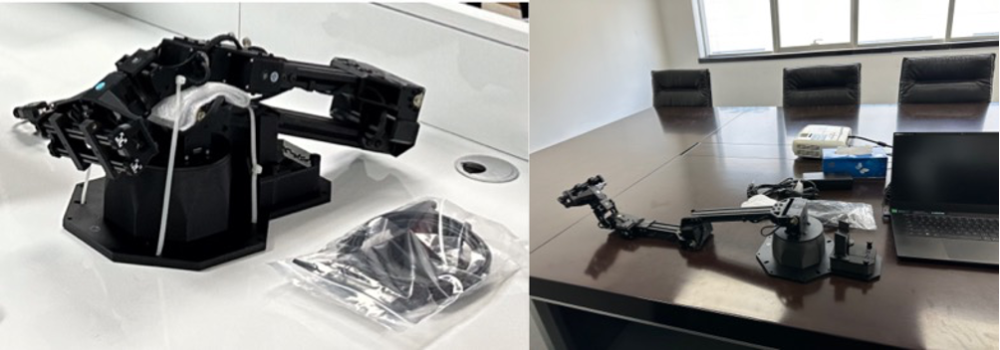
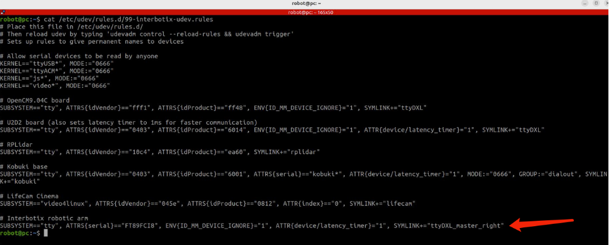
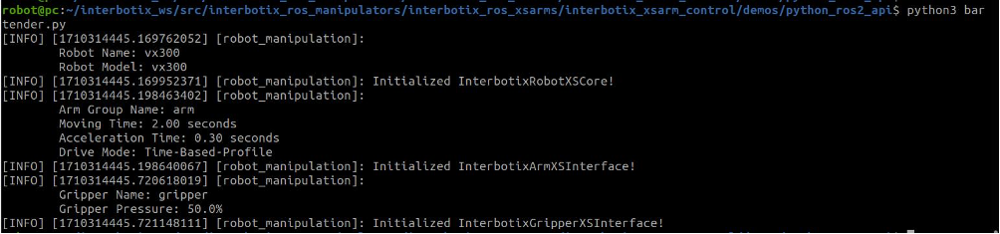

# Testing with the Interbotix physical arm
SO1E04, 2024.03.15

# 1. Objective

[Stanford mobile aloha housework robot](https://github.com/MarkFzp/mobile-aloha?tab=readme-ov-file#software-selection----os) uses 2 pairs of robotic arms.
Before, we mainly worked with the [rviz2](https://github.com/ros2/rviz) simulation, but this time, we are connecting [an Interbotix physical vx300 6DOF arm](https://docs.trossenrobotics.com/interbotix_xsarms_docs/) to our computer and programming it to perform predefined moves. This is laying the groundwork for the full range of motions in our upcoming housework robot.

# 2. Connecting the Interbotix arm to PC
Take an Interbotix physical vx300 arm out of the box, cut off the straps, and place it gently on the table. Then put on the corresponding gripper and cushion. Be careful and handle it with care throughout the process.

Connect the Interbotix vx300 arm to the power outlet using the original power adapter, and hook it up to your computer with the provided USB-to-Micro-USB cable. Make sure not to use any USB hub or extension cable for the connection. Also, do not forget to have Ubuntu 22.04 and the interbotix software with ROS2 Humble environment installed on your computer.

# 3. Testing the control of the Interbotix arm
Follow the instructions in ``MarkFzp/mobile-aloha``, or you can refer to the steps below.
Install and open dynamixel wizard. Go into options and hit Scan. 
Select:
   ~~~
   Protocal 2.0
   All ports
   1000000 bps
   ID range from 0-10
   ~~~

There should be 9 motors showing up.

Close dynamixel wizard，then run ``udevadm info --name=/dev/ttyUSB0 --attribute-walk | grep serial`` to obtain the serial number.
``sudo vim /etc/udev/rules.d/99-interbotix-udev.rules`` and add the following line.

This will make sure the right master robot is always binding to ttyDXL_master_right.
Open a terminal，then run the command:``ros2 launch interbotix_xsarm_control xsarm_control.launch.py robot_model:=vx300``. It should automatically open the rviz.

Open another terminal. Go to the right folder and run the command ``python3 bartender.py``. Remember to change the robot_model to vx300 beforehand. After running the command, the interface will look like this (check the picture below).

Now the Interbotix physical vx300 arm should start moving. It is recommended to have someone hold the robotic arm with their hands, and be careful not to get injured by the robotic arm.

# 4. Trouble shooting.
If you do not follow the steps above, you might encounter the following error.

At this point, you can refer to the instructions in "``3. Testing the control of the Interbotix arm``" and follow them, then run the corresponding command.
