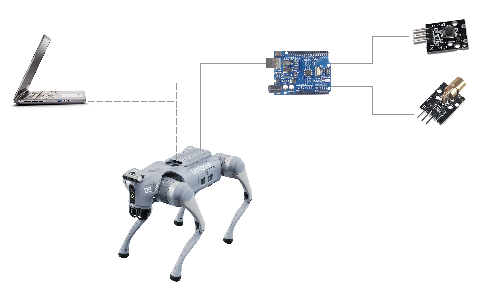
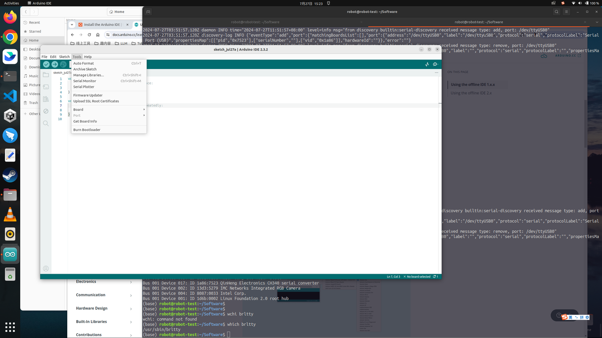
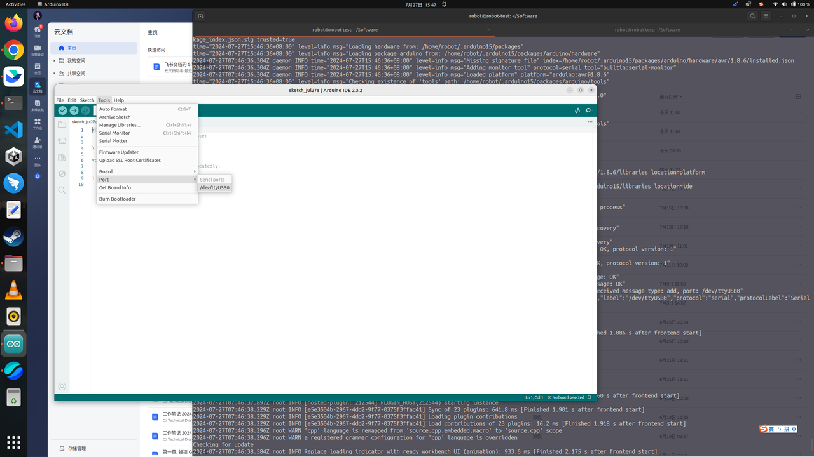

# Integrate Arduino into Unitree Go2 Robot Dog
SO3E02, 07.29.2024

# 1. Objectives

## 1.1 Final Objective

The subject of this article is to enrich the functionality of the Unitree-Go2 robotic dog by adding an Arduino board and associated modules to its body.

Specifically, we will ultimately complete the following tasks:

1. Connect two modules to the microcontroller of the Arduino Uno, one is the HW483 button module, and the other is the HW493 laser module.
2. Write two programs on the computer, one is a C program deployed to the Arduino microcontroller, and the other is a Python program deployed to the Nvidia Jetson Orin board on the Unitree-Go2 robot dog's body.
3. Configure the ubuntu OS on the Nvidia Orin board, so that the Python program automatically starts to run when the Unitree-Go2 robot dog's body is powered on.
4. When the user manually presses the HW483 button, the C program on the Arduino microcontroller reads the button signal and forwards it to the Python program running on the Nvidia Jetson Orin board.
5. The Python program on the Nvidia Jetson Orin board sends instructions to the C program on the Arduino, instructing the C program to send commands to the HW493 module to emit a laser.

There are two questions here:

1. After the button module HW483 sends the button signal, and the signal is received by the Arduino microcontroller, is it possible for the C program on the Arduino to process the button signal, and directly send the firing instruction to the laser module HW493 without going through the Nvidia Orin mainboard?
   
The answer is, it is possible.

The reason we take a detour through the Orin board is to be ready to handle a more diverse and complex set of signals on the Orin board in the future, not just the button signal, using the AI large models.

2. In addition to the button module HW483 and the laser module HW493, is it possible to add other functional modules?
   
The answer is, of course, yes.

Arduino is a hub, with this hub, various peripheral devices can be connected, adding various functions to the Unitree-Go2 robot dog.

Actually there are many awesome projects in Arduino community, we expect to use those project to empower unitree robot dog, to explore fun and profitable applications. 

## 1.2 Staging Objective

Due to the length, we will complete the final objective in two parts. The staging objectives of this article are:

1. Connect two modules to the microcontroller of the Arduino Uno, one is the HW483 button module, and the other is the HW493 laser module.
2. Write two programs on the computer, one is a C program deployed to the Arduino microcontroller, and the other is a Python program that runs on the computer.
3. When the user manually presses the HW483 button, the C program on the Arduino microcontroller reads the button signal and forwards it to the Python program running on the computer.
4. The Python program running on the computer sends instructions to the C program on the Arduino, instructing the C program to send commands to the HW493 module to emit a laser.

The flowchart of the phased system is shown in the figure below.

Once we have verified that these two programs are working properly, we will then deploy the Python program to the Unitree-Go2 robot dog's body, to be more precise, to the Nvidia Jetson Orin board mounted on the Unitree-Go2 robot dog.

At the same time, the C program deployed and running on the Arduino microcontroller will remain unchanged.

# 2. Arduino

## 2.1 Assemble the Modules

Assemble the Arduino microcontroller, with the HW483 button module and the HW493 laser module, following to the image below.

## 2.2 Arduino port

We use a [Tensorbook laptop](https://lambdalabs.com/deep-learning/laptops/tensorbook) produced by Razer, which runs the Ubuntu 22.04 operating system.

To facilitate writing, compiling, and deploying programs for Arduino on Ubuntu, we need to install [the Arduino IDE](https://www.arduino.cc/en/software). Installing the Arduino IDE on Ubuntu is quite straightforward: first, download the 64-bit zip file of the Arduino IDE, and then unzip it for use.

The installation process went smoothly, but then we encountered a problem when using it:

The IDE didn't find which USB port the Arduino is plugged into, as shown in the figure below. Since the IDE cannot find the Arduino connection, the "port" turned into grey. 

## 2.3 Solution

When we checked the various USB ports, and then found that the USB port connected to the Arduino was identified as "QinHeng". 

~~~
$ lsusb
Bus 004 Device 001: ID 1d6b:0003 Linux Foundation 3.0 root hub
Bus 003 Device 001: ID 1d6b:0002 Linux Foundation 2.0 root hub
Bus 002 Device 001: ID 1d6b:0003 Linux Foundation 3.0 root hub
Bus 001 Device 003: ID 1532:028a Razer USA, Ltd Razer Blade
Bus 001 Device 019: ID 1a86:7523 QinHeng Electronics CH340 serial converter
Bus 001 Device 002: ID 13d3:5279 IMC Networks Integrated RGB Camera
Bus 001 Device 004: ID 8087:0033 Intel Corp. 
Bus 001 Device 001: ID 1d6b:0002 Linux Foundation 2.0 root hub
$ 
~~~

[The root cause](https://learn.adafruit.com/ladyadas-learn-arduino-lesson-number-0/install-software-linux) for this problem is that, 

~~~
Some older Linux distributions used to install brltty (braille device) which will conflict with the Arduino. You must uninstall brltty if it is installed. Do so by running `sudo apt-get remove brltty`.
~~~

Hence, the solution is to [uninstall brltty](https://learn.adafruit.com/ladyadas-learn-arduino-lesson-number-0/install-software-linux)

~~~
$ sudo apt-get remove brltty
Reading package lists... Done
Building dependency tree... Done
Reading state information... Done
The following packages will be REMOVED:
  brltty
0 upgraded, 0 newly installed, 1 to remove and 541 not upgraded.
After this operation, 8,294 kB disk space will be freed.
Do you want to continue? [Y/n] Y
(Reading database ... 366138 files and directories currently installed.)
Removing brltty (6.4-4ubuntu3) ...
Processing triggers for man-db (2.10.2-1) ...
$  
$ lsusb
Bus 004 Device 001: ID 1d6b:0003 Linux Foundation 3.0 root hub
Bus 003 Device 001: ID 1d6b:0002 Linux Foundation 2.0 root hub
Bus 002 Device 001: ID 1d6b:0003 Linux Foundation 3.0 root hub
Bus 001 Device 003: ID 1532:028a Razer USA, Ltd Razer Blade
Bus 001 Device 019: ID 1a86:7523 QinHeng Electronics CH340 serial converter
Bus 001 Device 002: ID 13d3:5279 IMC Networks Integrated RGB Camera
Bus 001 Device 004: ID 8087:0033 Intel Corp. 
Bus 001 Device 001: ID 1d6b:0002 Linux Foundation 2.0 root hub
$ 
~~~

1. Unplug the cable connected to the Arduino board from the computer USB port.
2. Close the Arduino IDE on the computer.
3. Reinsert the cable into the computer USB port and restart the Arduino IDE.
4. At this point, you can see that the Arduino indicates the USB port for the arduino board as `/dev/ttyUSB0`.
5. If need to select the `Board` type, for the Uno board, choose `Arduino Uno`.

# 3. Programs

We need to write two programs, one is a C program that is deployed and runs on the Arduino microcontroller, and the other is a Python program that runs on the computer.

1. When the user manually presses the HW483 button, the C program on the Arduino microcontroller reads the button signal and forwards it to the Python program running on the computer.
   
2. The Python program running on the computer sends instructions to the C program on the Arduino, instructing the C program to send commands to the HW493 module to emit a laser.

The entire process is shown in the figure below.

## 3.1 C Program

The C program is deployed and runs on the Arduino microcontroller. 

~~~
#include <stdio.h>

#define laser_pin 13
#define button_pin 10

void setup() {
  // put your setup code here, to run once:
  pinMode(button_pin, INPUT);
  pinMode(laser_pin, OUTPUT);

  Serial.begin(9600);
  Serial.print("Arduino starts up ...");
}

void loop() {
  int button_int = 1;
  delay(500);  

  // put your main code here, to run repeatedly:
  button_int = digitalRead(button_pin);

  if (button_int == LOW) {
    Serial.print('1'); 
  } else {
    Serial.print('0');
  }

  if (Serial.available() > 0) {  
    // Read data from the serial port  
    char receivedChar = Serial.read();  
    
    if ( receivedChar == '1' || receivedChar == 1 ) {
      digitalWrite(laser_pin, HIGH);
    } else {
      digitalWrite(laser_pin, LOW);
    }
  }
}
~~~

## 3.2 Python program

The Python program runs on the computer. 

~~~
import serial
import time

def recv(serial):
    while True:
        data = serial.read_all()
        if data == b'':
            continue
        else:
            break
        time.sleep(1)
    return data

def send(send_data):

    if (serial.isOpen()):
        serial.write(send_data.encode('utf-8'))  # 编码
        print(f"Sending succeed: '{send_data}' \n")
    else:
        print("Sending fails！")

if __name__ == '__main__':
    serial = serial.Serial('/dev/ttyUSB1', 9600, timeout=1)
    if serial.isOpen():
        print("Openning succeeds!")
    else:
        print("Openning fails!")

    while True:
        time.sleep(1)  # sleep for 1 second
        data = recv(serial).decode('utf-8')

        if data != '':
            print(f"Receive message from arduino: '{data}' ") 
            send(data)    # echo, send back whatever received.
~~~

## 3.3 Run the programs

1. In the Arduino IDE, compile the C program and then load it onto the Arduino board.

    Once the loading is complete, the C program will automatically start.

2. In the computer's Command Line Interface (CLI) terminal, run the Python program.

~~~
$ sudo python3 laser_controller.py 
[sudo] password for robot: 
Openning succeeds!
Receive message from arduino: 'Arduino starts up ...' 
Sending succeed: 'Arduino starts up ...' 

Receive message from arduino: '0' 
Sending succeed: '0' 
...
~~~

3. Press and hold the HW483 button for more than 1 second, and then release the button.

    At this time, the laser will fire for a few seconds and then stop firing.

    Simultaneously, the following message will display on the computer's Command Line Interface (CLI) terminal:

~~~
Receive message from arduino: '1' 
Sending succeed: '1' 
...

Receive message from arduino: '0' 
Sending succeed: '0' 
...
~~~

# 4. Summary

The execution result is shown in the video below:

This article ends here.

In the next article, we will explain how to port the Python program to the Nvidia Jetson Orin board equipped on the Unitree-Go2 robot dog's body, and automatically start this Python program when the robot dog is powered on.

