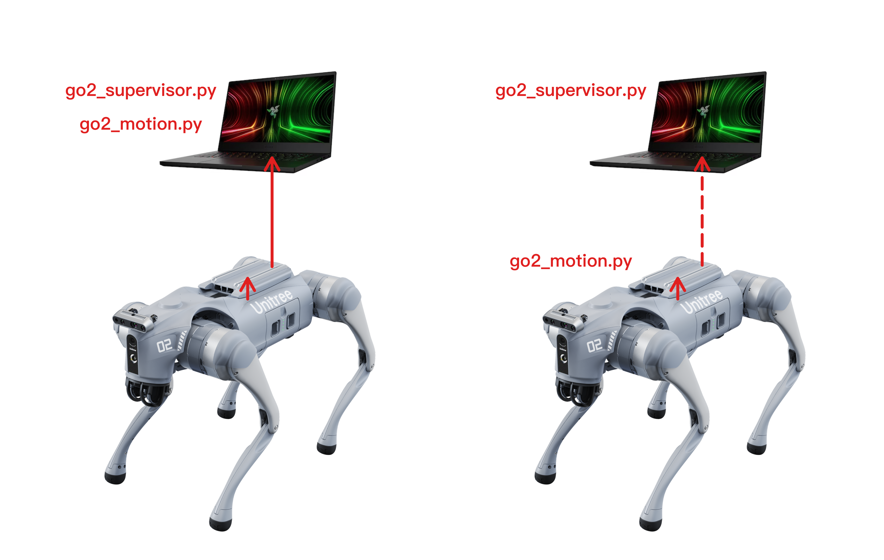
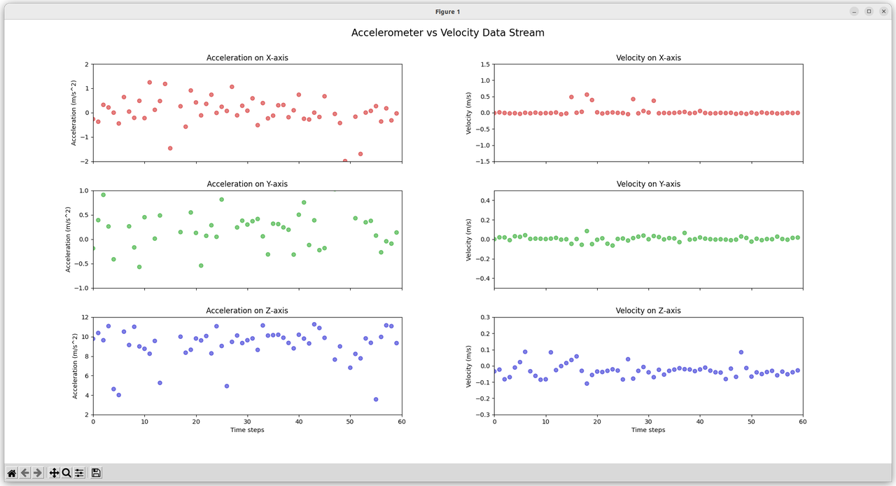
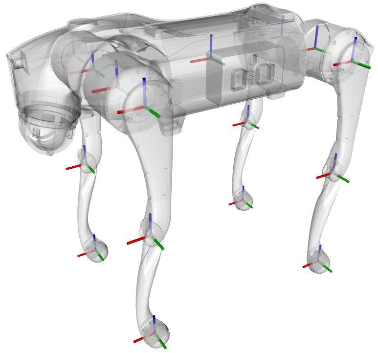

# 1. Objectives

The objectives of this article is data visualization, making the motion status data of the Unitree robotic dog Go2 more intuitive.

The Unitree robotic dog Go2 provides SDKs in both C++ and Python languages. Third-party developers can use the SDK to obtain and control the motion status data of the robotic dog in real-time, including both low-level and high-level motion status data.

1. [Low-level motion status data](https://support.unitree.com/home/en/developer/Basic_services)

The robotic dog has a total of 4 legs, each with 3 joints, which are the hip joint, thigh joint, and calf joint, making a total of 12 joints. When third-party developers select the low-level motion control mode, they can directly access and control the rotation angles, acceleration, and so on, of all motors in all joints of the robotic dog.

Low-level motion data also includes the status of the battery, data from the IMU gyroscope and accelerometer, as well as data from the remote controller.

2. [High-level motion status data](https://support.unitree.com/home/en/developer/sports_services)

Third-party developers can, of course, achieve various actions/gaits of the robotic dog by controlling the rotation angles of each joint, including actions/gaits such as crawling, sitting, standing, walking, running, and jumping. However, the implementation is quite challenging.

Unitree's engineers have implemented these standard actions/gaits and encapsulated them into high-level motion control.

However, if third-party developers use high-level motion control, they must first enter the `SportModeState_` high-level motion control mode. Once in this mode, low-level motion control is no longer available to third-party developers to prevent interference from self-defined low-level actions with high-level standard actions.

In [Unitree's official tutorials](https://support.unitree.com/home/en/developer/Software_Interface_Services), high-level motion control is divided into two subcategories: one is [high-level motion control](https://support.unitree.com/home/en/developer/sports_services), and the other is [AI motion control](https://support.unitree.com/home/en/developer/AI_motion_service). However, to use either of these motion controls, one must first enter the `SportModeState_` high-level motion control mode, and the APIs for both are identical. Therefore, for the sake of simplicity in this article, we don't distinct high-level motion control from AI motion control.

&nbsp;
Whether it is low-level motion control data or high-level motion control data, approximately ten readings can be taken per second, with each data packet containing dozens of data items. That is a large amount of data in a short time. 

Directly reading the data is not easy to discover data patterns, including the distribution of data, such as the range of data values, as well as the relationships among different data items, such as the relationship between speed and position, etc.

This article uses the [Matplotlib Python toolkit](https://matplotlib.org/) to visually display the data, allowing engineers to more intuitively understand the distribution and relationships of the data.

&nbsp;
# 2. Deployment

We wrote 3 python scripts to visualize the low-level or high-level motion control data of the Unitree Go2 using [matplotlib](https://matplotlib.org/).

1. `go2_motion.py`,

    This is the client-side script. It retrieves low-level or high-level motion control data from the Unitree Go2 itself, in real-time, through the cyclonedds interface provided by the Unitree SDK.

2. `unitree_legged_const.py`

    This is deployed on the client side, provides the assignment of constant variables for `go2_motion.py`, including LegID, etc. This script is copied from the open-source project on [Unitree's github repo](https://github.com/unitreerobotics/unitree_sdk2_python/blob/master/example/low_level/unitree_legged_const.py).

3. `go2_supervisor.py`

    This is the server-side script. The client-side `go2_motion.py` obtains low-level or high-level motion control data from the Unitree Go2 in real-time, and then forwards the motion control data to the server-side `go2_supervisor.py`. `go2_supervisor.py` uses the matplotlib toolkit to display the data as [scatter plots](https://en.wikipedia.org/wiki/Scatter_plot).

&nbsp;
There are two ways to communicate between the robotic dog and the computer, as shown in the figure 2.1 above:

1. The robotic dog and the computer are connected via an Ethernet cable for a wired connection. In case of wired connection, it will limit the range of motion of the robotic dog.

2. The robotic dog and the computer are connected via Wi-Fi for a wireless connection. In case of wireless connection, it will cause a delay of data transmission, approximately tens of milliseconds for each transmission.

&nbsp;
The deployment for the 3 scripts also comes in two ways, depending on the aforementioned communication methods:

1. In case of wired connection, the client-side `go2_motion.py` and `unitree_legged_const.py` can be deployed on a computer, as well as on the robotic dog itself.

    If both the client-side `go2_motion.py` and `unitree_legged_const.py`, and the server-side `go2_supervisor.py` are deployed on the same computer, two CLI terminals need to be opened on the computer during operation, one to run the client-side `go2_motion.py` and the other to run the server-side `go2_supervisor.py`.

2. In case of wireless connection, the client-side `go2_motion.py` and `unitree_legged_const.py` must be deployed on the robotic dog, and the server-side `go2_supervisor.py` must be deployed on the computer. 

    To start `go2_motion.py`, you must first connect the computer to the robotic dog using an Ethernet cable, then start `go2_motion.py`. 

    And once it enters the loop state, you can then disconnect the Ethernet cable.

3. Regardless whether the client-side `go2_motion.py` is running on the computer or on the Nvidia Orin board, a line must be added to the CLI terminal's startup script, such as `~/.bashrc` or other startup scripts, otherwise, it will not be able to obtain motion control data from the robotic dog itself.

    ~~~
    export CYCLONEDDS_HOME="~/cyclonedds/install"
    ~~~

Additionally, you must install and deploy the relevant toolkits:

1. On the computer, the [matplotlib Python toolkit](https://matplotlib.org/) must be installed so as to run the server-side `go2_supervisor.py` script.

2. If the client-side `go2_motion.py` and `unitree_legged_const.py` are deployed on the computer, the Unitree's [`unitree_sdk2_python`](https://github.com/unitreerobotics/unitree_sdk2_python) package must also be installed on the computer.

3. If the client-side `go2_motion.py` and `unitree_legged_const.py` are deployed on the robotic dog, then the Unitree's [`unitree_sdk2_python`](https://github.com/unitreerobotics/unitree_sdk2_python) package must be installed on the Nvidia Orin board that comes with the Unitree robotic Go2 EDU version.

4. The guide for installing unitree_sdk2_python is clearly described in its GitHub README.md. If you encounter any problems, you can also refer to [this note in this repo](./S03E01_unitree_go2_python_programming.md) to find solutions.

&nbsp;
# 3. UI Design

We have implemented a simple data visualization tool using Matplotlib. Due to the limited size of the computer screen, we have divided the interface into only two columns, left and right.

The scatter plot on the left displays the acceleration in the `(x, y, z)` 3-axis directions of the robotic dog. The data comes from the accelerometer within the robotic dog's built-in inertial measurement unit (IMU).

The scatter plot on the right displays the velocity in the `(x, y, z)` 3-axis directions of the robotic dog. The data comes from the robotic dog's high-level motion control data interface. It is said that the velocity is calculated by Unitree engineers using the accelerometer and gyroscope in the IMU with Kalman filtering, hence it is speculated that there may be cumulative errors in the velocity.

The [`(x, y, z)` 3-axis directions](https://support.unitree.com/home/en/developer/about_Go2), as shown in the above figure 3.2, have red for the x-axis, green for the y-axis, and blue for the z-axis. The positive direction of rotation conforms to the right-hand rule.

If more scatter plots need to be added, or if the data displayed in the scatter plots needs to be changed, or if need to change the range and scale of the horizontal and vertical axes of the scatter plots, you need to modify the source code of `go2_supervisor.py`, to do these jobs for the time being.

In the future, we may develop a website where data to be displayed, and the range and scale of the coordinate axes, can be changed by the control knobs on the web page.
