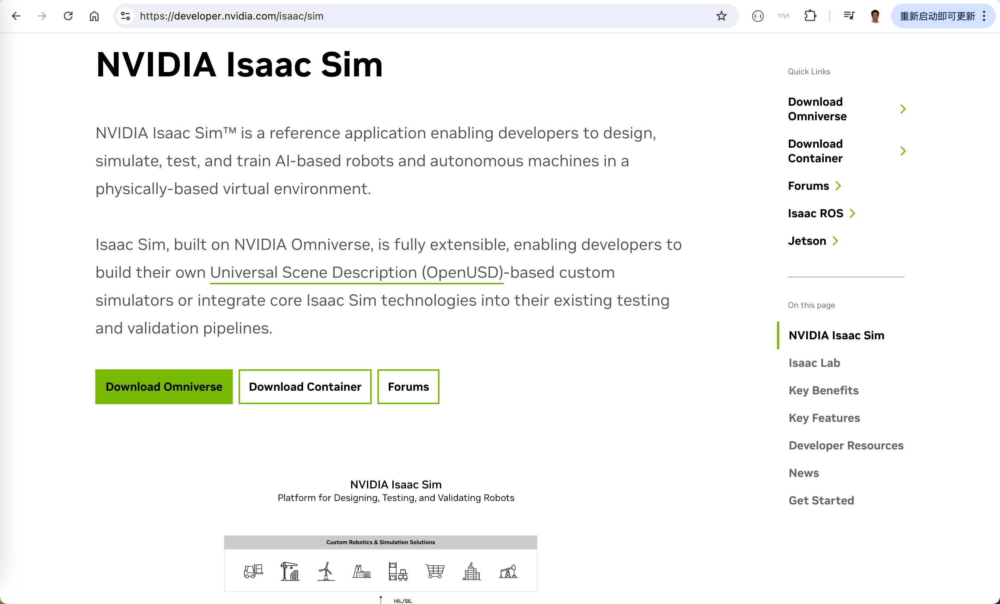
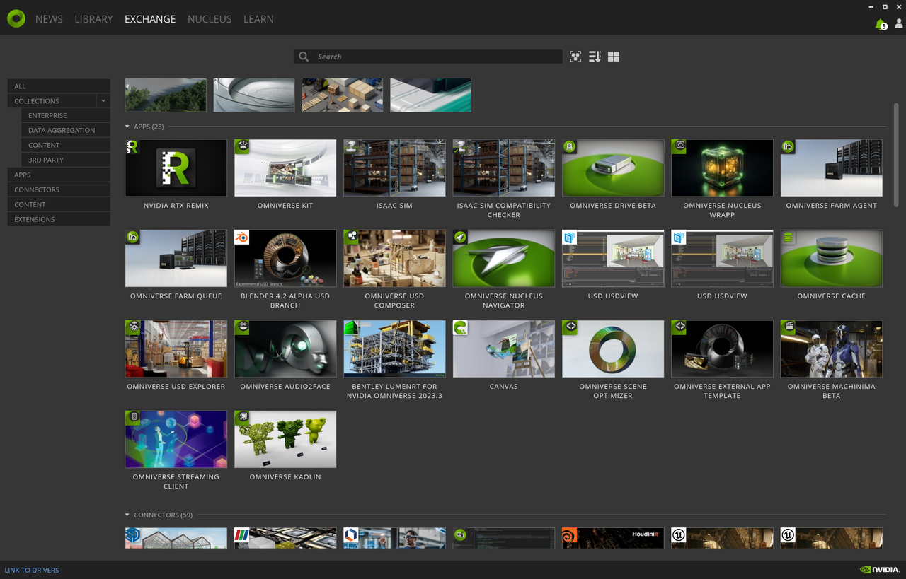
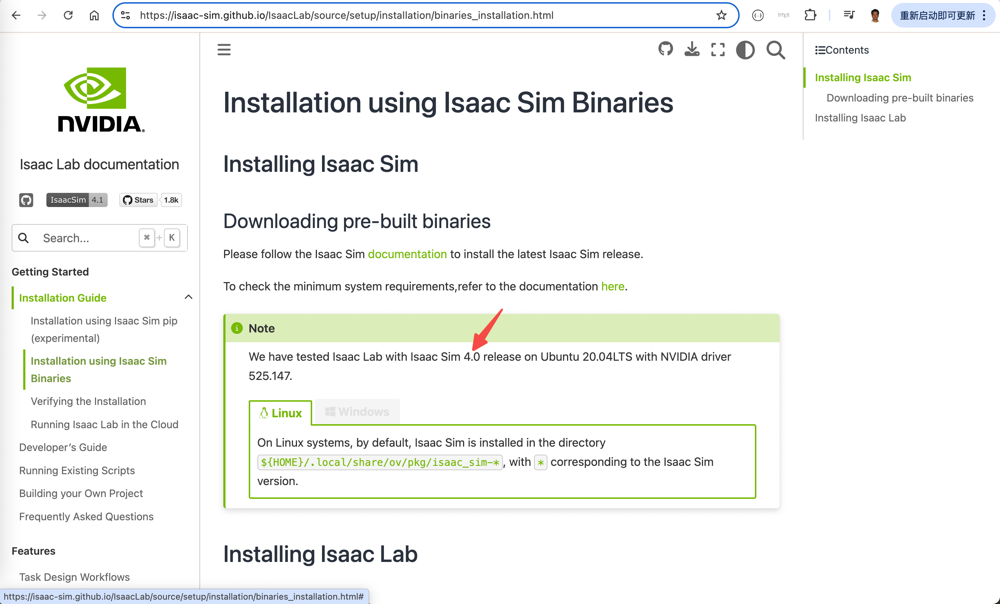
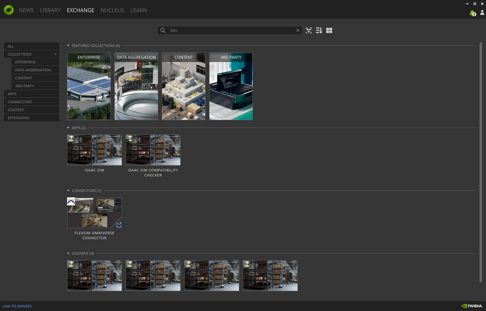
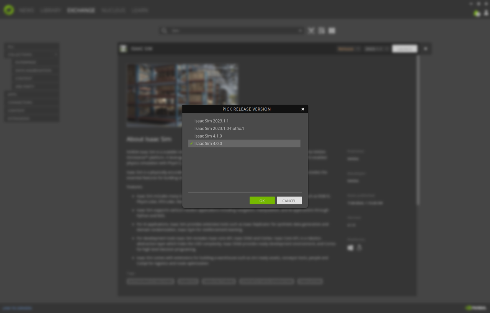
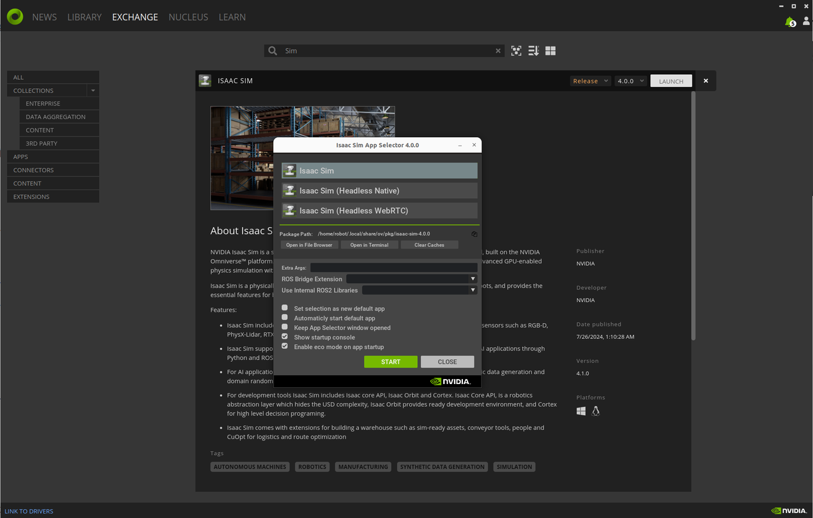
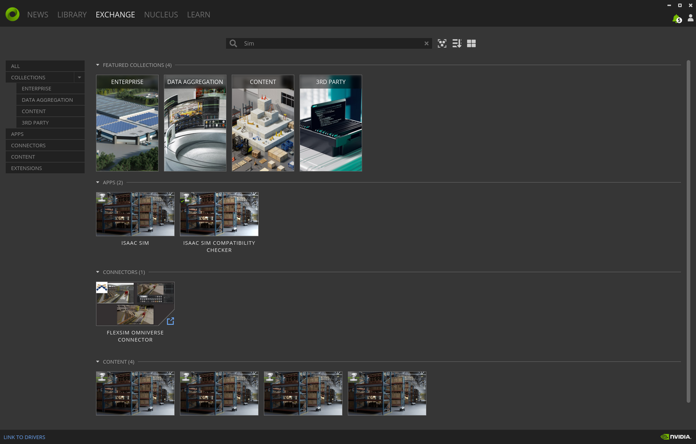
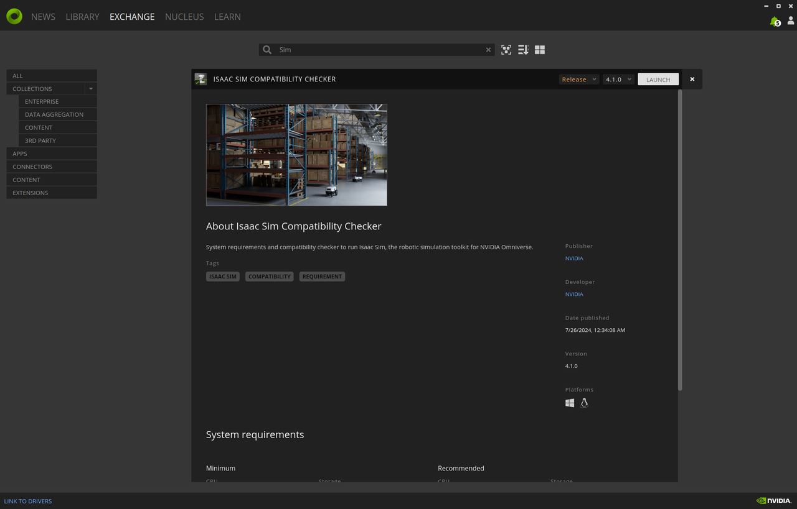
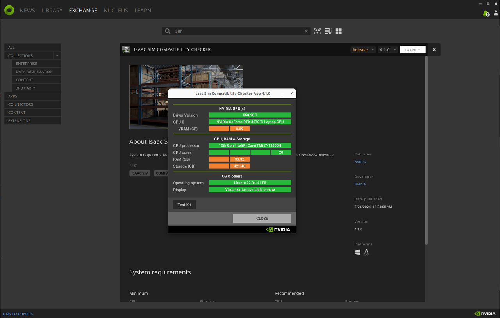
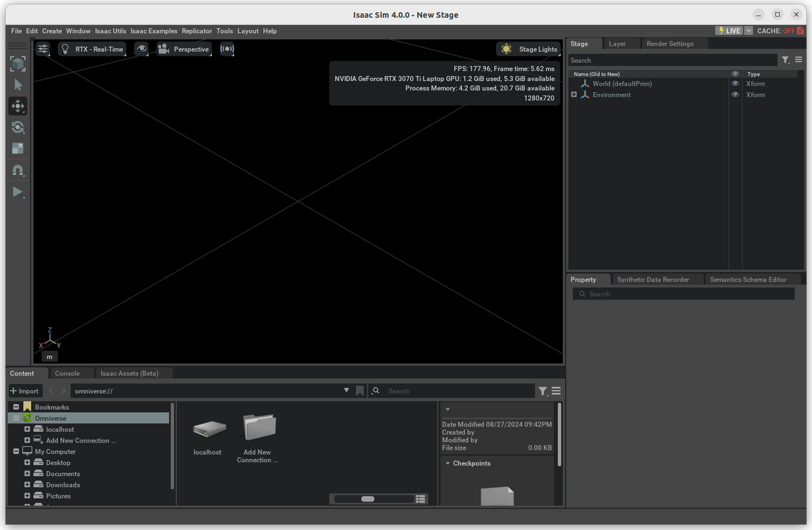

# Trouble shooting for the installation of Isaac Sim and Lab

# 1. Objectives

The content of this article is about how to correctly install and use Nvidia's Isaac Sim and Isaac Lab, including what mistakes to avoid. 

Since Isaac Sim and Isaac Lab are in a period of rapid iterative upgrading, the products are unstable, and the installation process is prone to errors, especially it is easy to make multiple mistakes at the same time, leading to many very confusing phenomena.

This article records the process of successfully installing Isaac Sim 4.0.0 and Isaac Lab, on an Ubuntu 22.04 computer equipped with an RTX3070Ti GPU. We don't know the version of Isaac Lab, because there is no place to check the version.

Why do we need Isaac Sim and Isaac Lab? Because We will use them in two application scenarios.

## 1.1 Teleoperation

### 1.1.1 Use case

For example, you are the boss of a nursing home in Japan, and you need cleaners to clean the bathroom and tidy up the rooms, but labor in Japan is very expensive. 

If you hire employees from other countries, you need to go through the visa process, which is cumbersome, and may lead to future troubles, including the impact of immigration on the social order.

The solution of teleoperation is that there are several robots in the Japanese nursing home. When the robots are cleaning the bathroom and tidying up the rooms, foreign employees remotely control the robots from overseas, thus avoiding the various troubles of hiring foreign employees physically working in Japan.

During teleoperation, foreign employees need to be able to "see" the workplace of the nursing home via the Internet.

The simplest solution is to transmit the video captured by the robot's camera to the foreign employees in real time.

By remotely controlling the robot to move and look around, the foreign employees can roughly outline a 3D map of the workplace in their minds.

### 1.1.2 Simulation engine

Is there a way to use a computer, rather than a human brain, to process the video and thereby create a 3D map of the workplace?

One solution is to use a simulation engine to draw the 3D map. We create a 3D map of the workplace in advance, including the 3D models of various furniture and equipments. Then, we apply the 2D images captured by the robot's camera onto the surface of the 3D model, similar to wall paper.

When necessary, we also make minor adjustments and modifications to the pre-made 3D models. 

### 1.1.3 Simulation engine vs game engine

Why use a simulation engine, such as Nvidia Isaac Sim, instead of a game engine like Unity and Unreal, to create the 3D map of workplace?

Game engines do not emphasize the movement of characters and objects, such as collisions and fragmentation, strictly in accordance with the laws of physics.

However, in teleoperation application scenarios, we must strictly adhere to the laws of physics to avoid incorrect operations.

Therefore, we need to use a simulation engine and do not recommend using a game engine to draw the 3D map of the workplace and the 3D models of furniture and equipments.

## 1.2 Robot Training

### 1.2.1 Gymnasium-Robotics

Training a robot using its physical body is feasible, but the training efficiency is low. 

Moreover, if collisions or other incidents occur during the training process that result in robot damage, the cost of training will be high.

Training robots using simulation requires the creation of a 3D model of the robot's body, which strictly replicates the angles, torques, forces, and other aspects of each joint of the robot. 

Additionally, training robot movements often involves the use of reinforcement learning algorithms.

> [Gymnasium-Robotics](https://robotics.farama.org/index.html) is a collection of robotics simulation environments for Reinforcement Learning

Gym is recognized as a de facto industry standard for robotic simulation training, it consists of three main aspects:

1. It has a large collection of 3D models of various robots,
   
2, It has a large collection of reinforcement learning algorithms, with standardized APIs, significantly reducing the learning cost,

3. It has implemented a framework of `environments` that allows different robots to interface with a variety of reinforcement learning algorithms, smoothly.

### 1.2.2 Mujoco vs Isaac Lab

The default simulation engine for Gym is [Mujoco](https://mujoco.org/). 

Initially developed by a PhD from MIT and released in 2012, the development of Mujoco was subsequently led by OpenAI. In 2021, Mujoco was acquired by Deepmind, a Google sub-company. 

While Mujoco is easy to use within the Gym framework, its capabilities seem not as powerful as Nvidia's [Isaac Sim](https://developer.nvidia.com/isaac/sim). 

Building upon Isaac Sim, Nvidia has developed [Isaac Lab](https://developer.nvidia.com/isaac/sim#isaac-lab), which makes it easy to use Isaac Sim within the Gym framework.

# 2. Install Isaac Sim 

## 2.1 Install Omniverse Launcher

Visit [the official website of Nvidia Isaac Sim](https://developer.nvidia.com/isaac/sim), click on `Download Omniverse`, not `Download Container`.

After filling the user registration information and submitting it, you can download the Omniverse Launcher. The file is not large, only 122MB, and it will be downloaded in a short time.

Be prepared that downloading Isaac Sim will take a long time, and if the network is unstable, you may need to download it repeatedly.

## 2.2 Install Cache and Nucleus 

Follow the instructions on [the Isaac Sim official website](https://docs.omniverse.nvidia.com/isaacsim/latest/installation/install_workstation.html#workstation-setup) to install [Cache](https://docs.omniverse.nvidia.com/utilities/latest/cache/installation/workstation.html) and [Nucleus](https://docs.omniverse.nvidia.com/nucleus/latest/workstation/installation.html). 

The download procedure is quite lengthy, but overall it goes relatively smoothly.

## 2.3 Install Isaac Sim

The first major mistake we made was installing the wrong version of Isaac Sim. 

Initially, we installed version 2023.1.1 of Isaac Sim as recommended by the Omniverse Launcher. 

After the installation, Isaac Sim itself worked properly, but we encountered many confusing errors when we proceeded to install and use Isaac Lab. 

After several trials and errors, we found in the installation guide on [the official Isaac Lab website](https://isaac-sim.github.io/IsaacLab/source/setup/installation/binaries_installation.html) that version 4.0 of Isaac Sim can guarantee that Isaac Lab will work properly.

However, the 4.0.0 version of Isaac Sim is hidden in a corner of the Omniverse Launcher, easy to be ignored. 

You need to first click to expand the `Release` option, and then click to expand `All Release Builds` to find the 4.0.0 version of Isaac Sim. 

Installing Isaac Sim requires downloading a file of about 14GB, and you need to be very patient for the time consuming download process.

1. Search for `Sim` in the Omniverse Launcher's `Exchange` tab,

2. Click to expand `Release`, and then click to expand `All release builds`,

  

3. Click to select `Isaac Sim 4.0.0`,

 

4. Click to select `Isaac Sim`, rather than `Headless` and `WebRTC`,

 

## 2.4 Install Isaac Sim Compatibility Checker

It seems optional to install `Isaac Sim Compatibility Checker`. Also it seems optional to install either version 4.1.0 or version 4.0.0.

We installed version 4.1.0. After the installation is complete, running Checker will brings up a window, as shown in the figure below.

1. In the Launcher, click to select `Isaac Sim Compatibility Checker`,

 

2. Click to select `Release 4.1.0`,

 

3. The execution result is a pop-up window containing system information.

 

# 3. Install Isaac Lab

The second major mistake we made was using the wrong method to install Isaac Lab. 

On [the official Isaac Lab website](https://isaac-sim.github.io/IsaacLab/source/setup/installation/binaries_installation.html), there are two installation methods: the first is `pip`, and the second is `binary`. 

Do not use `pip` for installation! It will lead to many errors, the root causes of thoese errors are still under investigation. 

Follow the instructions on the official Isaac Lab website strictly for installation. And pay attention to the following details, to avoid the mistakes we made before. 

## 3.1 Symbolic link

~~~
# enter the cloned repository
cd IsaacLab

# create a symbolic link
ln -s path_to_isaac_sim _isaac_sim
# For example: ln -s /home/nvidia/.local/share/ov/pkg/isaac-sim-4.1.0 _isaac_sim
~~~

If you don't take this step, you will not be able to run `./isaaclab.sh` later on. 

## 3.2 Conda

~~~
conda activate isaaclab  # or "conda activate my_env"
~~~

We did not set up a conda virtual environment, but still we are able to run `Isaac Lab` normally with `Isaac Sim 4.0.0`. 

However, during the installation process of `Isaac Lab`, many packages such as `torch` need to be installed, and the versions of those packages often do not match the versions of the same packages with `Isaac Sim`. 

Therefore, it is recommended to install and use `Isaac Lab` in a conda virtual environment.

## 3.3 No module named pip

~~~
./isaaclab.sh --install # or "./isaaclab.sh -i"
~~~

During the installation process of `Isaac Lab`, we also encountered another error with `isaaclab.sh`, which was unable to find `pip`, resulting in the error message "no module named pip3." 

We successfully resolved the issue by uninstalling `pip` first, and then reinstalling it.

~~~
sudo apt remove python3-pip
sudo apt install python3-pip
~~~

## 3.4 Miss Isaac Sim packages

~~~
./isaaclab.sh --install # or "./isaaclab.sh -i"
~~~

During the installation process of `Isaac Lab`, we encountered errors with `isaaclab.sh` not being able to find the `Isaac Sim` packages. 

We manually installed the following packages related to `Isaac Sim` and successfully resolved those errors.

~~~
pip install isaacsim-rl isaacsim-replicator isaacsim-extscache-physics isaacsim-extscache-kit-sdk isaacsim-extscache-kit isaacsim-app --extra-index-url https://pypi.nvidia.com
~~~

# 4. Verify Isaac Sim support Isaac Lab

After downloading and installing `Isaac Lab`, we mistakenly assumed that the installation of `Isaac Lab` is finally completed, and didn't pay attention to the details of the section [Verifying the Isaac Sim installation](https://isaac-sim.github.io/IsaacLab/source/setup/installation/verifying_installation.html). 

However, when executing the commands in this section, many errors were encountered.

## 4.1 Set environmental variables

You must set the environment variables; otherwise, subsequent commands cannot be executed properly. 

Note that the version of `Isaac Sim` we installed is `4.0.0`, so the `ISAACSIM_PATH` differs from the official one which is version `4.1.0`.

~~~
# Isaac Sim root directory
export ISAACSIM_PATH="${HOME}/.local/share/ov/pkg/isaac-sim-4.0.0"

# Isaac Sim python executable
export ISAACSIM_PYTHON_EXE="${ISAACSIM_PATH}/python.sh"
~~~

## 4.2 Launch Isaac Sim

There are two methods to launch `Isaac Sim`, 

1. the one is to select `Isaac Sim` in `Omniverse Launcher`'s `Library`, and then lick `Launch` button.

2. In CLI terminal, execute `isaac-sim.sh` script.

~~~
# note: you can pass the argument "--help" to see all arguments possible.
${ISAACSIM_PATH}/isaac-sim.sh
~~~   

When executing `isaac-sim.sh` script, it will pop up a window as following, 

 

## 4.3 Run Isaac Sim's python program

When running `Isaac Sim`'s python programs, you must use `Isaac Sim`'s `python.sh` script, instead of using `python` directly. 

~~~
${ISAACSIM_PYTHON_EXE} ${ISAACSIM_PATH}/standalone_examples/api/omni.isaac.core/add_cubes.py  
~~~

The execution result is a pop-up window, with red and white blocks jumping up and down. 

 

## 4.4 Run Isaac Lab's python program

In the directory `IsaacLab/source/standalone`, there are several Python programs. 

You can run them with `${ISAACSIM_PYTHON_EXE}`, but you cannot run them directly with `python`.

When running, there might be errors indicating insufficient memory or computing power, which is normal and can be ignored. This is because the computer we are using is a Razer laptop, equipped with 16GB DDR5 RAM, as well as an RTX 3070Ti GPU with 8GB GDDR6 RAM, which has limited memory and computing power.

~~~
${ISAACSIM_PYTHON_EXE} /home/robot/IsaacLab/source/standalone/demos/arms.py 
~~~

The execution result is shown in the following video, 

   

# 5. RL training for Unitree Go2 dog

There is a chapter on using reinforcement learning to train unitree go2 robotic dog with `Isaac Sim`, on [Unitree tutorial website](https://support.unitree.com/home/en/developer/rl_example). 

However the tutorial and code relies on [Isaac Gym Preview 4](https://developer.nvidia.com/isaac-gym), and `Isaac Gym Preview 4` has been replaced by `Isaac Lab`. 

Nvidia provides a guide on [the migration from IsaacGymEnvs to IsaacLab](https://isaac-sim.github.io/IsaacLab/source/migration/migrating_from_isaacgymenvs.html).

It is not an easy job to do the migration, because you must be familiar with both `IsaacSim & IsaacLab` and `unitree SDK`, before you start to modify unitree's [unitree_rl_gym code](https://github.com/unitreerobotics/unitree_rl_gym). 

We are waiting for Unitree to update their tutorial and codes. 

