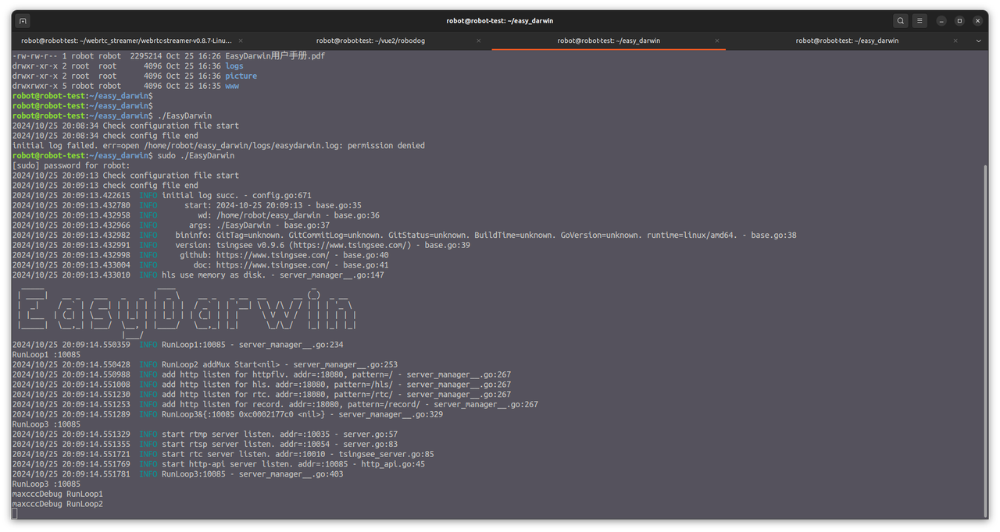
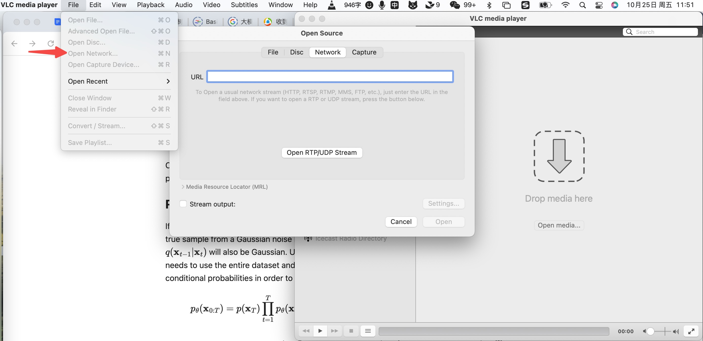
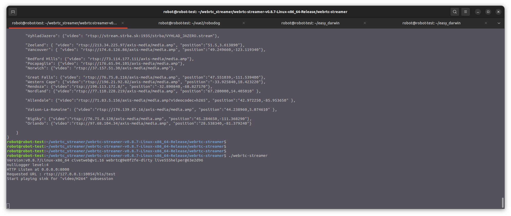
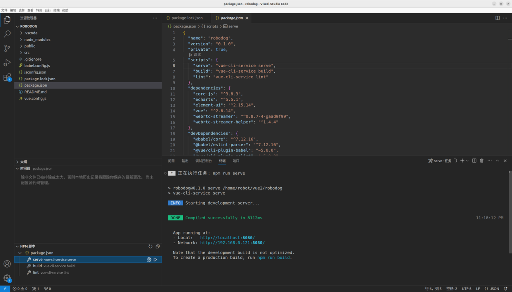

# Video streaming with Computer Webcam

   by Yujie Wang, Kan Deng, Yaoxuan Wang, Octo.26.2024

&nbsp;
--------------------------

##  1. Objectives

The objective of this article is an experiment, rather than a final product. In the experiment, we setup the communication channel from a computer's webcam to a website, to practice the related techniques. 

More specifically, the system consists of the following components, 

1. Running [ffmpeg](https://www.ffmpeg.org/) in a ubuntu CLI terminal, to push the video stream captured by the ubuntu computer's camera, to the server via RTSP protocol.

2. On the server side, an [EasyDarwin engine](https://www.easydarwin.org/p/easydarwin.html) collects the video stream from multiple robots via RTSP.
  
3. A [VLC media player](https://www.videolan.org/vlc/) pulls the video stream from the EasyDarwin engine, via RTSP protocol. 

4. A [WebRTC_streamer engine](https://github.com/mpromonet/webrtc-streamer) pulls the video stream from the EasyDarwin engine, the WebRTC_streamer also runs on the server side.

5. The WebRTC_streamer pushes the video stream to website, developed with VUE, via WebRTC protocol.

All the 5 components, ffmpeg, EasyDarwin, WebRTC-Streamer, VLC, and VUE website, run on one ubuntu computer for testing purpose.

&nbsp;
## 2. ffmpeg pushes video stream from webcam to EasyDarwin

### 2.1 Install ffmpeg
   
~~~
$ sudo add-apt-repository -y ppa:djcj/hybrid && sudo apt update && sudo apt install -y ffmpeg
~~~

### 2.2 Push video stream from webcam via RTSP

~~~
$ ffmpeg -f v4l2 -framerate 30 -video_size 640x480 -i /dev/video0 -vf scale=640:480 -c:v libx264 -c:a aac -f rtsp -rtsp_transport tcp rtsp://127.0.0.1:10054/hls/test
~~~

Notice, 

1. In ubuntu, the format of the webcam is `v4l2`.

2. `rtsp://127.0.0.1:10054` is the protocol and address of EasyDarwin engine, we will talk about it in more details later in this article.

The following screen snapshot shows the running result in a ubuntu CLI terminal,

&nbsp;
## 3. EasyDarwin collects video streams

Referring to [EasyDarwin's github repo](https://github.com/EasyDarwin/EasyDarwin), for installation and running. 

~~~
$ cd ~/easy_darwin/

$ sudo ./EasyDarwin
~~~

The following screen snapshot shows the running result in a ubuntu CLI terminal. 

Notice, the EasyDarwin engine listens to the RTSP at port 10054. 

&nbsp;
## 4. A VLC media player pulls the video stream from the EasyDarwin

Open VLC media player, and navigate to the setting of `open network`, type in 

~~~
rtsp://127.0.0.1:10054/hls/test
~~~

Notice, the protocol and address must be consistent with EasyDarwin, as well as ffmpeg's setting. 

So far, we have setup a communication channel, 

1. `ffmpeg` pushes the webcam video stream to an `EasyDarwin engine`.

2. A `VLC media player` pulls the video stream from the `EasyDarwin engine`.

The webcam video stream is displayed in the VLC player, shown in [the following video clip](https://www.youtube.com/watch?v=zmGPoJj8emc). 

Even though the video quality is good, the delay of the video stream is significant, possibly around 1 second. 

Click the following image to view the screen snapshot video clip, notice that in the video clip one cannot feel the delay. 

&nbsp;
## 5. A WebRTC_streamer engine pulls the video stream from the EasyDarwin engine

### 5.1 Install and test run webrtc-streamer

Referring to [webrtc-streamer github repo](https://github.com/mpromonet/webrtc-streamer), to download and install `webrtc-streamer`. 

We downloaded `webrtc-streamer-v0.8.7-Linux-x86_64-Release.tar.gz` for our ubuntu computer. 

No need to install the `webrtc-streamer`, instead, simply unzip the tar.gz file. 

~~~
$ tar -xvzf webrtc-streamer-v0.8.7-Linux-x86_64-Release.tar.gz
~~~

To test run it, execute the following command, after then visit `http://localhost:8000` in browser. 

~~~
$ cd ~/webrtc_streamer/webrtc-streamer-v0.8.7-Linux-x86_64-Release/webrtc-streamer

$ ./webrtc-streamer -C config.json
~~~

In the browser, we can see the webcam video streams from various cities in the world, as in [the following video clip](https://www.youtube.com/watch?v=LZmBpPczl98). 

Click the following image to view the screen snapshot video clip. 

### 5.2 Run webrtc-streamer to get the video stream from the EasyDarwin

To startup the webrtc-streamer engine, run the following command, 

~~~
$ cd ~/webrtc_streamer/webrtc-streamer-v0.8.7-Linux-x86_64-Release/webrtc-streamer

$ ./webrtc-streamer 
~~~

After starting up the webrtc-streamer, it seams to be able to automatically discover the video stream pushed from EasyDarwin, with this URL `rtsp://127.0.0.1:10054/hls/test`, shown in the following screensnap. 

However, in fact the webrtc-streamer engine doesn't automatically connect to the EasyDarwin engine, the magic is done by the VUE script that we will discuss in the next section. 

&nbsp;
## 6. A VUE website pulls the video stream from the WebRTC_streamer pushes 

### 6.1 Install VUE framework

Referring to [Node Version Manager (NVM) github repo](https://github.com/nvm-sh/nvm), to install NVM and NPM. 

Install VUE of the latest version,

~~~
$ npm install vue -g
~~~

Notice, no need to install `vue-cli` because it is deprecated. 

To run the VUE website, open the [`robodog/`](./S05E01_src/robodog) file folder in a VSCode IDE, then open `package.json` file, and click `serve` in the `NPM script` panel on the left side, shown in the following screen snapshot. 

### 6.2 The VUE website mounts the WebRTC-streamer

In the [`robodog/`](./S05E01_src/robodog) file folder, open [`VideoWebRtc.vue`](./S05E01_src/robodog/src/robodog/VideoWebRtc.vue) script. 

~~~
<template>
  <video
    id="video"
    controls
    autoplay
    muted
    width="100%"
    height="100%"
    style="object-fit: fill"
  ></video>
</template>

~~~

Notice, 

1. `camera_ip: "127.0.0.1:8000"` refers to the address of the webrtc-streamer.

2. `rtsp://127.0.0.1:10054/hls/test` is the EasyDarwin engine's address that ffmpeg pushes the video stream to. 

Now, in a browser visit the IP address of the VUE website, `http://localhost:8080`, we can view the video stream origined from `ffmpeg`. 

Click the following image to view the screen snapshot video clip. Notice, the quality of the video is quite bad, even though the delay is significantly shorter than VLC player. 

