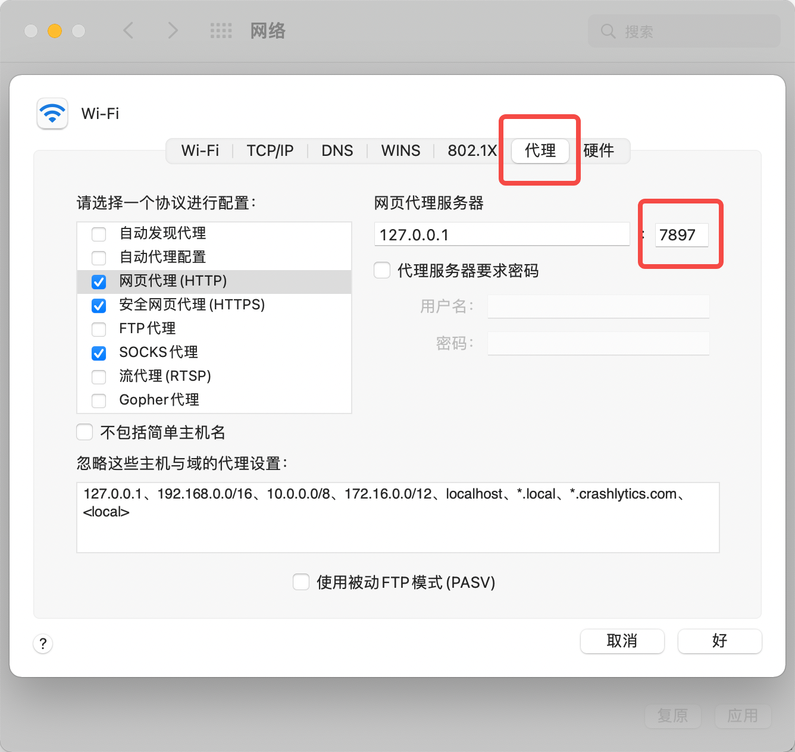
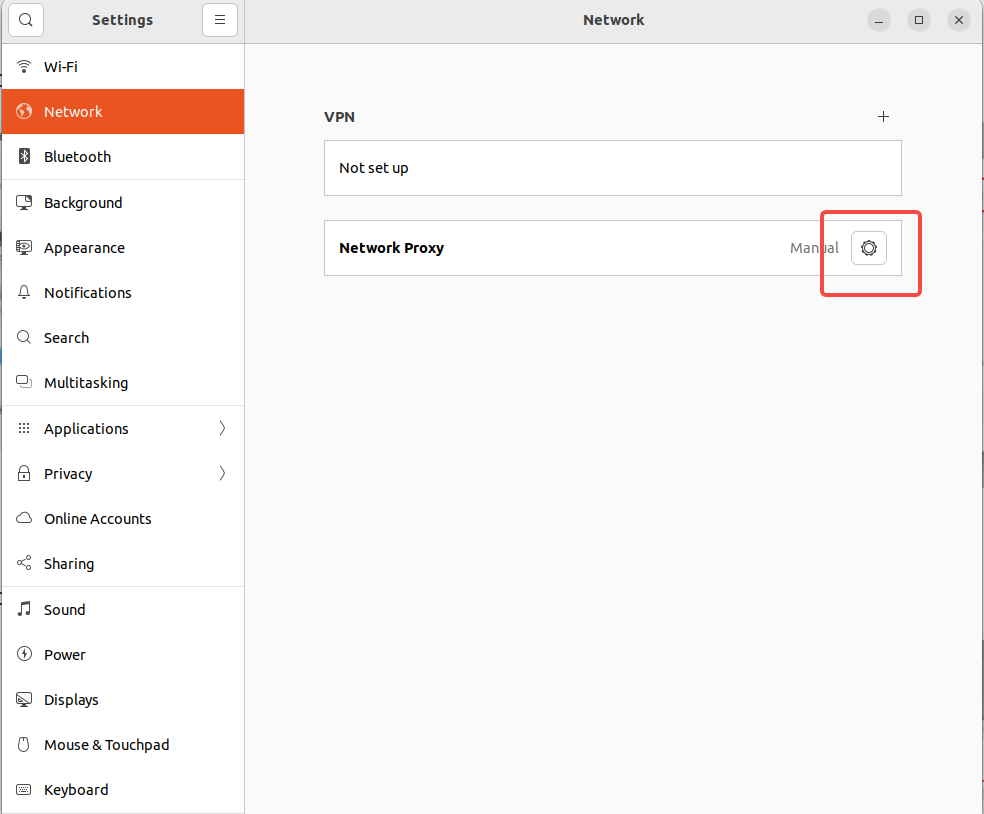
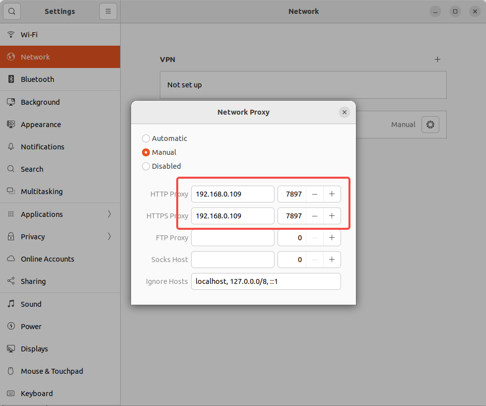
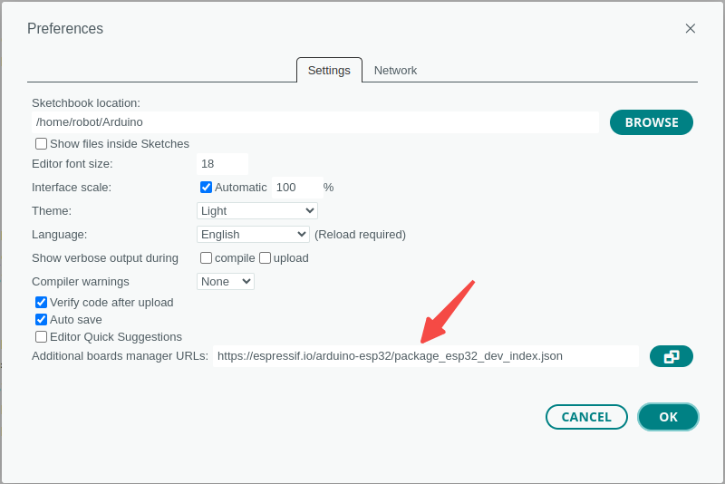
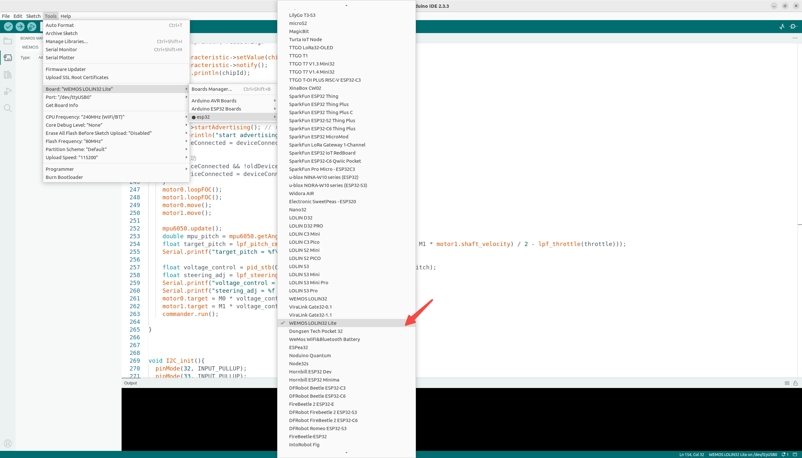
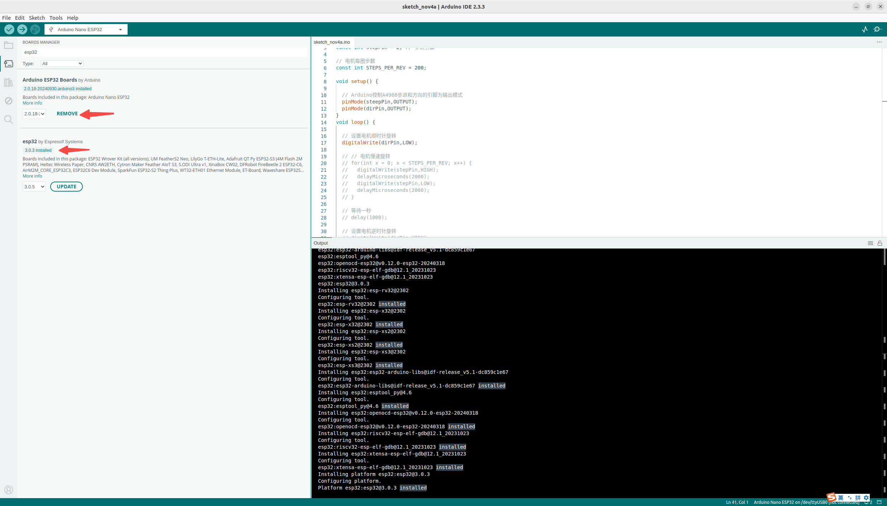
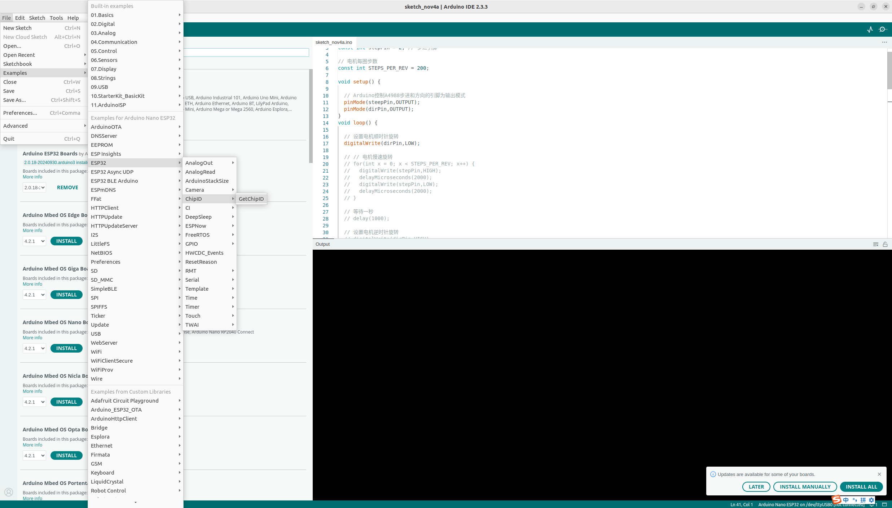
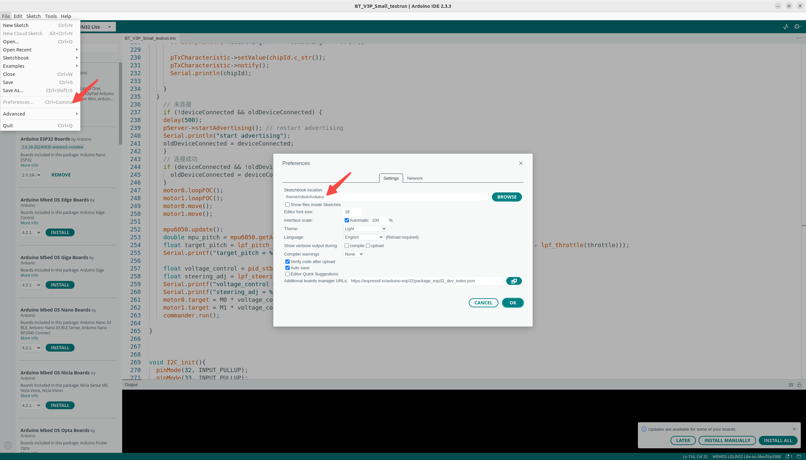
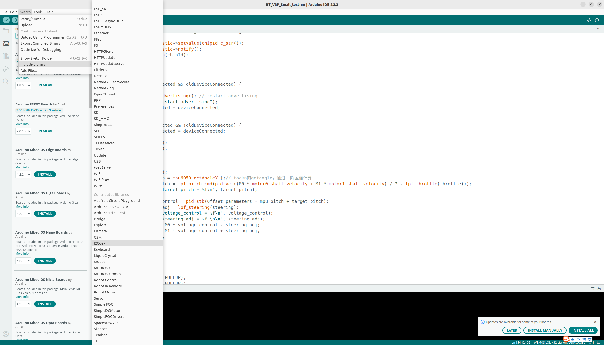

# Programming 2-wheel Balancing Bot

by Kan Deng, Yujie Wang, Yaoxuan Wang, Nov. 16, 2024

----------------------------------------------------------

## 1. Objectives

[Arduino SimpleFOCBalancer](https://github.com/simplefoc/Arduino-FOC-balancer) is an open source project that builds a two wheel balancing robot 
based on 2 BLDC motors, 1 [MPU6050 IMU](https://en.wikipedia.org/wiki/Inertial_measurement_unit), 1 ESP32 module for Bluetooth communication, 
and [SimpleFOC library](https://github.com/simplefoc).

[Balance_Bot_DengFOC](https://github.com/ToanTech/Balance_Bot_DengFOC) simplifies simpleFOC by focusing on a few selected chip modules and boards. 
In addition it provides more detailed tutorials and cheapers electrical and mechanical components. 

However [the source code of Balance_Bot_DengFOC](https://github.com/ToanTech/Balance_Bot_DengFOC/blob/main/DengFOC%20%E5%B9%B3%E8%A1%A1%E8%BD%A6%E7%A8%8B%E5%BA%8F/Wx_BlueToothBalancer/Wx_BlueToothBalancer.ino) is for windows. 
To migrate it from windows to ubuntu, there are a few technical challenges. 

This document records the steps we took to migrate `Balance_Bot_DengFOC` source code from windows to ubuntu. 

&nbsp;
## 2. Arduino libraries

To migrate `Balance_Bot_DengFOC` from windows to ubuntu, we have to manually install the related libraries in Arduino IDE.  

### 2.1 Network proxy

Before installing the libraries, we need to setup the network proxy, to make it convenient to download the libraries especially those resides in Github. 

The challenge is that there are only a few VPNs available for ubuntu, e.g. [lantern.io](https://lantern.io/), and they are not stable and quite slow for downloading. 

Our solution is to use two computer, one is Ubuntu, the other is either Macbook or Windows. 

#### 1. Find out the IP address and proxy port of the Macbook.

   In the CLI terminal, use `ifconfig` to find the IP address of the macbook. In our case, it is `192.168.0.118`

   ~~~
   $ ifconfig
     wlo1: flags=4163<UP,BROADCAST,RUNNING,MULTICAST>  mtu 1500
           inet 192.168.0.118  netmask 255.255.255.0  broadcast 192.168.0.255
           ...
   ~~~

   Open macbook's `System Preference`, navigate to `Network`, click `Advanced...` at the lower right corner, then select `proxy` tab, here you can find the proxy port.
   In our case, it is `7897`, shown in the following screen snapshot.

   

     
   

#### 2. Configure the proxy of the Ubuntu.

   Open ubuntu's `System Settings`, navigate to `Network`, and configure it using Macbook's IP address and proxy port, shown in the following screen snapshots.

   

     
     &nbsp;  
     
   

&nbsp;
### 2.2 ESP32

#### 1. Additional Board Manager URLs

Following [the official installation guide of ESP32](https://docs.espressif.com/projects/arduino-esp32/en/latest/installing.html), 
fill in the `Stable release link` in the `Additional Board Manager URLs` field in Arduino IDE's preference window.

After then, restart the Arduino IDE, you will see the various ESP32 boards listed in the Arduino IDE. 

   

     
     &nbsp;  
     
   

#### 2. Install ESP32 libraries

With different board, there are related libraries. To install ESP32 libraries, we selected `Arduino Nano ESP32` board. Then, we opened the `board manager` and search `esp32`. 

We installed the ESP32 libraries related to the `Arduino Nano ESP32` board, one by one. 

The latest version of `esp32` library is `3.0.5`, but for unknown reason, we failed to install `esp 3.0.5`. Hence, we installed an earlier version, `3.0.3`. 

To check the success of ESP32 library installation, we can open the examples, if successful, we will see many examples related to ESP32. 

   

     
     &nbsp;  
     
   

&nbsp;
### 2.3 I2CDev

[The I2C Device Library (i2cdevlib)](https://github.com/jrowberg/i2cdevlib) is a collection of libraries to provide simple and intuitive interfaces to I2C devices.

Following its installation guide, 

1. Find the Arduino IDE library file directory, by clicking Arduino IDE's `File` > `Preference`,

   then you will see the Arduino IDE library file directory in the Preference window.

   

     
   

   

2. We downloaded a .zip archive of [the I2C Device github repo](https://github.com/jrowberg/i2cdevlib).

3. Copied two relevant libraries, [I2CDev](https://github.com/jrowberg/i2cdevlib/tree/master/Arduino/I2Cdev) and [MPU6050](https://github.com/jrowberg/i2cdevlib/tree/master/Arduino/MPU6050), into our Arduino IDE library subfolder.

   ~~~
   $ cd /home/robot/Software/
   $ unzip i2cdevlib-master.zip
   $ cd /home/robot/Software/i2cdevlib-master/Arduino

   $ cp -r I2Cdev/  /home/robot/Arduino/libraries/.
   $ cp -r MPU6050 /home/robot/Arduino/libraries/.
   $ ls /home/robot/Arduino/libraries/
     Adafruit_Circuit_Playground  Bridge    Firmata  Keyboard       MPU6050        RobotIRremote  Servo          SimpleFOCDrivers  Temboo
     Arduino_ESP32_OTA            Esplora   GSM      LiquidCrystal  MPU6050_tockn  Robot_Motor    SimpleDCMotor  SpacebrewYun      TFT
     ArduinoHttpClient            Ethernet  I2Cdev   Mouse          Robot_Control  SD             Simple_FOC     Stepper
   ~~~

4. Restart Arduino IDE, then we will see those two I2C libraries. 

   

     
   

   

&nbsp;
### 2.4 MPU6050_tockn

&nbsp;
### 2.5 SimpleFOC
