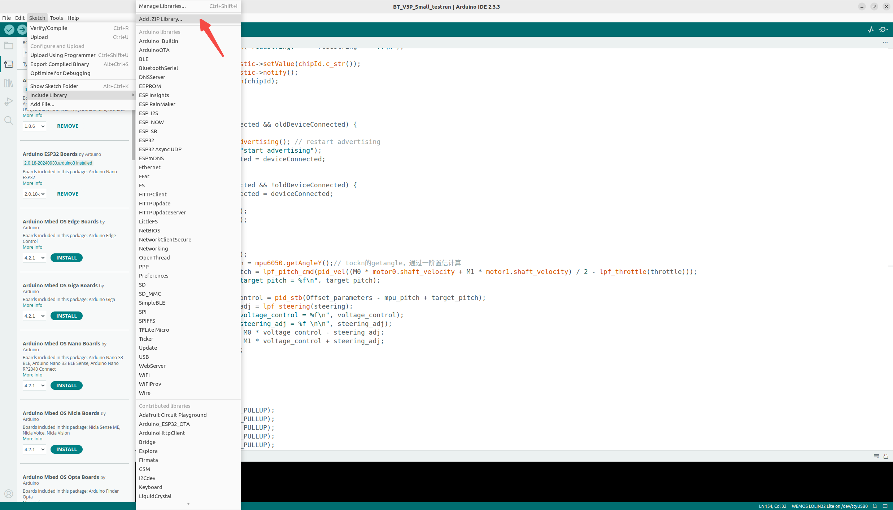
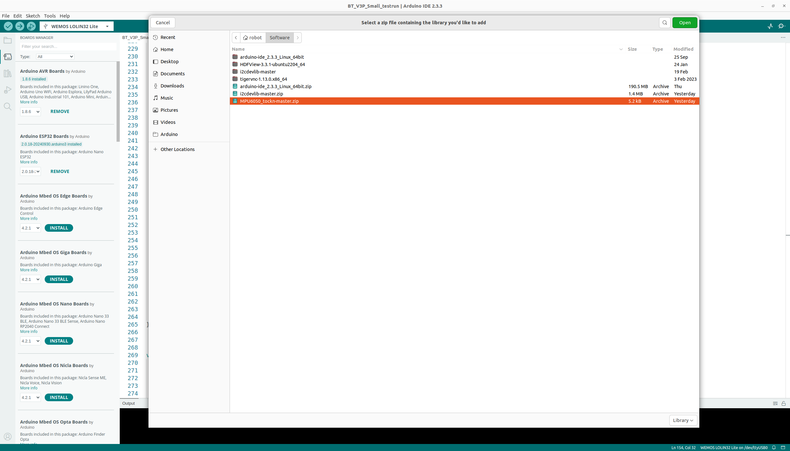
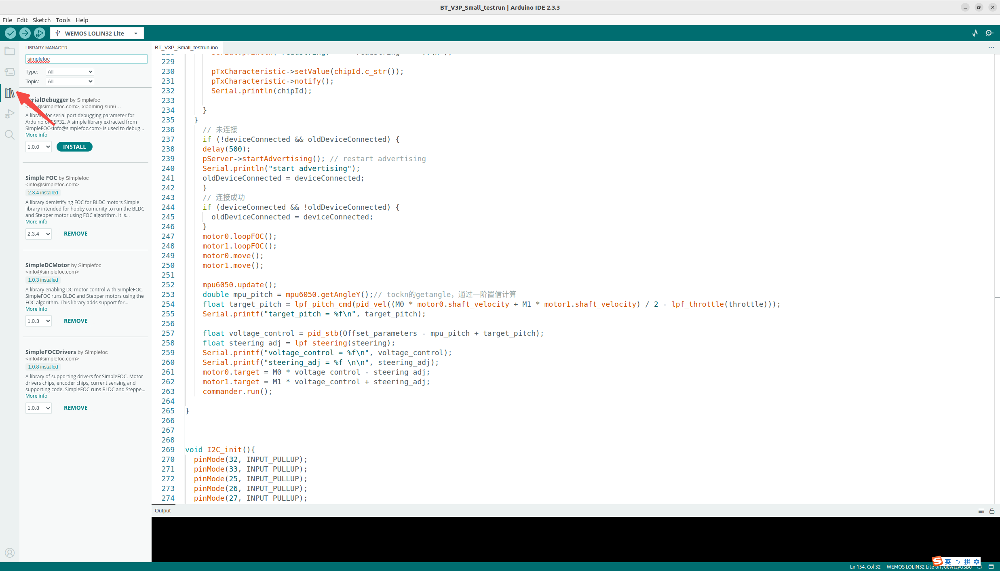
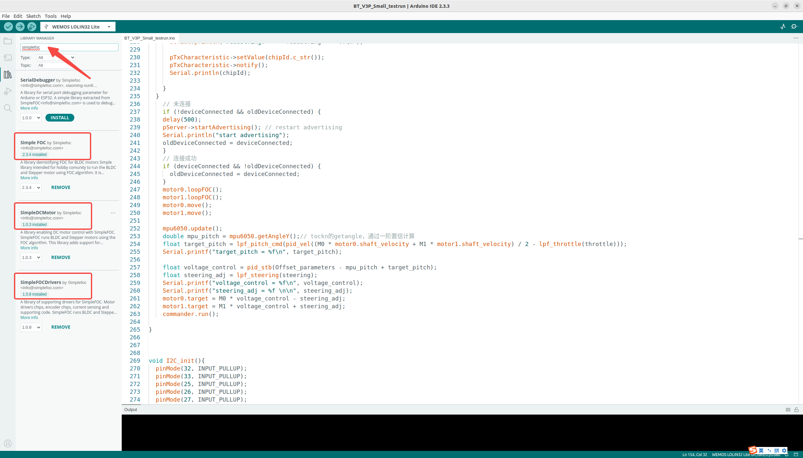
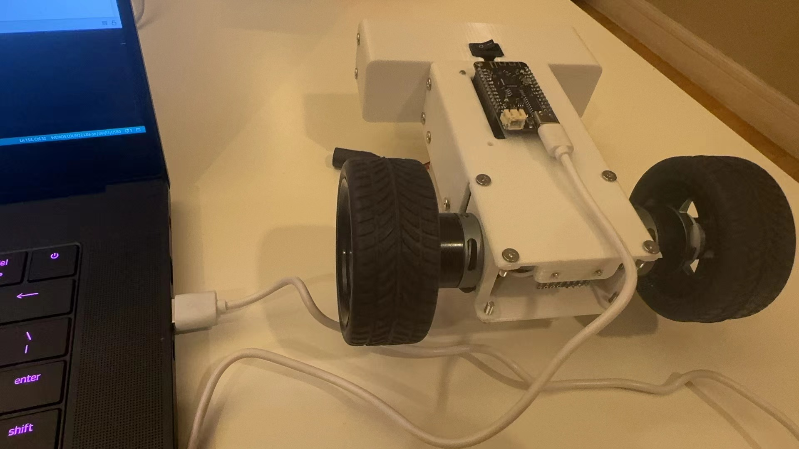
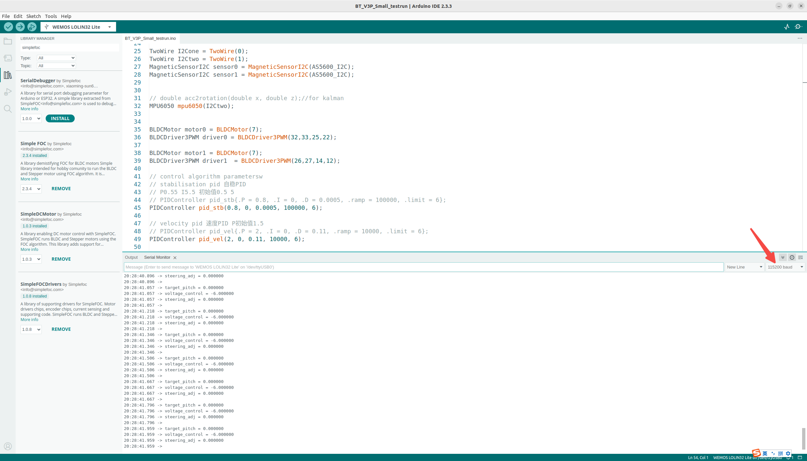

# Programming 2-wheel Balancing Bot

by Kan Deng, Yujie Wang, Yaoxuan Wang, Nov. 18, 2024

----------------------------------------------------------

## 1. Objectives

[Arduino SimpleFOCBalancer](https://github.com/simplefoc/Arduino-FOC-balancer) is an open source project that builds a two wheel balancing robot 
based on 2 BLDC motors, 1 [MPU6050 IMU](https://en.wikipedia.org/wiki/Inertial_measurement_unit), 1 ESP32 module for Bluetooth communication, 
and [SimpleFOC library](https://github.com/simplefoc).

[Balance_Bot_DengFOC](https://github.com/ToanTech/Balance_Bot_DengFOC) simplifies simpleFOC by focusing on a few selected chip modules and boards. 
In addition it provides more detailed tutorials and cheapers electrical and mechanical components. 

However [the source code of Balance_Bot_DengFOC](https://github.com/ToanTech/Balance_Bot_DengFOC/blob/main/DengFOC%20%E5%B9%B3%E8%A1%A1%E8%BD%A6%E7%A8%8B%E5%BA%8F/Wx_BlueToothBalancer/Wx_BlueToothBalancer.ino) is for windows. 
To migrate it from windows to ubuntu, there are a few technical challenges. 

This document records the steps we took to migrate `Balance_Bot_DengFOC` source code from windows to ubuntu. 

&nbsp;
## 2. Arduino libraries

To migrate `Balance_Bot_DengFOC` from windows to ubuntu, we have to manually install the related libraries in Arduino IDE.  

### 2.1 Network proxy

Before installing the libraries, we need to setup the network proxy, to make it convenient to download the libraries especially those resides in Github. 

The challenge is that there are only a few VPNs available for ubuntu, e.g. [lantern.io](https://lantern.io/), and they are not stable and quite slow for downloading. 

Our solution is to use two computer, one is Ubuntu, the other is either Macbook or Windows. 

#### 1. Find out the IP address and proxy port of the Macbook.

   In the CLI terminal, use `ifconfig` to find the IP address of the macbook. In our case, it is `192.168.0.118`

   ~~~
   $ ifconfig
     wlo1: flags=4163<UP,BROADCAST,RUNNING,MULTICAST>  mtu 1500
           inet 192.168.0.118  netmask 255.255.255.0  broadcast 192.168.0.255
           ...
   ~~~

   Open macbook's `System Preference`, navigate to `Network`, click `Advanced...` at the lower right corner, then select `proxy` tab, here you can find the proxy port.
   In our case, it is `7897`, shown in the following screen snapshot.

   

     
   

#### 2. Configure the proxy of the Ubuntu.

   Open ubuntu's `System Settings`, navigate to `Network`, and configure it using Macbook's IP address and proxy port, shown in the following screen snapshots.

   

     
     &nbsp;  
     
   

&nbsp;
### 2.2 ESP32

#### 1. Additional Board Manager URLs

Following [the official installation guide of ESP32](https://docs.espressif.com/projects/arduino-esp32/en/latest/installing.html), 
fill in the `Stable release link` in the `Additional Board Manager URLs` field in Arduino IDE's preference window.

After then, restart the Arduino IDE, you will see the various ESP32 boards listed in the Arduino IDE. 

   

     
     &nbsp;  
     
   

#### 2. Install ESP32 libraries

With different board, there are related libraries. To install ESP32 libraries, we selected `Arduino Nano ESP32` board. Then, we opened the `board manager` and search `esp32`. 

We installed the ESP32 libraries related to the `Arduino Nano ESP32` board, one by one. 

The latest version of `esp32` library is `3.0.5`, but for unknown reason, we failed to install `esp 3.0.5`. Hence, we installed an earlier version, `3.0.3`. 

To check the success of ESP32 library installation, we can open the examples, if successful, we will see many examples related to ESP32. 

   

     
     &nbsp;  
     
   

&nbsp;
### 2.3 I2CDev

[The I2C Device Library (i2cdevlib)](https://github.com/jrowberg/i2cdevlib) is a collection of libraries to provide simple and intuitive interfaces to I2C devices.

Following its installation guide, 

1. Find the Arduino IDE library file directory, by clicking Arduino IDE's `File` > `Preference`,

   then you will see the Arduino IDE library file directory in the Preference window.

   

     
   

   

2. We downloaded a .zip archive of [the I2C Device github repo](https://github.com/jrowberg/i2cdevlib).

3. Copied two relevant libraries, [I2CDev](https://github.com/jrowberg/i2cdevlib/tree/master/Arduino/I2Cdev) and [MPU6050](https://github.com/jrowberg/i2cdevlib/tree/master/Arduino/MPU6050), into our Arduino IDE library subfolder.

   ~~~
   $ cd /home/robot/Software/
   $ unzip i2cdevlib-master.zip
   $ cd /home/robot/Software/i2cdevlib-master/Arduino

   $ cp -r I2Cdev/  /home/robot/Arduino/libraries/.
   $ cp -r MPU6050 /home/robot/Arduino/libraries/.
   $ ls /home/robot/Arduino/libraries/
     Adafruit_Circuit_Playground  Bridge    Firmata  Keyboard       MPU6050        RobotIRremote  Servo          SimpleFOCDrivers  Temboo
     Arduino_ESP32_OTA            Esplora   GSM      LiquidCrystal  MPU6050_tockn  Robot_Motor    SimpleDCMotor  SpacebrewYun      TFT
     ArduinoHttpClient            Ethernet  I2Cdev   Mouse          Robot_Control  SD             Simple_FOC     Stepper
   ~~~

   Notice that we may not need `MPU6050` library, but it doesn't hurt to install redundant libraries. 

4. Restart Arduino IDE, then we will see those two I2C libraries. 

   

     
   

   

&nbsp;
### 2.4 MPU6050_tockn

1. Download a .zip archive of [the MPU6050_tockn's github repo](https://github.com/tockn/MPU6050_tockn)

2. Open Arduino IDE, and click `Sketch` > `Include Library` > `Add .ZIP Library`, then select the downloaded `MPU6050_tockn-master.zip` github archive.

   

     
     &nbsp; 
     
   

3. Restart Arduino IDE, then we will see the `MPU6050_tockn` library. 

&nbsp;
### 2.5 SimpleFOC

Following [the SimpleFOC official installation guide](https://docs.simplefoc.com/library_download), 

1. Click the `library` icon on the left side bar on the Arduino IDE.

2. Search for `simplefoc`, and install the latest versions of `Simple FOC`, `SimpleDCMotor`, and `SimpleFOCDrivers`.

   

     
     &nbsp; 
     
   
   

&nbsp;
## 3. Software

### 3.1 System architecture

The original source code is provided by [Balance_Bot_DengFOC](https://github.com/ToanTech/Balance_Bot_DengFOC) as an open source project. 

We rebuilt the original code to be a system consisting of 3 tiers, up_tier, core_tier and down_tier.

1. The up_tier provides shareable services for various robots.

   For example, the up_tier will provide wifi communication, pushing the video captured by the balancing bot's camera to the remote streaming server, and receiving commands from the remote supervisor server. 

2. The down_tier provide specific services for specific robots.

   The down_tier handles motion control, motion status collection, sensor data collection, video capture, and audio playing services.

3. The core_tier behaves as an workflow and dataflow organizer, to make the up_tier and the down_tier working together.

The objectives to split the system into up-core-down tiers, are that, 

1. We will use reinforcement learning to make the robot smarter. In order to make it more convenient to use reinforcement learning, we will ask

   * the down_tier to handle `obs = get_observation()`,
     
   * the up_tier to handle `cmd = receive_command()`,
     
   * the core_tier to handle `action = policy(obs, cmd)`,
     
   * finally the down_tier to handle `step(action)`

2. Make it easy for the engineers to maintain the source code for various robots. 
  
3. Make it easy to integrate more peripherals, like camera etc.

4. Make it easy to collaborate with the remote AI large models to do visual navigation etc.

5. Make it easy for the remote supervisor server to orchestrate hundreds and thousands robots to work together.

   The supervisor only needs to send command to the up_tier, and be agnostic to the core_tier and down_tier of the heterogeneous robots.

### 3.2 Source code

This repo contains our source codes, that are openned and no charge for all purpose, including business. 

1. The [balancing_bot.h](./S06E01_src/robot_gateway/balancing_bot.h) and [balancing_bot.cpp](./S06E01_src/robot_gateway/balancing_bot.cpp) are for the down_tier. 

   It controls the motor motion, collects the pitch、yaw and roll angles of the robot body from the IMU, and collects motor velocities from the motor sensors, etc. 

2. The [robot_gateway.ino](./S06E01_src/robot_gateway/robot_gateway.ino) is the core_tier,

   It takes charge of the reinforcement learning loop, including `get_observation()`, `receive_command()`, `policy()`, and `step()`.

3. The up_tier is not yet implemented.

Notice that,

1. Since Arduino doesn't support subfolder file structure stably, we store all the source codes in one file folder.

2. For the time being, the `action = policy(obs, cmd)` doesn't involve complex input, like video analysis.

   To keep simple, we implement `action = policy(obs, cmd)` in the down_tier in the down_tier. 

3. The original source code provided by [Balance_Bot_DengFOC](https://github.com/ToanTech/Balance_Bot_DengFOC), has been modified to be compilable in our environment.

   The modified original code is also uploaded to this repo, referring to [balancing_bot.ino](./S06E01_src/balancing_bot.ino).

&nbsp;
## 4. Electronics assembly

We used a white USB cable connecting our ubuntu computer to the ESP32 module, referring to the white cable in the left image below. 

Inside the white box, there is a board similar to Arduino, that is self-made by the author of [Balance_Bot_DengFOC](https://github.com/ToanTech/Balance_Bot_DengFOC). 

More specifically, the ESP32 module is `WEMOS LOLIN32 Lite`. It is used as a shield on top of DengFOC board. 

Therefore, even though we only connect to the ESP32 module, but also we can access the underneath DengFOC board. 

   

     
     &nbsp; 
     
   
  

More details of the electronics assembly refers to [the github repo of DengFOC](https://github.com/ToanTech/Balance_Bot_DengFOC), 
which provides a step-by-step guide for the assembly. 

&nbsp;
## 5. Loading from Arduino IDE

After connecting our ubuntu computer, where an Arduino IDE is running, to the balancing bot using a USB cable, now it is time to the load our source code to the bot. 

One detail is that the baud rate must be `115200`, because in the source code, we set the Serial to be with `115200` baud rate. 

~~~
void setup(){
    Serial.begin(115200);
~~~

   

     
   
  

&nbsp;
## 6 Demo video

Click the following image and display a video hosted in Youtube. 

   

