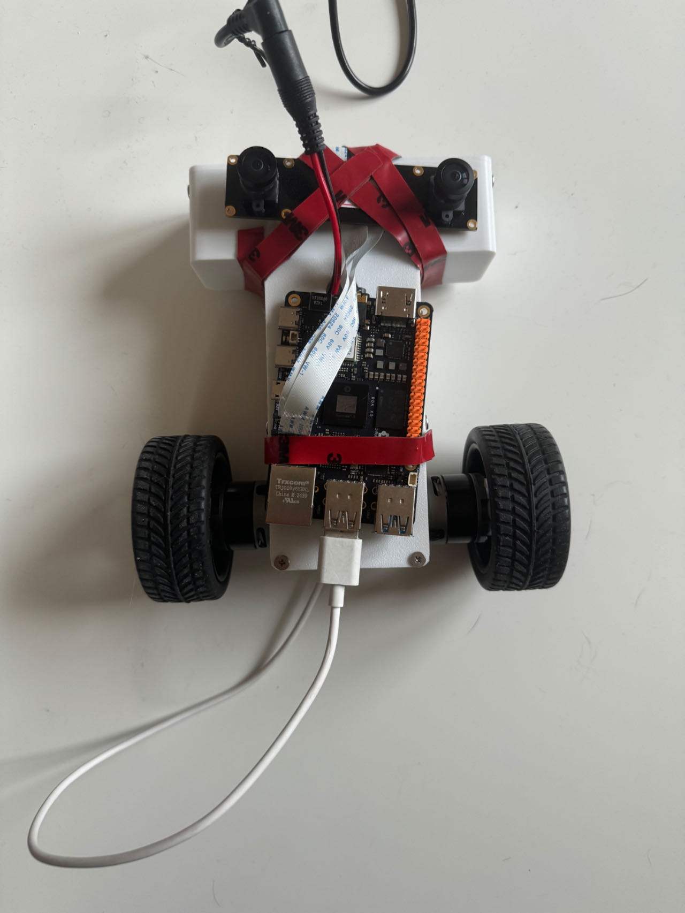
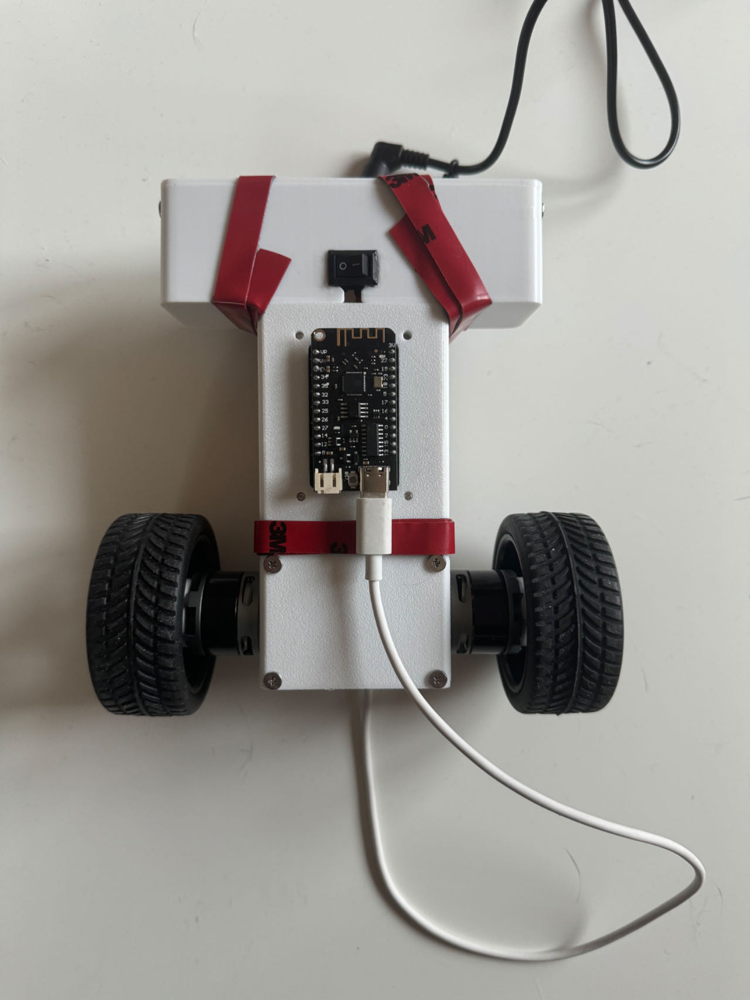
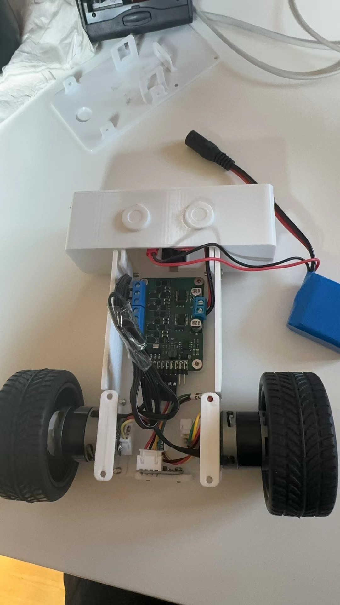
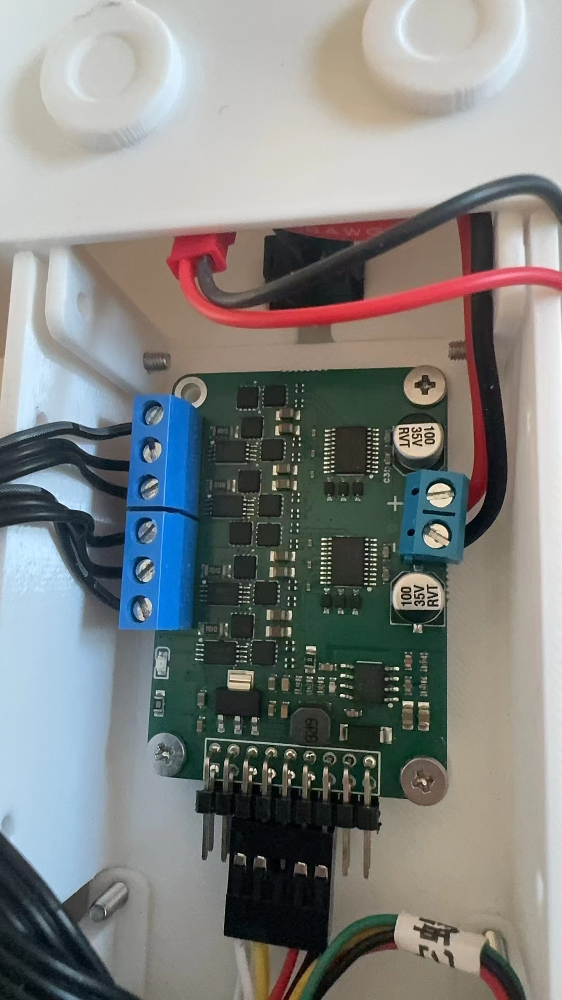
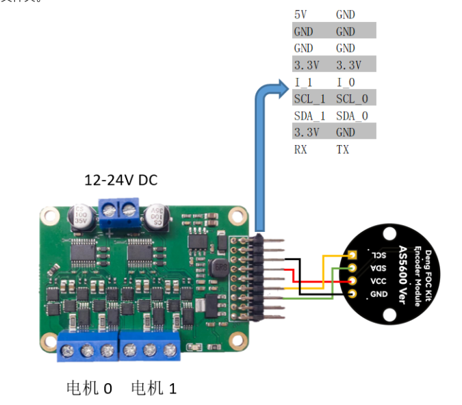

# Serial Communication between Arduino and Python

              by Kan Deng, Nov 25, 2024

-------------------

## 1. Objectives

We want to integrate [D-Robotics' RDK-X5 board](https://developer.d-robotics.cc/rdk_doc/Quick_start/hardware_introduction/rdk_x5) 
with [DengFOC driver board](https://github.com/ToanTech/Deng-s-foc-controller) for Brushless DC Electric Motors (BLDC) 
in [a simple balancing bot](https://github.com/ToanTech/Balance_Bot_DengFOC). 

   

     
     &nbsp;  
     
   

In more detail, 

1. The balancing bot has two 2204 brushless motors, two AS5600 motor sensors, one MPU6050 IMU sensor.
   These motors and sensors are controlled by a DengFOC driver board, which is installed inside the white box.

3. [A ESP32 (wemos lolin32 lite) module](https://mischianti.org/esp32-wemos-lolin32-lite-high-resolution-pinout-and-specs/) is connected to the DengFOC driver board.

    The ESP32 takes charge of running Arduino codes, control the DengFOC driver, and communicating with a RDK-X5 board.
    It exposes its USB port on the backside of the balancing bot, and its pins are plugging into the DengFOC driver board inside the white box. 

4. A RDK-X5 board is assembled on the frontside of the balancing bot, and is connected to a RDK binocular camera on the top of the bot. 

5. RDK-X5 board behaves like an organizer, it receives the video stream captured by the RDK's camera,
   and pushes to the remote [SRS streaming server](https://ossrs.io/lts/en-us/docs/v6/doc/getting-started).

6. RDK-X5 uses AI large model to analyze the video stream, and recognize the environment for navigation.

   RDK-X5 receives the speeds of the motors, the pose of the balancing bot, from the ESP32 module and DengFOC driver board.
   
   Taking the environmental analysis result and the motion status of the balancing bot as inputs,
   the RDK-X5 runs a policy model to output the command, which usually consists of speed, steering angle etc. 

In order to empower the RDK-X5 to receive motion status from the ESP32, and send command back to them, 
we need to implement a communication channel between the RDK-X5 board and the ESP32 module. 

Since both the RDK-X5 board and the ESP32 module have wifi and bluetooth, wireless communication is one option. 

Another option is to use cable, especially for serial communication. 

Look into the pinouts of [the ESP32 wemos lolin32 lite module](https://mischianti.org/esp32-wemos-lolin32-lite-high-resolution-pinout-and-specs/) and [the RDK-X5 board](https://archive.d-robotics.cc/downloads/hardware/rdk_x5/RDK_X5_Product_Brief_V1.0.pdf), UART, I2C, and SPI are all candidate solutions. 

   

     
     &nbsp;  
     
   

In this article, we implemented UART serial communication, sending and receiving JSON messages. 

&nbsp;
## 2. Hardware assembly

Take a look inside the balancing bot, where the DengFOC driver board is installed. 
The DengFOC driver board is used as a shield of the ESP32 module, 
so that all the pins of ESP32 module are plugged into DengFOC driver board, and not available for other usage. 

   

     
     &nbsp;  
     
   

Now that we cannot connect the RDK-X5 board to ESP32 module, how about connecting RDK-X5 to the DengFOC driver board? 
The DengFOC driver board has a few pins for external communication, 
but they are used for [the I2C connection for the AS5600 motor sensors](https://github.com/ToanTech/Balance_Bot_DengFOC). 
Therefore, it is not feasible to connect the RDK-X5 board to DengFOC driver board. 

   

     
   

If we want to use cable to connect the RDK-X5 board to the ESP32 module, 
and don't want to change the hardware structure of the balancing bot, the only candidate solution is to use USB cable. 

However, since there is only one USB port in the ESP32 module, it must be the `/dev/ttyUSB0`, 
which is usually reserved for testing purpose. 
What will happen if we use `/dev/ttyUSB0` for the serial communication, for production? 

&nbsp;
## 3. Source code

Suppose we use a USB cable to connect the RDK-X5 board with the ESP32 module, how can we send and receive JSON messages between them?

### 3.1 Related work

1. An engineer of the D-Robotics, the manufacturer of the RDK-X5 board,
   wrote [a blog on the serial communication between RDK-X3 and ESP32 module](https://blog.csdn.net/SA2672873269/article/details/136834623).

   He used RDK-X3's pin 8 and pin 10 for UART serial communication, corresponding to `/dev/ttyS3`.
   Although he successfully sent and received bytes between the RDK-X3 board and the ESP32 module,
   he didn't parse the bytes into data structures like `str` and `dict` etc.

2. There is [a popular tutorial on how to parse the bytes of serial communication](https://forum.arduino.cc/t/serial-input-basics-updated/382007).
   However, it is quite time-consuming to implement a serial communication parser from scratch.

3. [`SerialTransfer`](https://github.com/PowerBroker2/SerialTransfer) and [`pySerialTransfer`](https://github.com/PowerBroker2/pySerialTransfer) is sibling open projects
   to provide parsers for the serial communication on both Arduino side and python side.

   The libraries support multiple serial communcation, including UART, I2C and SPI.

   The libraries work quite well to send and receive simple messages, like float and string. But they doesn't behave correctly when exchanging JSON messages. 

4. [`ArduinoJson`](https://github.com/bblanchon/ArduinoJson) is an open source project,
   to provide powerful and easy-to-use library for JSON serialization and deserialization on Arduino board.

   One solution to work around the pitfall of `SerialTransfer`,
   is to use `ArduinoJson` to serialize JSON into string before sending message,
   and use `ArduinoJson` again to deserialize string into JSON when receiving message.
   

### 3.2 Source code

&nbsp;
## 4. Run and results

