# Anatomy of a Wheel-legged Robot

# 1. Objectives

[Stack-force bipedal wheeled robot](https://gitee.com/StackForce/bipedal_wheeled_robot) is a particially open-sourced project, 
that provides tutorials on the principles, and some source codes. However, it wraps up some lower-level source codes into a library. 

This article dives into the source codes and the related documents of Stack-force bipedal, to get better understanding of this project. 

The top level principle of a wheel-legged robot is quite simple, it uses an [inertial measurement unit (IMU)](https://en.wikipedia.org/wiki/Inertial_measurement_unit) chip 
to get the pose of the robot, including the roll, pitch, and yaw angles, in addition to the forces on x-y-z axes. 
Based on the pose, the robot controls the wheel to move forward, backforward, and make turns, 
controls the legs to stretch and fold, so as to keep the robot standing or moving with balance. 

Therefore, the key to understanding a wheel-legged robot, is to understand how to get robot pose information from IMU, 
to control the motors of the wheels, and to control the servos of legs. 

In details, [Stack-force bipedal wheeled robot](https://gitee.com/StackForce/bipedal_wheeled_robot) uses,

1. Two stack-force self-made BLDC motors, `DengFOC 2208`.

   The two motors are linked to a Stack-force self-made low-power BLDC motor driver board. 
    Their speeds, positions/angles, and torques/currents can be controlled.

2. One `INA240A2` motor current sensor chip.

   The sensor chip is embedded in the Stack-force self-made low-power BLDC motor driver board. 

3. Two `MT6701` motor position sensor modules.

   One `MT6701` sensor for one `DengFOC 2208` motor, they are one-to-one bundled together.

   The two `MT6701` sensors are linked to a Stack-force self-made master control board,
   via [SPI serial communication](https://en.wikipedia.org/wiki/Serial_Peripheral_Interface).

4. Four `DS041MG` servos.

   The four `DS041MG` servos control the four legs.

   They are linked to a Stack-force self-made servo and IMU board, via [I2C serial communication](https://en.wikipedia.org/wiki/I%C2%B2C).

5. One `MPU6050` IMU chip.

   The `MPU6050` IMU chip is embedded in the Stack-force self-made servo and IMU board.

6. Three Stack-force self-made boards.

   A low-power BLDC motor driver board, a master control board, and a servo and IMU board.
   They are stacked together from bottom to top, in the way of Arduino shields.

   The master control board contains two ESP32 chips, `S1` and `S3`.
   `S1` is in charge of controlling the motors, and `S3` for servos and the IMU.

7. Kinematical motion control.

   After collecting robot pose and motion information from `MPU6050` IMU chip, `MT6701` motor position sensor, and `INA240A2` motor current sensor, 
   the robot software system uses algorithms, including inverse kinematics,
   to control the motors and servos, to make the robot moving and keep balance.  

In addition, the Stack-force wheel-legged robot also contains a wireless controller and its receiver module. 
But in this article, we will not discuss the wireless controller and its receiver in details.

# 2. BLDC motors

## 2.1 SimpleFOC motor control code

[Stack-force](https://stackforce.cc/), as known as DengFOC, is based on [the open-source project SimpleFOC](https://docs.simplefoc.com/). 

Following is a sample code from [SimpleFOC official tutorial](https://docs.simplefoc.com/code#step-9-getting-started-step-by-step-guide). 
The content is how to control the BLDC motors with SimpleFOC library. 

~~~
#include <SimpleFOC.h>

// magnetic position sensor instance - SPI
MagneticSensorSPI sensor = MagneticSensorSPI(AS5147_SPI, 10);

// BLDC motor & driver instance
BLDCMotor motor = BLDCMotor(11);
BLDCDriver3PWM driver = BLDCDriver3PWM(9, 5, 6, 8);

// external commander interface, for wireless controller.
// Commander command = Commander(Serial);
// void onMotor(char* cmd){ command.motor(&motor, cmd); }

void setup() {
  // monitoring port
  Serial.begin(115200);
  
  // enable the debugging output
  // SimpleFOCDebug::enable(&Serial);

  // initialise magnetic position sensor hardware
  sensor.init();
  // link the motor to the position sensor
  motor.linkSensor(&sensor);
  
  // driver config
  // power supply voltage [V]
  driver.voltage_power_supply = 12;
  driver.init();
  // link driver
  motor.linkDriver(&driver);
  
  // set control loop type to be used
  motor.controller = MotionControlType::torque;  
  
  // contoller configuration based on the control type 
  motor.PID_velocity.P = 0.2;
  motor.PID_velocity.I = 20;
  motor.PID_velocity.D = 0;
  // default voltage_power_supply
  motor.voltage_limit = 12;  
  
  // velocity low pass filtering time constant
  motor.LPF_velocity.Tf = 0.01;
  
  // angle loop controller
  motor.P_angle.P = 20;
  // angle loop velocity limit
  motor.velocity_limit = 50;  
  
  // use monitoring with serial for motor init
  // comment out if not needed
  // motor.useMonitoring(Serial);
  
  // initialise motor
  motor.init();
  // align encoder and start FOC
  motor.initFOC();  
  
  // set the inital target value
  motor.target = 2;
  // define the motor id
  // command.add('A', onMotor, "motor");
  // Run user commands to configure and the motor
  // (find the full command list in docs.simplefoc.com)
  Serial.println(F("Motor commands sketch | Initial motion control > torque/voltage : target 2V."));
  
  _delay(1000); 
}

void loop() {
  // iterative setting of the FOC phase voltage
  motor.loopFOC();   
  
  // iterative function setting the outter loop target
  // velocity, position or voltage
  // if target not set in parameter uses motor.target variable
  motor.move();
  
  // user communication
  //command.run();
}  
~~~

As a summary of the SimpleFOC's official tutorial, 
we developers should take the following steps to control the BLDC motors with SimpleFOC library. 

1. Setup BLDC motors.
2. Setup BLDC motor driver, and link the driver to the motors.
3. Setup position sensors, and link the position sensors to the motors.
4. Setup current sensors, and link the current sensors to the motors.
5. Align the motor and sensors, by calling `motor.initFOC()`.
6. Run the loop,
  
   The loop usually consists of
  `motor.loopFOC()` for FOC algorithm execution,
   and `motor.move(target)` for motion control.

&nbsp;
## 2.2 Stack-force BLDC motor control code

Following source code is copied and pasted from [Stack-force toolkit for motor calibration](./S06E03_src/dengfoc_bipedal_bot/BLDC_Control/src/main.cpp). 

~~~
#include <Arduino.h>
#include <SPI.h>
#include <Wire.h>
#include <EEPROM.h>
#include "SF_Motor.h"
#include "SF_Communication.h"
#include "Pins_Specify.h"

//串口发送的

SPIClass vspi(VSPI);//如果用到MT6701编码器，采用的SPI通信，需要实例化SPI总线
TwoWire iic0 = TwoWire(0);//如果是AS5600编码器，采用IIC通信，双电机控制需要实例化两条IIC总线
TwoWire iic1 = TwoWire(1);

SF_Motor M0 = SF_Motor(0);//实例化电机类
SF_Motor M1 = SF_Motor(1);

SF_Communication com = SF_Communication();//实例化通信接口

float Vbus = 12.0;//设置供电电压值
float alignVoltage = 3;//电机-编码器校准时的电压值

void setup()
{
    Serial.begin(115200);
    com.linkMotor(M0, M1); // 链接电机和通信接口 可以选一个或两个
    com.init(ONBOARD); //选择通信的输出 USB:通过USB输出；ONBOARD:与扩展主控通信。
    // com.init(USB);

    //为AS5600编码器的初始化
    // iic0.begin(AS5600_SDA0, AS5600_SCL0, 400000UL);
    // iic1.begin(AS5600_SDA1, AS5600_SCL1, 400000UL);
    // M0.initEncoder(AS5600,iic0);
    // M1.initEncoder(AS5600,iic1);
    //为MT6701编码器的初始化
    vspi.begin(MT6701_CLK, MT6701_DO, 0, -1);
    M0.initEncoder(MT6701, vspi);
    M1.initEncoder(MT6701, vspi);

    //电机初始化，传入电压值
    M0.init(Vbus);
    M1.init(Vbus);
    //电机-编码器的校准，传入校准时的电压值
    M0.AlignSensor(alignVoltage);
    M1.AlignSensor(alignVoltage);

    //通信端口开启持续的电机状态输出
    com.start();

    //设置相关的PID值 传入参数为P、I、D、Limit值
    M0.setAnglePID(0.5, 0, 0, 6);
    M0.setVelPID(0.05, 0.005, 0, 6);
    M0.setCurrentPID(1.2,0,0,0);

    M1.setAnglePID(0.5, 0, 0, 6);
    M1.setVelPID(0.05, 0.005, 0, 6);
    M1.setCurrentPID(1.2,0,0,0);
    
}

uint32_t now_time = 0;
uint32_t last_time = 0;

void loop()
{
  //电机的循环控制执行
  M0.run();
  M1.run();
  

  //设置电机的控制方式示例,当然也可以通过串口控制
  M0.setTorque(1);
  M1.setTorque(1);
  M0.setForceAngle(0);
  M1.setForceAngle(0);
  
  M0.setVelocity(10);
  M1.setVelocity(10);
}
~~~

Comparing Stack-force's motor control with SimpleFOC's, 

1. Setup BLDC motors.
   
   *Both are the same.*
   
2. Setup BLDC motor driver, and link the driver to the motors.
   
   *Stack-force doesn't setup the driver explicitly, maybe the driver is embedded inside Stack-force's library.*
   
3. Setup position sensors, and link the position sensors to the motors.
   
   *Both are the same.*
   
4. Setup current sensors, and link the current sensors to the motors.
   
   *Stack-force doesn't setup the current sensors explicitly, but it can get the current value,
   maybe the current sensor is embedded inside Stack-force's library.*
   
5. Align the motor and sensors, by calling `motor.initFOC()`.

   *Stack-force uses M0.AlignSensor(alignVoltage) to align the motor with sensor,
   similar but not exactly the same with SimpleFOC.*
   
6. Run the loop,
  
   The loop usually consists of
  `motor.loopFOC()` for FOC algorithm execution,
   and `motor.move(target)` for motion control.

   *Stack-force uses M0.run() for the loop, without explicity calling loopFOC(),
   similar but not exactly the same with SimpleFOC.*

In summary, Stack-force's motor control is consistent with the standord SimpleFOC's routine, 
except it hides some details, including wrapping up the motor driver in Stack-force's library. 

&nbsp;
## 2.3 Motor assembly 

Let us take a look at how to assemble motors to the controller board.

Actually there are 3 boards in the wheel-legged robot. 
From bottom to the top, they are the motor driver board, the master controller board, and the servo and IMU board. 
These 3 boards are stacked together in the way of Arduino shields, shown in the left image below. 

The right image below is the motor driver board. 
Notice that there are 2*10 pins on the top edge of the driver board, they are used for connection with the master controller board.

   

     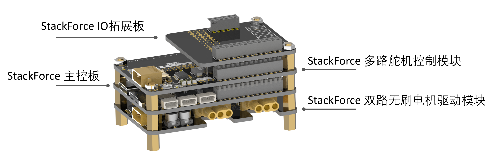
     &nbsp;  
     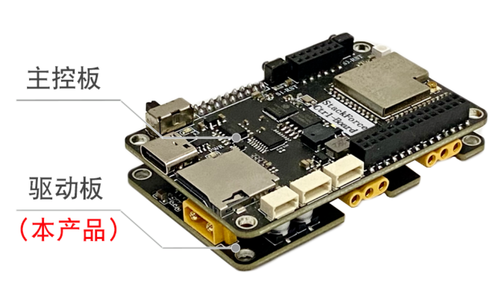
   

The left image below is the outlook of the master controller board, and the right diagram below illustrates the structure of the board. 

   

     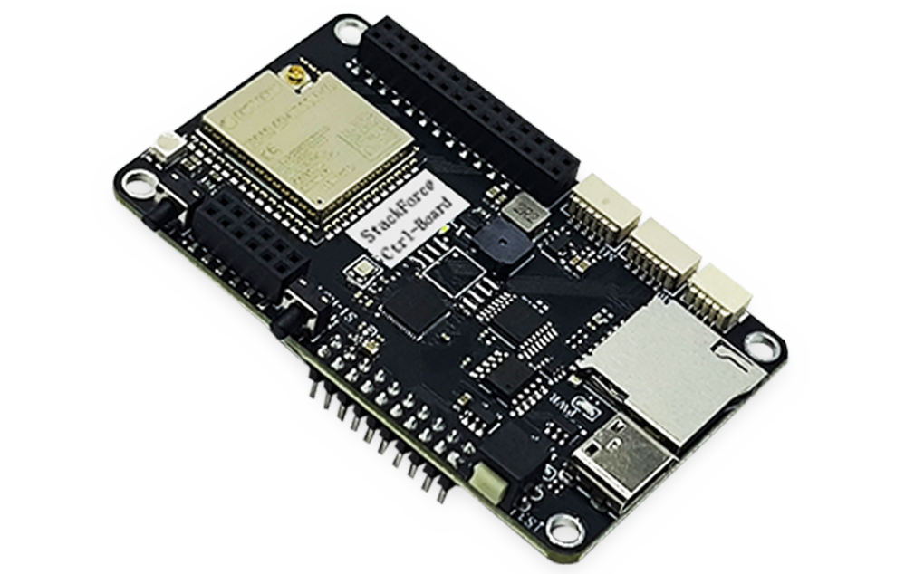
     &nbsp;  
     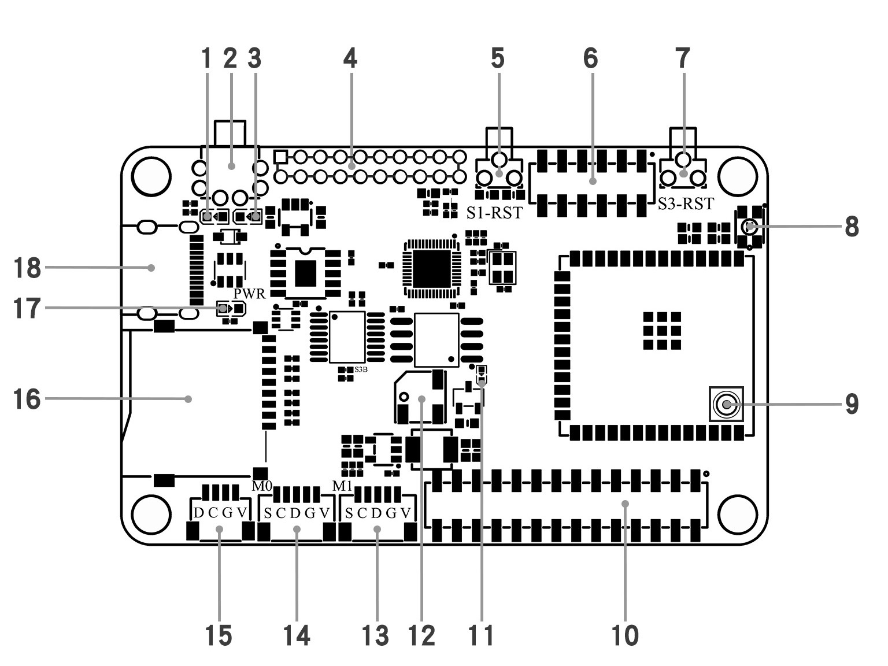
   

Notice that on the top edge of the master controller board, with label `4`, there are 2*10 pins which are used for the connection with the motor driver board. 

The program running in the master controller board can send its commands to the motors through these pins. 
In details, there are 2 groups of pins, the `4, 2, 13` are for `M0` motor, and `12, 14, 27` are for `M1` motor. 

   

     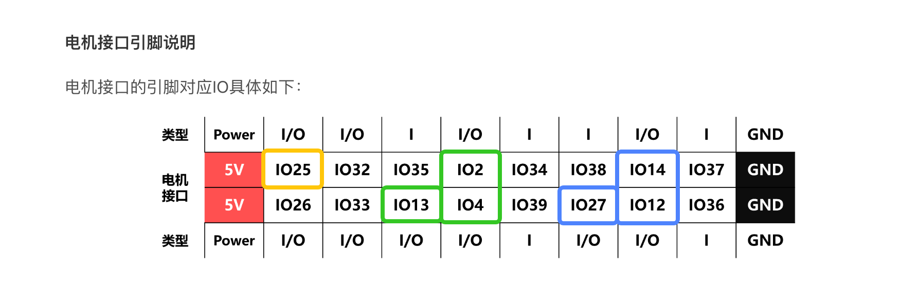
   

&nbsp;
## 2.4 PWM-based motor driver 

It is quite straightforward to implement a PWM-based driver to control the motion of the motors. 

Following [the Stack-force tutorial's sample code](https://dengfoc.com/#/dengfoc/%E7%81%AF%E5%93%A5%E6%89%8B%E6%8A%8A%E6%89%8B%E6%95%99%E4%BD%A0%E5%86%99FOC%E7%AE%97%E6%B3%95/4.2FOC%E5%BC%80%E7%8E%AF%E9%80%9F%E5%BA%A6%E4%BB%A3%E7%A0%81%E7%9A%84%E6%92%B0%E5%86%99), 
we can use the following program to make the M0 motor or M1 motor rotating at a constant speed 15. 

Notice that in the program, `pwmA, pwmB, pwmC` correspond to the `4, 2, 13` pins for `M0` motor, and `12, 14, 27` pins for `M1` motor, as mentioned in last section.

~~~
#include <Arduino.h>

int pwmA = 4;
int pwmB = 2;
int pwmC = 13;
// int pwmA = 12;
// int pwmB = 14;
// int pwmC = 27;

// 初始变量及函数定义
// 宏定义实现的一个约束函数,用于限制一个值的范围。
#define _constrain(amt,low,high) ((amt)<(low)?(low):((amt)>(high)?(high):(amt)))

float voltage_power_supply=12.6;
float shaft_angle=0,open_loop_timestamp=0;
float zero_electric_angle=0,Ualpha,Ubeta=0,Ua=0,Ub=0,Uc=0,dc_a=0,dc_b=0,dc_c=0;

void setup() {
  // put your setup code here, to run once:
  Serial.begin(115200);

  //PWM设置
  pinMode(pwmA, OUTPUT);
  pinMode(pwmB, OUTPUT);
  pinMode(pwmC, OUTPUT);
  ledcAttachPin(pwmA, 0);
  ledcAttachPin(pwmB, 1);
  ledcAttachPin(pwmC, 2);

  ledcSetup(0, 30000, 8);  // pwm频道, 频率, 精度
  ledcSetup(1, 30000, 8);  // pwm频道, 频率, 精度
  ledcSetup(2, 30000, 8);  // pwm频道, 频率, 精度
  Serial.println("完成PWM初始化设置");

  delay(3000);
  pinMode(25, OUTPUT);     //使能引脚设置高电平
}

// 电角度求解
float _electricalAngle(float shaft_angle, int pole_pairs) {
  return (shaft_angle * pole_pairs);
}

// 归一化角度到 [0,2PI]
float _normalizeAngle(float angle) {
  float a = fmod(angle, 2*PI);   //取余运算可以用于归一化，列出特殊值例子算便知
  return a >= 0 ? a : (a + 2*PI);  
}

// 设置PWM到控制器输出
void setPwm(float Ua, float Ub, float Uc) {

  // 计算占空比
  // 限制占空比从0到1
  dc_a = _constrain(Ua / voltage_power_supply, 0.0f , 1.0f );
  dc_b = _constrain(Ub / voltage_power_supply, 0.0f , 1.0f );
  dc_c = _constrain(Uc / voltage_power_supply, 0.0f , 1.0f );

  //写入到 PWM 的 0 1 2 通道
  ledcWrite(0, dc_a*255);
  ledcWrite(1, dc_b*255);
  ledcWrite(2, dc_c*255);
}

void setPhaseVoltage(float Uq,float Ud, float angle_el) {
  angle_el = _normalizeAngle(angle_el + zero_electric_angle);

  // 帕克逆变换
  Ualpha =  -Uq*sin(angle_el); 
  Ubeta =   Uq*cos(angle_el); 

  // 克拉克逆变换
  Ua = Ualpha + voltage_power_supply/2;
  Ub = (sqrt(3)*Ubeta-Ualpha)/2 + voltage_power_supply/2;
  Uc = (-Ualpha-sqrt(3)*Ubeta)/2 + voltage_power_supply/2;
  setPwm(Ua,Ub,Uc);
}

//开环速度函数
float velocityOpenloop(float target_velocity){
  unsigned long now_us = micros();  //获取从开启芯片以来的微秒数，它的精度是 4 微秒。 micros() 返回的是一个无符号长整型（unsigned long）的值
  
  //计算当前每个Loop的运行时间间隔
  float Ts = (now_us - open_loop_timestamp) * 1e-6f;

  //由于 micros() 函数返回的时间戳会在大约 70 分钟之后重新开始计数，在由70分钟跳变到0时，TS会出现异常，因此需要进行修正。如果时间间隔小于等于零或大于 0.5 秒，则将其设置为一个较小的默认值，即 1e-3f
  if(Ts <= 0 || Ts > 0.5f) Ts = 1e-3f;
  
  // 通过乘以时间间隔和目标速度来计算需要转动的机械角度，存储在 shaft_angle 变量中。在此之前，还需要对轴角度进行归一化，以确保其值在 0 到 2π 之间。
  shaft_angle = _normalizeAngle(shaft_angle + target_velocity*Ts);
  //以目标速度为 10 rad/s 为例，如果时间间隔是 1 秒，则在每个循环中需要增加 10 * 1 = 10 弧度的角度变化量，才能使电机转动到目标速度。
  //如果时间间隔是 0.1 秒，那么在每个循环中需要增加的角度变化量就是 10 * 0.1 = 1 弧度，才能实现相同的目标速度。因此，电机轴的转动角度取决于目标速度和时间间隔的乘积。

  // 使用早前设置的voltage_power_supply的1/3作为Uq值，这个值会直接影响输出力矩
  // 最大只能设置为Uq = voltage_power_supply/2，否则ua,ub,uc会超出供电电压限幅
  float Uq = voltage_power_supply/3;
  
  setPhaseVoltage(Uq,  0, _electricalAngle(shaft_angle, 7));
  
  open_loop_timestamp = now_us;  //用于计算下一个时间间隔
  return Uq;
}

void loop() {
  digitalWrite(25, HIGH);   //使能引脚设置高电平
  // put your main code here, to run repeatedly:
  velocityOpenloop(15);
}
~~~

&nbsp;
## 2.5 SF_Motor library

In last section, we implemented a PWM-based motor driver, that keeps the motors rotating at a constant speed. 

Suppose we want to change the motor speed to a target speed, in addition we want to make the changing process efficient and stable. 

Stack-force gave [a series of tutorial on 4 motor control modes](https://dengfoc.com/#/dengfoc/%E7%81%AF%E5%93%A5%E6%89%8B%E6%8A%8A%E6%89%8B%E6%95%99%E4%BD%A0%E5%86%99FOC%E7%AE%97%E6%B3%95/1%E4%B8%80%E5%88%87%E7%9A%84%E8%B5%B7%E6%BA%90%E6%97%A0%E5%88%B7%E7%94%B5%E6%9C%BA%E6%A6%82%E8%AE%BA). 

It is not very difficult to implement the 4 control modes from scratch. For convenience, Stack-force provides a [SF_Motor library](./S06E03_src/dengfoc_bipedal_bot/BLDC_Control/lib/SF_Motor). 

~~~
// SF_Motor.h

#define VELOCITY_MODE 1
#define FORCE_ANGLE_MODE 2
#define VEL_ANGLE_MOED 3
#define TORQUE_MODE 4

...
~~~

Of course, the `SF_Motor` library is only useful for BLDC motors, 
and the motors must be wired to the Stack-force's motor driver board, in the way mentioned in the previous section. 

The usage of the `SF_Motor` library refers to the sample code in the previous section ["Stack-force BLDC motor control code"](./S06E03_anatomy_wheel_legged_bot.md#22-stack-force-bldc-motor-control-code).

&nbsp;
# 3. Motor sensors

## 3.1 MT6701 motor position sensor

Let's take a look at how the MT6701 motor position sensor are wired to the master controller board. 

The left diagram below illustrates the structure of the master controller board. 
The lower edge contains 2 SCDGV sockets, labelled as `14` for `M0` motor and `13` for `M1` motor.  

Notice that each socket has 5 internal pins, that are used for the connection to the MT6701 motor position sensors. 
The pin numbers are shown in the right digram below, 
where pin `23` for CLK, `19` for DO, and `18` and `22` for the 2 chip select (CS) of M0 and M1 motors.

   

     
     &nbsp;  
     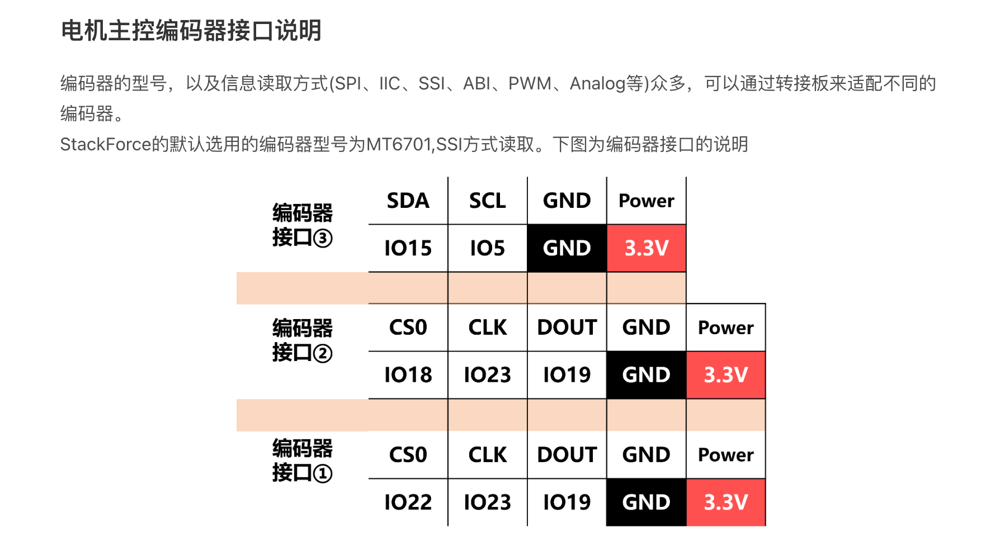
   

The usage of the MT6701 motor position sensors refers to the sample code in the previous section ["Stack-force BLDC motor control code"](./S06E03_anatomy_wheel_legged_bot.md#22-stack-force-bldc-motor-control-code).

To be convenient, the following code snippet from ["Stack-force BLDC motor control code"](./S06E03_anatomy_wheel_legged_bot.md#22-stack-force-bldc-motor-control-code) 
shows how to usage the MT6701 motor position sensors. 

~~~
#include <Arduino.h>
#include <SPI.h>
#include <Wire.h>
#include <EEPROM.h>
#include "SF_Motor.h"
#include "Pins_Specify.h"

#define MT6701_CS0 18
#define MT6701_CS1 22
#define MT6701_CLK 23
#define MT6701_DO 19

#define MT6701 1
#define AS5600 2

// If using MT6701 position sensor, we need to initialize an instance of SPI class. 
SPIClass vspi(VSPI);  

SF_Motor M0 = SF_Motor(0);   // Get an instance of Motor. 
SF_Motor M1 = SF_Motor(1);

float Vbus = 12.0;   // The voltage for the motor to start. 
float alignVoltage = 3;  // The voltage for the calibration between motor and the position sensor. 

void setup()
{
  // https://github.com/espressif/arduino-esp32/blob/master/libraries/SPI/src/SPI.h#L64
  // vspi.begin(int8_t sck = -1, int8_t miso = -1, int8_t mosi = -1, int8_t ss = -1);
  // scl - Clock signal. Each data bit is clocked out or in on the positive or negative edge of this signal
  // miso - Also known as q, this is the input of the serial stream into the ESP32
  // mosi - Also known as d, this is the output of the serial stream from the ESP32
  // ss - quadwp for write protect signal, quadhd for hold signal.

  vspi.begin(MT6701_CLK, MT6701_DO, 0, -1);

  M0.initEncoder(MT6701, vspi);
  M1.initEncoder(MT6701, vspi);

  M0.init(Vbus);
  M1.init(Vbus);

  // Calibrate the motor with the position sensor.
  M0.AlignSensor(alignVoltage);
  M1.AlignSensor(alignVoltage);
}

void loop()
{
  M0.run();
  M1.run();

  // Get the position related data from the MT6701 position sensors. 
  M0_angle = M0.getAnlge();  // Stack-force's typo
  M1_angle = M1.getAnlge();  
  M0_velocity = M0.getVelocity();  
  M1_velocity = M1.getVelocity();  
}
~~~

&nbsp;
## 3.2 INA240A2 motor current sensor

An INA240A2 motor current sensor chip is embedded in the motor driver board. 

The usage of the INA240A2 motor current sensor is wrapped in the SF_Motor library. 

~~~
void loop()
{
  M0.run();
  M1.run();

  // Get the position related data from the MT6701 position sensors. 
  M0_angle = M0.getAnlge();  // Stack-force's typo
  M1_angle = M1.getAnlge();  
  M0_velocity = M0.getVelocity();  
  M1_velocity = M1.getVelocity();

  // Get the current related data from the INA240A2 current sensors.
  M0_current = M0.getCurrent();   // Current
  M1_current = M1.getCurrent();  
  M0_velocity = M0.getElecAngle();  // Electrical angle
  M1_velocity = M1.getElecAngle();
}
~~~

&nbsp;
# 4. SF_BLDC library

Stack-force wraps up the PMW driver of the BLDC motors, PID control, as well as the 4 control modes etc, into a library `SF_Motor`. 

With `SF_Motor` library, it is easier to control the motors. However, the limitation is that `SF_Motor` library is only useful for
Stack-force's motor driver board and master controller board, 
and the motors must be wired to the boards in the specific way described in the previous sections. 

Furthermore, Stack-force wraps up `SF_Motor` library, motor sensors, as well as other related functionality, into a bigger library `SF_BLDC`. 
Again, `SF_BLDC` library is only useful for
Stack-force's motor driver board and master controller board, 
and the motors and the sensors must be wired to the boards in the specific way described in the previous sections. 

## 4.1 SF_BLDC library usage

The [`main.cpp`](./S06E03_src/dengfoc_bipedal_bot/bipedal/src/main.cpp) is a good example, for the usage of `SF_BLDC` library. 

Following is the code snippet of `main.cpp` that is related with `SF_BLDC` library.

~~~
#include <Arduino.h>
#include "SF_BLDC.h"
#define _constrain(amt, low, high) ((amt) < (low) ? (low) : ((amt) > (high) ? (high) : (amt)))

robotposeparam robotPose;
robotmode robotMode;
motorstatus motorStatus;
controlparam controlTarget;
motorstarget motorsTarget;
float targetVoltage;

SF_BLDC motors = SF_BLDC(Serial2);

void setup() {
  motors.init();
  motors.setModes(4,4);
}

void loop() {
  getMotorValue();
  robotRun();
}

void getMotorValue(){
  BLDCData = motors.getBLDCData();
  motorStatus.M0Speed = BLDCData.M0_Vel;
  motorStatus.M1Speed = BLDCData.M1_Vel;
}

void robotRun(){ 
  ...
  motorsTarget.motorLeft = motorStatus.M0Dir * (targetVoltage + controlTarget.differVel);
  motorsTarget.motorRight = motorStatus.M1Dir * (targetVoltage - controlTarget.differVel);

  if (robotMode.motorEnable == 1 && robotPose.pitch <= 40 && robotPose.pitch >= -35) {
    motorsTarget.motorLeft = _constrain(motorsTarget.motorLeft, -5.7, 5.7);
    motorsTarget.motorRight = _constrain(motorsTarget.motorRight, -5.7, 5.7);

    motors.setTargets(motorsTarget.motorLeft, motorsTarget.motorRight);
  } else {
    motors.setTargets(0, 0);
  }
}
~~~

&nbsp;
## 4.2 SF_Communication library 

In the sample code of the previous section, an instance of `SF_BLDC` is initialized in the following way. 

~~~
SF_BLDC motors = SF_BLDC(Serial2);
~~~

What is `Serial2`? And what functionality does it provide to the `SF_BLDC` instance?

As we know, `SF_BLDC` is a library wrapping up `SF_Motor` library, plus motor sensors, plus some other tools. 
Among those tools, there is a [`SF_Communication` library](./S06E03_src/dengfoc_bipedal_bot/BLDC_Control/lib/SF_Communication).  

**1. SF_Communication functionality**

Following is the header file of the `SF_Communication` library,

~~~
#ifndef SF_COMMUNICATION_H
#define SF_COMMUNICATION_H
#include <Arduino.h>

/*-----通信方式说明-------------
T[M0目标值],[M1目标值],[M0控制模式],[M1控制模式],0B  举例：T10,10,1,1,0B M0M1电机在速度模式下以10rad/s旋转
C[设置的对象电机],[电流环P值],[电流环I值],[电流环D值],[电流环限幅值]T
V[设置的对象电机],[速度环P值],[速度环I值],[速度环D值],[速度限幅值]Y
A[设置的对象电机],[位置环P值],[位置环I值],[位置环D值],[位置环限幅值]E
U[M0校准电压值],[M1校准电压值],0,0,0V
-----------------------------*/
class SF_Motor;

#define NOCONTACT 0
#define USB 1
#define ONBOARD 2

class SF_Communication
{
public:
    SF_Communication();
    void setUSBBaud(uint32_t baud);

    // When initializing, must take a Serial communication object as input. 
    void init(uint8_t contactSerial);  
    void stop();
    void start();

    void linkMotor(SF_Motor &motor0, SF_Motor &motor1);
    void linkMotor(SF_Motor &motor0);

private:
    HardwareSerial *_serial;
    uint8_t _contactSerial;
    SF_Motor *M0, *M1;
    uint32_t _USBbaud;
    bool _startFlag;
    char _recCommand1,  _recCommand7;
    float _recCommand2, _recCommand3, _recCommand4, _recCommand5, _recCommand6;
    int _commaPosition;
    uint16_t sendLoopCount;

    static void taskFunction(void *parameter)
    {
        SF_Communication *instance = static_cast<SF_Communication *>(parameter);

        while (true)
        {
            instance->appCpuLoop();
            vTaskDelay(1); 
        }
    }

    void appCpuLoop();

    // Each appCpuLoop will executes the following functions in sequence.
    void sendMotorStatus0();
    void sendMotorStatus1();
    void sendMotorStatus2();
    void recCommand();
    void calRecCommand();

    TaskHandle_t taskHandle; 
};

#endif
~~~

&nbsp;
**2. SF_Communication usage**

[The calibration code of the BLDC motors](./S06E03_src/dengfoc_bipedal_bot/BLDC_Control/src/main.cpp) is an example 
for the usage of the `SF_Communication` library.

~~~
#include <Arduino.h>
#include "SF_Motor.h"
#include "SF_Communication.h"

SF_Motor M0 = SF_Motor(0);
SF_Motor M1 = SF_Motor(1);

SF_Communication com = SF_Communication();

void setup()
{
  Serial.begin(115200);

  // Link M0, or M1, or both motors to the SF_Communication instance. 
  com.linkMotor(M0, M1);

  // The input must be either 'ONBOARD' for the communication with S3 chip.
  // or, 'USB' to the Serial output.
  com.init(ONBOARD);

  // Open the communication channel to send the motor status, 
  // and to receive the external commands.
  com.start();
}

void loop()
{
  M0.run();
  M1.run();
}
~~~

When running this code, the `SF_Communication` library will output the motors status to the `Serial`. 

In addition, if we initialize the SF_Communication as `USB`, `com.init(USB)`, we can input the following commmand in the Serial, 
to make both M0 and M1 motors rotating at speed 10rad/s.
~~~
T10,10,1,1,0B
~~~

&nbsp;
## 4.3 Stack-force custom board

Back to `SF_BLDC` library, that is a wrapper of `SF_Communication` and `SF_Motor` etc.

SF_BLDC's `SF_BLDC(Serial2)` is equivalent to SF_Communication's `SF_Communication.init(ONBOARD)`.

SF_BLDC's `Serial2` is a custom HardwareSerial instance, for the UART serial communication between the S1 chip and the S3 chip on Stack-force's master driver board.

   

     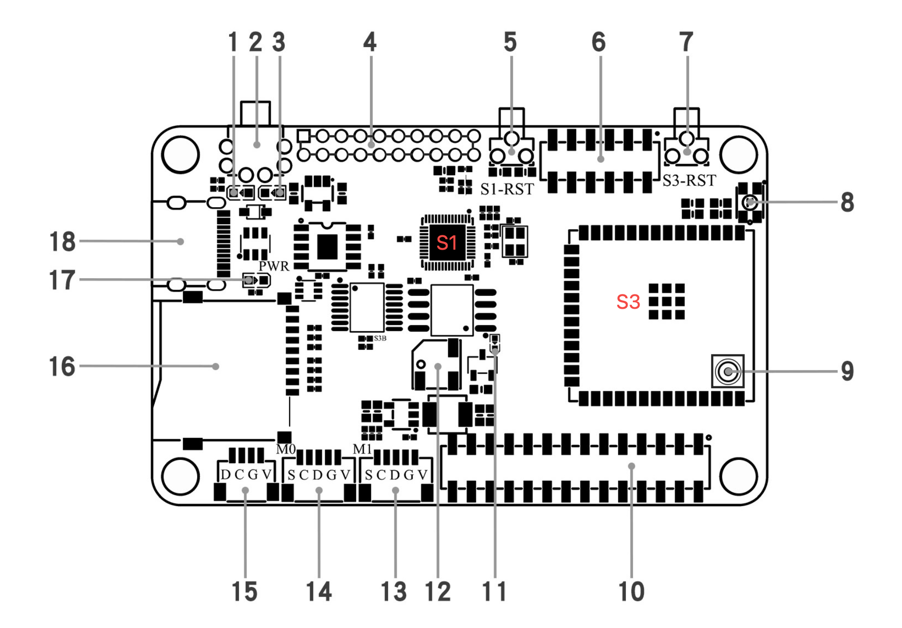
     &nbsp;  
     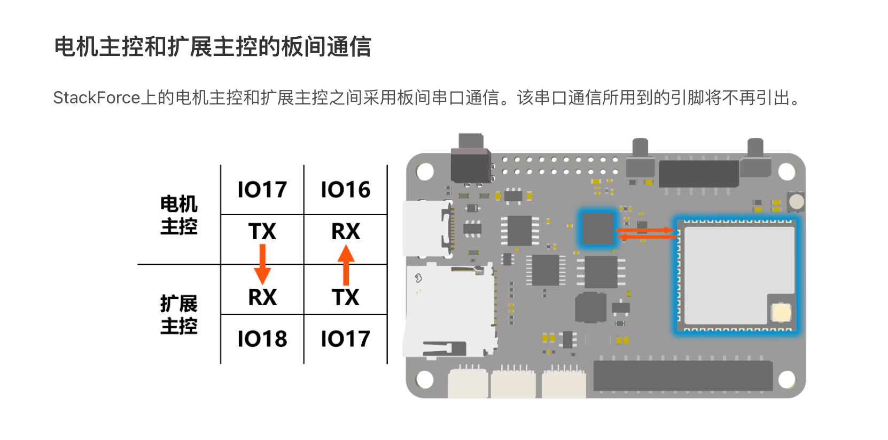
   

Stack-force's master controller board is a custom Arduino board. Following is a list of tutorials how to make a custom Arduino board. 

1. [DIY Arduino UNO | How to Make Your Own Arduino Uno Board](https://www.instructables.com/DIY-Arduino-UNO-How-to-Make-Your-Own-Arduino-Uno-B/)
2. [How to Build an Arduino Uno on a BreadBoard](https://www.instructables.com/How-to-Build-an-Arduino-Uno-on-a-BreadBoard/)
3. [Building an Arduino on a Breadboard](https://docs.arduino.cc/retired/hacking/hardware/building-an-arduino-on-a-breadboard/)
4. [How to Burn Bootloader on ATmega328 using Arduino UNO?](https://www.electronicshub.org/burn-bootloader-on-atmega328/)
5. [Arduino IDE: Creating Custom Boards](https://www.instructables.com/Arduino-IDE-Creating-Custom-Boards/)

Therefore，Stack-force's boards have their custom settings, and also redefine some Arduino default settings, including `Serial2` and `Wire` etc. 

&nbsp;
# 5. Servos

## 5.1 Servo assembly

Stack-force's wheel-legged robot has 4 servos, in charge of controlling the hip joints of its 4 legs. 
The 4 servos are linked to Stack-force self-made servo and imu board, shown in the left image below. 

The 4 servos are controlled by [a PCA9685 chip](https://www.instructables.com/Mastering-Servo-Control-With-PCA9685-and-Arduino/), which provides multiple PWM outputs.

The servo and imu board is stacked on the top of a Stack-force self-made master controller board, 
in the way of a Arduino shield, shown in the right image below. 

Notice that the 4 servos are linked to the pins at position `3`, `4`, `5`, and `6`. 

   

     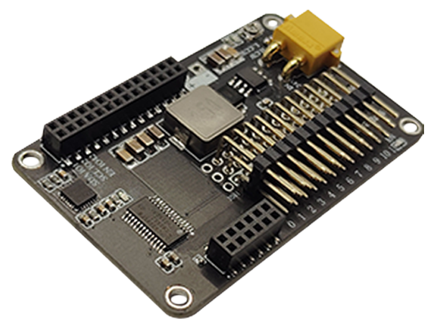
     &nbsp;  
     
   

The servo and imu board is like a shield on the top of the master board. 
The communication between these 2 boards is implemented with I2C at pin `1` for SDA and pin `2` for SCL,
of the servo and imu board shown in the left image below. 

   

     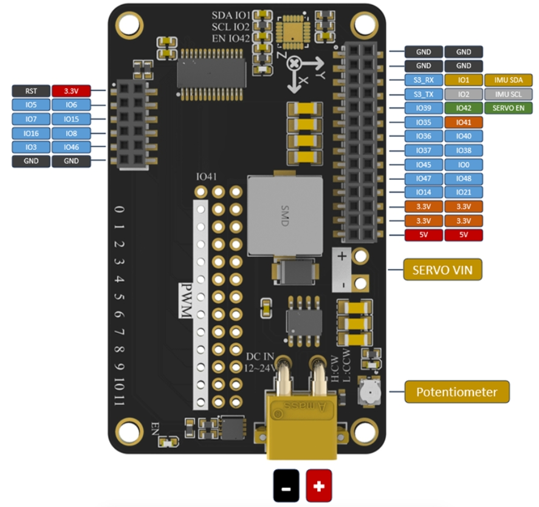
     &nbsp;  
     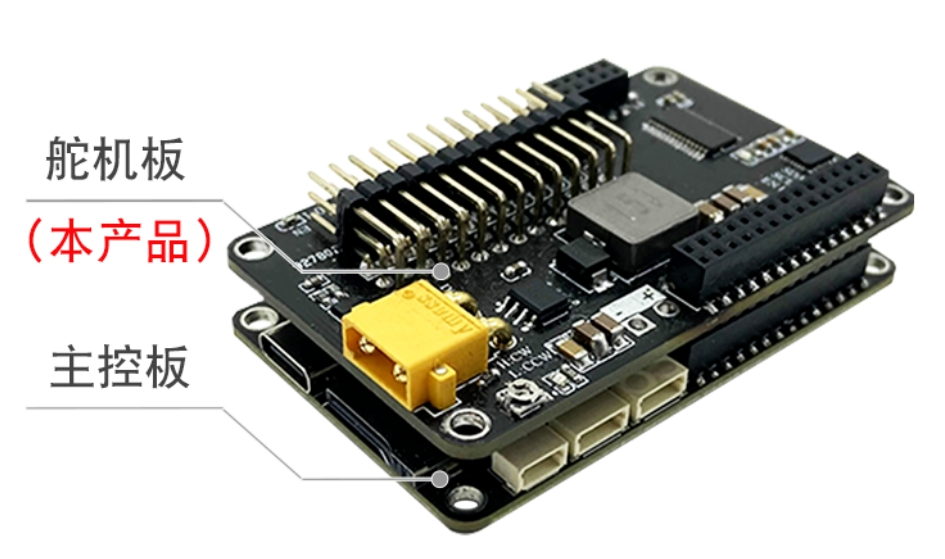
   

On the master controller board, the I2C serial communication to the servo and imu board
uses pin `1` for SDA and pin `2` for SCL, shown in the right image below. 

   

     
     &nbsp;  
     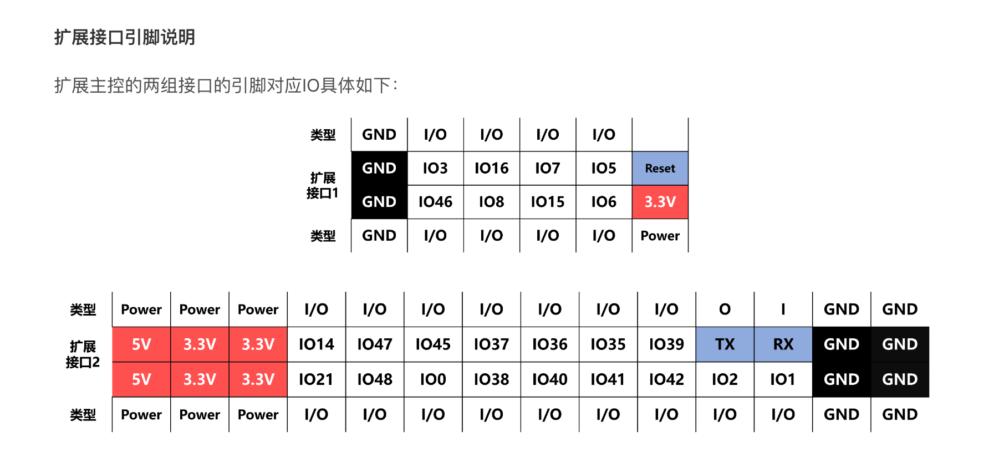
   

   
&nbsp;
## 5.2 SF_Servo library

The following code snippet is extracted from [the `main.cpp` of Stack-force wheel-legged robot](./S06E03_src/dengfoc_bipedal_bot/bipedal/src/main.cpp), 
which gives an example for the usage of `SF_Servo` library. 

~~~
#include <Arduino.h>
#include "SF_Servo.h"
#include "bipedal_data.h"

SF_Servo servos = SF_Servo(Wire); 

void setServoAngle(uint16_t servoLeftFront, uint16_t servoLeftRear, uint16_t servoRightFront, uint16_t servoRightRear);
void inverseKinematics();

void setup() {
  Wire.begin(1, 2, 400000UL);
  servos.init();
  servos.setAngleRange(0,300);
  servos.setPluseRange(500,2500);

  delay(6000);
}

void loop() {
  ...
  inverseKinematics();
}

void setServoAngle(uint16_t servoLeftFront, uint16_t servoLeftRear, uint16_t servoRightFront, uint16_t servoRightRear){
  servos.setAngle(3, 90+LFSERVO_OFFSET+servoLeftFront);
  servos.setAngle(4, 90+LRSERVO_OFFSET+servoLeftRear);
  servos.setAngle(5, 270+RFSERVO_OFFSET-servoRightFront);
  servos.setAngle(6, 270+RFSERVO_OFFSET-servoRightRear);
}

void inverseKinematics(){
  ...
  alpha1ToAngle = (int)((IKParam.alpha1 / 6.28) * 360);
  beta1ToAngle = (int)((IKParam.beta1 / 6.28) * 360);
  alpha2ToAngle = (int)((IKParam.alpha2 / 6.28) * 360);//todo
  beta2ToAngle = (int)((IKParam.beta2 / 6.28) * 360);

  if(robotMode.servoEnable){
    setServoAngle(beta1ToAngle, alpha1ToAngle, beta2ToAngle, alpha2ToAngle);
  }
}
~~~

Notice that, 

1. `SF_Servo servos = SF_Servo(Wire); `

   Instantiate an SF_Servo instance, with I2C communication.

2. `Wire.begin(1, 2, 400000UL);`

   Start I2C communication with SDA at pin `1`, SCL at pin `2`, and frequency as 400000.

   The `Wire.begin()` API refers to [the ESP32 library](https://docs.espressif.com/projects/arduino-esp32/en/latest/api/i2c.html#i2c-master-apis) in master mode. 

4. `servos.setAngle(3, ...);` 

   The first servo is linked to the PWM chip at position `3`.
   The second at position `4`, the third at `5`, and the fourth at `6`.
   Take a look at the servo assembly images in the previous section.

&nbsp;
## 5.3 PCA9685 multi-PWM driver

It is interesting to look into the cpp code of SF_Servo library, 
especially how to work with [the PCA9685 chip](https://www.instructables.com/Mastering-Servo-Control-With-PCA9685-and-Arduino/), 
which provides multiple PWM outputs.

~~~
#include "SF_Servo.h"

#define SERVO_ENABLE_PIN 42
#define PCA9685_ADDR 0x40

#define PCA9685_MODE1 0x00     
#define PCA9685_MODE2 0x01  
#define FREQUENCY_OSCILLATOR 25000000

#define MODE1_RESTART 0x80 /**< Restart enabled */
#define MODE1_SLEEP 0x10   /**< Low power mode. Oscillator off */
#define MODE1_AI 0x20      /**< Auto-Increment enabled */

#define PCA9685_PRESCALE 0xFE     /**< Prescaler for PWM output frequency */
#define PCA9685_LED0_ON_L 0x06  /**< LED0 on tick, low byte*/
#define PCA9685_LED0_ON_H 0x07  /**< LED0 on tick, high byte*/
#define PCA9685_LED0_OFF_L 0x08 /**< LED0 off tick, low byte */
#define PCA9685_LED0_OFF_H 0x09 /**< LED0 off tick, high byte */

SF_Servo::SF_Servo(TwoWire &i2c)
    :  _i2c(&i2c), freq(50){}

void SF_Servo::init(){
    _i2c->begin();
    reset();

    setPWMFreq(freq);
    enable();
}

void SF_Servo::setPWMFreq(float freq){
    float prescaleval = ((FREQUENCY_OSCILLATOR / (freq * 4096.0)) + 0.5) - 1;
    uint8_t prescale = (uint8_t)prescaleval;

    uint8_t oldmode = readFromPCA(PCA9685_MODE1);
    uint8_t newmode = (oldmode & ~MODE1_RESTART) | MODE1_SLEEP;  // sleep
    writeToPCA(PCA9685_MODE1, newmode);                    // go to sleep
    writeToPCA(PCA9685_PRESCALE, prescale);             
    writeToPCA(PCA9685_MODE1, oldmode);

    delay(5);
    writeToPCA(PCA9685_MODE1, oldmode | MODE1_RESTART | MODE1_AI);
}

void SF_Servo::enable(){
    pinMode(SERVO_ENABLE_PIN, OUTPUT);
    digitalWrite(SERVO_ENABLE_PIN, HIGH);
}

void SF_Servo::disable(){
    pinMode(SERVO_ENABLE_PIN, OUTPUT);
    digitalWrite(SERVO_ENABLE_PIN, LOW);
}

void SF_Servo::reset(){
    writeToPCA(PCA9685_MODE1, MODE1_RESTART);
    delay(10);
}

void SF_Servo::sleep(){
    uint8_t awake = readFromPCA(PCA9685_MODE1);
    uint8_t sleep = awake | MODE1_SLEEP;  // 睡眠位调高
    writeToPCA(PCA9685_MODE1, sleep);
    delay(5);
}

void SF_Servo::wakeup(){
  uint8_t sleep = readFromPCA(PCA9685_MODE1);
  uint8_t wakeup = sleep & ~MODE1_SLEEP;  // 睡眠位调低
  writeToPCA(PCA9685_MODE1, wakeup);
}

void SF_Servo::setAngle(uint8_t num, uint16_t angle){
    if(angle < angleMin || angle > angleMax)
        return;
    uint16_t offTime = (int)(pluseMin + pluseRange * angle / angleRange);
    uint16_t off = (int)(offTime * 4096 / 20000);
    setPWM(num, 0, off);
}

void SF_Servo::setPWM(uint8_t num, uint16_t on, uint16_t off){
    _i2c->beginTransmission(PCA9685_ADDR);
    _i2c->write(PCA9685_LED0_ON_L + 4 * num);
    _i2c->write(on);
    _i2c->write(on >> 8);
    _i2c->write(off);
    _i2c->write(off >> 8);
    _i2c->endTransmission();
}

void SF_Servo::writeToPCA(uint8_t addr, uint8_t data){
    _i2c->beginTransmission(PCA9685_ADDR);
    _i2c->write(addr);
    _i2c->write(data);
    _i2c->endTransmission();
}

uint8_t SF_Servo::readFromPCA(uint8_t addr){
    _i2c->beginTransmission(PCA9685_ADDR);
    _i2c->write(addr);
    _i2c->endTransmission();

    _i2c->requestFrom((uint8_t)PCA9685_ADDR, (uint8_t)1);
    return _i2c->read();
}
~~~
