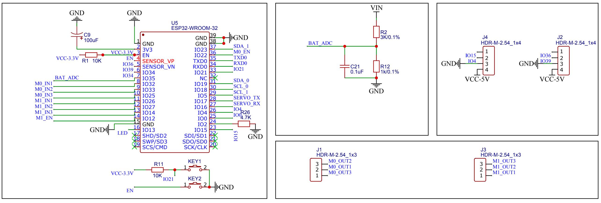
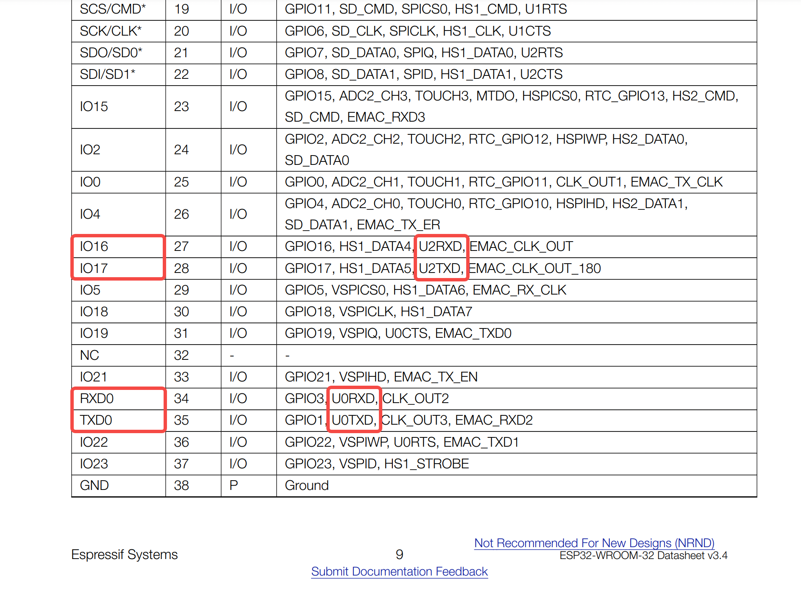
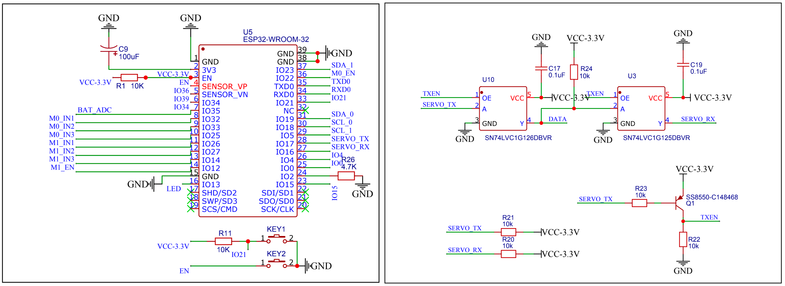

# Anatomy of Mushibot, Another Wheel-legged Robot

## 1. Objectives

In the last blog, we studied [Stack-force's wheel-legged robot](https://gitee.com/StackForce/bipedal_wheeled_robot). 
What boards, modules, and chips are used, how are they wired together, and how to write program to access them.

In this blog, we studied another wheel-legged robot, [Mushibot](https://github.com/MuShibo/Micro-Wheeled_leg-Robot), 
which is almost a mini version of ETH Zurich's [Ascento](https://www.ascento.ai/), 
with some differences in the shape and structure of the leg linkages etc. 

Let's start with the hardware used in the Mushibot, especially

1. Two 2208 80T-100kv BLDC motors that control the wheels.
2. Two AS5600-ASOM motor encoders that monitor the rotation speed of the motors.
3. Two Feetech's STS3032 servos that control the pose of the legs.
4. One MPU6050 IMU module.

We will study how those hardware are wired to the master controller board, how to write C/C++ program to access them. 

&nbsp;
## 2. 2208 BLDC motors

The following code snippet is extracted from Mushibot's 
"[wl_pro_robot/wl_pro_robot.ino](https://github.com/MuShibo/Micro-Wheeled_leg-Robot/blob/master/3.Software/wl_pro_robot/wl_pro_robot.ino)", 
which is the main program of the Mushibot system. 

In the code, we can learn, 
1. how to set up the motors with drivers,
2. how to initialize and start the motors,
3. and how to control the torques of the motors. 

~~~
// https://github.com/MuShibo/Micro-Wheeled_leg-Robot/blob/master/3.Software/wl_pro_robot/wl_pro_robot.ino

// 机器人控制头文件
#include <SimpleFOC.h>
#include <Arduino.h>

//电机实例
BLDCMotor motor1 = BLDCMotor(7);
BLDCMotor motor2 = BLDCMotor(7);
BLDCDriver3PWM driver1 = BLDCDriver3PWM(32,33,25,22);
BLDCDriver3PWM driver2  = BLDCDriver3PWM(26,27,14,12);

void setup() {
  Serial.begin(115200);  //通讯串口

  // 驱动器设置
  // set motor's power supply voltage,
  // the rule of thumb is to align with the motor.voltage_limit for the open loop.
  motor1.voltage_sensor_align = 6;
  motor2.voltage_sensor_align = 6;

  // set driver's power supply voltage [V]
  driver1.voltage_power_supply = 8;
  driver2.voltage_power_supply = 8;

  driver1.init();
  driver2.init();

  // 连接motor对象与驱动器对象
  motor1.linkDriver(&driver1);
  motor2.linkDriver(&driver2);

  // set the torque control type
  motor1.torque_controller = TorqueControlType::voltage;
  motor2.torque_controller = TorqueControlType::voltage;

  // set motion control loop to be used
  motor1.controller = MotionControlType::torque;
  motor2.controller = MotionControlType::torque;
  
  // monitor相关设置
  motor1.useMonitoring(Serial);
  motor2.useMonitoring(Serial);

  // 电机初始化
  // initialize motor
  motor1.init();
  // align sensor and start FOC
  motor1.initFOC();

  motor2.init();
  motor2.initFOC();

  delay(500);
}

void loop() {
  lqr_balance_loop(); // lqr自平衡控制，calculate 'LQR_u'
  yaw_loop();         // yaw轴转向控制, calculate 'YAW_output'
  
  //将自平衡计算输出转矩赋给电机
  motor1.target = (-0.5)*(LQR_u + YAW_output);
  motor2.target = (-0.5)*(LQR_u - YAW_output);
  ...
  
  //迭代计算FOC相电压
  motor1.loopFOC();
  motor2.loopFOC();
  
  //设置轮部电机输出
  motor1.move();
  motor2.move();
}
~~~

Let's dive into the code. 

### 2.1 BLDC Motor configuration

~~~
BLDCMotor motor1 = BLDCMotor(7);
BLDCMotor motor2 = BLDCMotor(7);
~~~

The `7` here is the pole pair number, referring to the SimpleFOC's tutorial, "[BLDC Motor configuration](https://docs.simplefoc.com/bldcmotor#step-1-creating-the-instance-of-the-bldc-motor)".

### 2.2 BLDC driver 3 PWM

~~~
BLDCDriver3PWM driver1 = BLDCDriver3PWM(32,33,25,22);
BLDCDriver3PWM driver2  = BLDCDriver3PWM(26,27,14,12);
~~~

The parameters in `BLDCDriver3PWM()` are the A, B, C phase pwm pins, and the enable pin, referring to the SimpleFOC's tutorial, "[BLDC driver 3 PWM](https://docs.simplefoc.com/bldcdriver3pwm#step-1-hardware-setup)". 

### 2.3 Voltage setting

~~~
void setup() {
  // 驱动器设置
  // set motor's power supply voltage [V],
  // the rule of thumb is to align with the motor.voltage_limit for the open loop.
  motor1.voltage_sensor_align = 6;
  motor2.voltage_sensor_align = 6;

  // set driver's power supply voltage [V]
  driver1.voltage_power_supply = 8;
  driver2.voltage_power_supply = 8;
}
~~~

It is a bit tricky to set the power supply's voltages of the motors and drivers, because they must be aligned with the voltages of the motor's encoders. 

A high-level guidance refers to the SimpleFOC's tutorial, "[Let’s get started](https://docs.simplefoc.com/example_from_scratch#step-3-closed-loop-control---torque-using-voltage)", especially "Step 3. Closed-loop control - torque using voltage" section, and the example sketch for "BLDC Motor + 3PWM driver + Encoder".

A more detailed explanation refers to SimpleFOC's tutorial, "[Torque control using voltage](https://docs.simplefoc.com/voltage_torque_mode)"。

### 2.4 Torque control

~~~
void setup() {
  // set the torque control type
  motor1.torque_controller = TorqueControlType::voltage;
  motor2.torque_controller = TorqueControlType::voltage;

  // set motion control type to be used
  motor1.controller = MotionControlType::torque;
  motor2.controller = MotionControlType::torque;
}

void loop() {
  motor1.target = (-0.5)*(LQR_u + YAW_output);
  motor2.target = (-0.5)*(LQR_u - YAW_output);
}
~~~

Mushibot set the torque of the motor to be controlled by the power supply's voltage. Also, it set the motor's control mode to be torque. 

Therefore, we can control the motors by changing their power supply's voltages. 

&nbsp;
## 3. The master controller board

   

     
   

### 3.1 ESP32-WROOM-32 chip

The schematic on the left is a ESP32-WROOM-32 chip with its pins. 

Over there, you can find `IO32` `IO33` `IO25` `IO22` and `IO26` `IO27` `IO14` `IO12` 
correspond to the parameters of `BLDCDriver3PWM()` of the two motors. 

~~~
BLDCDriver3PWM driver1 = BLDCDriver3PWM(32,33,25,22);
BLDCDriver3PWM driver2  = BLDCDriver3PWM(26,27,14,12);
~~~

### 3.2 Battery ADC

The `BAT_ADC` in the right-upper-left schematic diagram refers to the Analog-to-Digital Converter to control the voltage of the power supply. 

Mushibot doesn't have a separated board for the motor PWM drivers. Instead, it controls the motors by the master controller board directly. 

### 3.3 HDR-M-2.54

The right-lower schematic diagram is for HDR-M-2.54, a pin header male connector, with 2.54mm pin spacing.

The motors are wired to the HDR-M-2.54 pin connectors, J1 and J3. 

The right-upper-right schematic is also for HDR-M-2.54, but it is for the motor encoder's operational amplifier, i.e `Vp` and `Vn`, 
we will discuss them in next section.

&nbsp;
## 4. AS5600-ASOM motor encoder

The following code snippet is extracted from Mushibot's 
"[wl_pro_robot/wl_pro_robot.ino](https://github.com/MuShibo/Micro-Wheeled_leg-Robot/blob/master/3.Software/wl_pro_robot/wl_pro_robot.ino)", 
which is the main program of the Mushibot system. 

In the code, we can learn,
1. how to set up the motor encoders with I2C serial connection,
2. how to initialize and start the motor encoders,
3. and how to read the motor's rotation angle and velocity from the encoders.

~~~
// https://github.com/MuShibo/Micro-Wheeled_leg-Robot/blob/master/3.Software/wl_pro_robot/wl_pro_robot.ino

//机器人控制头文件
#include <SimpleFOC.h>
#include <Arduino.h>

//电机实例
BLDCMotor motor1 = BLDCMotor(7);
BLDCMotor motor2 = BLDCMotor(7);
BLDCDriver3PWM driver1 = BLDCDriver3PWM(32,33,25,22);
BLDCDriver3PWM driver2  = BLDCDriver3PWM(26,27,14,12);

//编码器实例
TwoWire I2Cone = TwoWire(0);
TwoWire I2Ctwo = TwoWire(1);
MagneticSensorI2C sensor1 = MagneticSensorI2C(AS5600_I2C);
MagneticSensorI2C sensor2 = MagneticSensorI2C(AS5600_I2C);

void setup() {
  // 编码器设置
  I2Cone.begin(19,18, 400000UL); 
  I2Ctwo.begin(23,5, 400000UL); 
  sensor1.init(&I2Cone);
  sensor2.init(&I2Ctwo);
  
  //连接motor对象与编码器对象
  motor1.linkSensor(&sensor1);
  motor2.linkSensor(&sensor2);

  //连接motor对象与驱动器对象
  motor1.linkDriver(&driver1);
  motor2.linkDriver(&driver2);

  delay(500);
}

void loop() {
  lqr_balance_loop(); //lqr自平衡控制
  yaw_loop();         //yaw轴转向控制

  //将自平衡计算输出转矩赋给电机
  motor1.target = (-0.5)*(LQR_u + YAW_output);
  motor2.target = (-0.5)*(LQR_u - YAW_output);
 
  //迭代计算FOC相电压
  motor1.loopFOC();
  motor2.loopFOC();
  
  //设置轮部电机输出
  motor1.move();
  motor2.move();
}

//lqr自平衡控制
void lqr_balance_loop(){
  //给负值是因为按照当前的电机接线，正转矩会向后转
  LQR_distance  = (-0.5) *(motor1.shaft_angle + motor2.shaft_angle);
  LQR_speed     = (-0.5) *(motor1.shaft_velocity + motor2.shaft_velocity);
  ...
}
~~~

Let's dive into the code. 

### 4.1 Encoder configuration

As a full-fledged configuration, we need to create an instance of the configuration first,

~~~
// Data structure of the magnetic sensor I2C configuration
struct MagneticSensorI2CConfig_s  {
  int chip_address;
  int bit_resolution; 
  int angle_register;
  int data_start_bit; 
};

// configuration for AS5600 sensor
MagneticSensorI2CConfig_s MySensorConfig = {
  .chip_address = 0x36, 
  .bit_resolution = 12, 
  .angle_register=0x0E, 
  .data_start_bit=11
}; 
~~~

After then provide it to the constructor, 

~~~
// the sensor class with desired sensor configuration
MagneticSensorI2C sensor = MagneticSensorI2C(MySensorConfig);

void setup(){
  sensor.init();
  ...
}
~~~

For the most common I2C magnetic sensors, the  SimpleFOC library provides the simplified configuration constructor. 
Namely for `AS5600` 12-bit sensor and `AS5048` 14-bit sensor. 

More detail refers to the SimpleFOC tutorial, "[I2C Magnetic sensor setup](https://docs.simplefoc.com/magnetic_sensor_i2c#quick-configuration-for-common-sensors)".

~~~
#include <SimpleFOC.h>

MagneticSensorI2C sensor1 = MagneticSensorI2C(AS5600_I2C);
MagneticSensorI2C sensor2 = MagneticSensorI2C(AS5600_I2C);
~~~

### 4.2 I2C communication 

Mushibot uses I2C serial communication to link the encoders to the motors. 

~~~
//编码器实例
// 0 and 1 are sequence IDs, to distinguish themself from others. 
TwoWire I2Cone = TwoWire(0);  
TwoWire I2Ctwo = TwoWire(1);  

void setup() {
  // 编码器设置
  // bool begin(int sdaPin, int sclPin, uint32_t frequency);
  I2Cone.begin(19,18, 400000UL); 
  I2Ctwo.begin(23,5, 400000UL);

  sensor1.init(&I2Cone);
  sensor2.init(&I2Ctwo);
  
  //连接motor对象与编码器对象
  motor1.linkSensor(&sensor1);
  motor2.linkSensor(&sensor2);
}
~~~

   

     
   

In the schematic diagram on the left side, we can find the `IO19` `IO18` and `IO23` `IO5` pins, correspond to the following code. 

~~~
  // 编码器设置
  // bool begin(int sdaPin, int sclPin, uint32_t frequency);
  I2Cone.begin(19,18, 400000UL); 
  I2Ctwo.begin(23,5, 400000UL);
~~~

The upper-right schematic is for HDR-M-2.54_1x4, a pin header male connector, one column of four pins, with 2.54mm pin spacing.

`J2` `J4` pin connectors are for the encoders' I2C serial communication. 

`I2Cone.begin(int sdaPin, int sclPin, uint32_t frequency)` is an I2C function, and this function is used only for I2C's master mode, 
referring to [ESP32's API documentation](https://docs.espressif.com/projects/arduino-esp32/en/latest/api/i2c.html#i2c-master-apis).

   

     
     &nbsp;  
     
   

The above diagrams illustrate the difference between I2C's master mode and slave mode. 

An ESP32 chip can be used either as a master or as a slave. The diagram on the left is an ESP32 chip behaves as a master communicating with multiple slave devices. 

There are two ESP32 chips in the diagram on the right, one for the master, the other for the slave, they communicate with each other via I2C. 

### 4.3 Read from encoder

It is quite straightforward to read motor's rotation angle and velocity from the encoder. 

In Mushibot system, the following code gives an example of the usage,
simply retrieving the values of motor's member variables `motor1.shaft_angle` and `motor1.shaft_velocity`.  

~~~
void lqr_balance_loop(){
  //给负值是因为按照当前的电机接线，正转矩会向后转
  LQR_distance  = (-0.5) *(motor1.shaft_angle + motor2.shaft_angle);
  LQR_speed     = (-0.5) *(motor1.shaft_velocity + motor2.shaft_velocity);
  ...
}
~~~

&nbsp;
## 5. STS3032 servo

The following code snippet is extracted from Mushibot's 
"[wl_pro_robot/wl_pro_robot.ino](https://github.com/MuShibo/Micro-Wheeled_leg-Robot/blob/master/3.Software/wl_pro_robot/wl_pro_robot.ino)", 
which is the main program of the Mushibot system. 

In the code, we can learn,

1. how to set up the STS3032 servo with serial communication,
2. how to control the STS3032 servo.

~~~
// https://github.com/MuShibo/Micro-Wheeled_leg-Robot/blob/master/3.Software/wl_pro_robot/wl_pro_robot.ino

//机器人控制头文件
#include "Servo_STS3032.h"
#include <Arduino.h>

//STS舵机实例
SMS_STS sms_sts;

//腿部舵机控制数据
byte ID[2];
s16 Position[2];
u16 Speed[2];
byte ACC[2];

void setup() {
  Serial.begin(115200);    //通讯串口
  Serial2.begin(1000000);  //腿部sts舵机

  //舵机初始化
  sms_sts.pSerial = &Serial2;
  ID[0] = 1;
  ID[1] = 2;

  //舵机有效行程450
  ACC[0] = 30;
  ACC[1] = 30;
  Speed[0] = 300;
  Speed[1] = 300;

  //左侧舵机[2048+12+50,2048+12+450]
  //左侧舵机[2048-12-50,2048-12-450]
  Position[0] = 2148;
  Position[1] = 1948;

  //舵机(ID1/ID2)以最高速度V=2400步/秒，加速度A=50(50*100步/秒^2)，运行至各自的Position位置
  sms_sts.SyncWritePosEx(ID, 2, Position, Speed, ACC);

  delay(500);
}
~~~

### 5.1 Servo_STS3032 library

It looks quite simple to initialize an instance of `SMS_STS` servo, as the following. 

~~~
//STS舵机实例
SMS_STS sms_sts;
~~~

However, if you look into [Mushibot's github repo](https://github.com/MuShibo/Micro-Wheeled_leg-Robot), you will find two servo libraries, 

1. [Servo_STS3032.{h,cpp}](https://github.com/MuShibo/Micro-Wheeled_leg-Robot/tree/master/3.Software/wl_pro_robot)

   ~~~
    //飞特SMS/STS系列串行舵机应用层程序
    class SMS_STS : public SCSerial
    {
    public:
      //同步写多个舵机位置指令
    	virtual void SyncWritePosEx(u8 ID[], u8 IDN, s16 Position[], u16 Speed[], u8 ACC[]);
    };
   ~~~

   This is the library that "[wl_pro_robot/wl_pro_robot.ino](https://github.com/MuShibo/Micro-Wheeled_leg-Robot/blob/master/3.Software/wl_pro_robot/wl_pro_robot.ino)" uses. 

2. [libraries/SCServo.zip](https://github.com/MuShibo/Micro-Wheeled_leg-Robot/tree/master/3.Software/libraries)

   Looking into this zip library, we found that it is quite different from [Servo_STS3032.{h,cpp}](https://github.com/MuShibo/Micro-Wheeled_leg-Robot/tree/master/3.Software/wl_pro_robot).

   Looking into [Servo_STS3032.{h,cpp}](https://github.com/MuShibo/Micro-Wheeled_leg-Robot/tree/master/3.Software/wl_pro_robot), we didn't find any code to call the [libraries/SCServo.zip](https://github.com/MuShibo/Micro-Wheeled_leg-Robot/tree/master/3.Software/libraries) library.
   
   The question is that why Mushibot put this zip library in its repo?

   To verify that [libraries/SCServo.zip](https://github.com/MuShibo/Micro-Wheeled_leg-Robot/tree/master/3.Software/libraries) is useless in the Mushibot system, we removed it from the library directory, and reload the software to the hardware for re-deployment.

   The reloaded mushibot behaves exactly the same as before, therefore, we think [libraries/SCServo.zip](https://github.com/MuShibo/Micro-Wheeled_leg-Robot/tree/master/3.Software/libraries) is useless in the Mushibot system.

&nbsp;
### 5.2 Serial2

It looks quite straightforword to setup the communication from the master controller, that is a ESP32-WROOM-32 chip, to the two STS3032 servos. 

~~~
void setup() {
  Serial2.begin(1000000);  //腿部sts舵机

  //舵机初始化
  sms_sts.pSerial = &Serial2;
}
~~~

1. Since Mushibot uses ESP32-WROOM-32 chip as its master controller, let's look into [ESP32-WROOM-32's datasheet](https://www.espressif.com/sites/default/files/documentation/esp32-wroom-32_datasheet_en.pdf). 

   

     
   

    In its datasheet, ESP32-WROOM-32 defines its default pins for `Serial`, `Serial1` and `Serial2` etc. For `Serial2`, the receiver pin (RX) is `IO16` and the transmitter pin (TX) is `IO17`. 

2. Next, we look into the schematic of ESP32-WROOM-32 chip and its related components in the Mushibot's master controller board, as the left diagram below. 
As expected, the ESP32-WROOM-32 chip's `IO16` pin is used for `SERVO_RX`, and `IO17` pin is for `SERVO_TX`. 

   

     
   

3. The right diagram above indicates how the two servos are connected to the master controller board.

   The key component here is the `SN74LVC1G126DBVR` chip, that is a single bus buffer gate with 3-state output,
   as the driver to control the servo. One driver for one servo.

&nbsp;
## 6. MPU6050 IMU module

The following code snippet is extracted from Mushibot's 
"[wl_pro_robot/wl_pro_robot.ino](https://github.com/MuShibo/Micro-Wheeled_leg-Robot/blob/master/3.Software/wl_pro_robot/wl_pro_robot.ino)", 
which is the main program of the Mushibot system. 

In the code, we can learn,
1. how to initialize an instance of MPU6050 IMU,
2. how to retrieve the gyro and accelerometer data from the MPU6050 IMU.

~~~
// https://github.com/MuShibo/Micro-Wheeled_leg-Robot/blob/master/3.Software/wl_pro_robot/wl_pro_robot.ino

#include <MPU6050_tockn.h>
#include <SimpleFOC.h>
#include <Arduino.h>

//编码器实例
TwoWire I2Cone = TwoWire(0);
TwoWire I2Ctwo = TwoWire(1);
MagneticSensorI2C sensor1 = MagneticSensorI2C(AS5600_I2C);
MagneticSensorI2C sensor2 = MagneticSensorI2C(AS5600_I2C);

//MPU6050实例
MPU6050 mpu6050(I2Ctwo);

void setup() {

  // 编码器设置
  I2Cone.begin(19,18, 400000UL); 
  I2Ctwo.begin(23,5, 400000UL); 
  sensor1.init(&I2Cone);
  sensor2.init(&I2Ctwo);
  
  //连接motor对象与编码器对象
  motor1.linkSensor(&sensor1);
  motor2.linkSensor(&sensor2);

  delay(500);
}

void loop() {
  mpu6050.update();   //IMU数据更新
  lqr_balance_loop(); //lqr自平衡控制
  
}

//lqr自平衡控制
void lqr_balance_loop(){
  ...
  LQR_angle = (float)mpu6050.getAngleY();
  LQR_gyro  = (float)mpu6050.getGyroY();
  ...
}
~~~

The Mushibot system uses an open source toolkit to access the MPU6050 data, ["MPU6050_tockn"](https://github.com/tockn/MPU6050_tockn).  

It is quite straightforward to use this toolkit. 

~~~
TwoWire I2Ctwo = TwoWire(1);
MPU6050 mpu6050(I2Ctwo);
I2Ctwo.begin(23,5, 400000UL);
 
LQR_angle = (float)mpu6050.getAngleY();
LQR_gyro  = (float)mpu6050.getGyroY();
~~~

1. Initialize an I2C connection, by `TwoWire I2Ctwo = TwoWire(1)`,

2. Initialize an instance of MPU6050 instance, by `MPU6050 mpu6050(I2Ctwo)`,

3. Start up the I2C connection, by `I2Ctwo.begin(23,5, 400000UL)`,

4. Read the gyro data by `mpu6050.getAngleY()` and `mpu6050.getGyroY()`.

Notice that, 

1. `I2Ctwo` is shared by the MPU6050 IMU module and the motor M1's encoder `AS5600` sensor,

   Read ["section 2.2 AS5600-ASOM motor encoder" of this blog](https://github.com/housework-robot/main/blob/main/S06_robot_side/S06E04_anatomy_wheel_legged_mushibot.md#22-as5600-asom-motor-encoder) for more details of the hardware assembly and the software usage of the `AS5600` motor encoder.

   For the hardware wiring,

   * The M1 motor's AS5600 encoder is wired to the IMU board, to set up the I2C serial communication, 
     The IMU board is wired to the master controller board, to access the `IO23` and `IO5` pins of the ESP32-WROOM-32 chip.
   * The M0 motor's AS5600 encoder is wired to the master controller board, to access the `IO19` and `IO18` pins of the ESP32-WROOM-32 chip.

2. `MPU6050` provides the access to the IMU data, including the gyro's data, and the accelerometer's data.

   ["MPU6050_tockn"](https://github.com/tockn/MPU6050_tockn) is not well documented. You have to read its source code to understand its APIs.

   To understand `MPU6050_tockn` source code, you have to understand its working principle.

   ["The MPU6050 Explained"](https://mjwhite8119.github.io/Robots/mpu6050) is a good article to explain the physical meaning of MPU6050's raw data. In summary,

   * Gyroscopes do NOT report angles, they report the speed at which the device is turning, or angular velocity.
     In order to get the angle position you have to integrate it over time.

   * There are two ways to extract useful data from the MPU6050.
     One way is to read the raw sensor data values, as we did during calibration process, and use that data to compute the new orientation.
     The second method is to pull the data out of the MPU’s onboard Digital Motion Processor (DMP).

   In short, use the data out of DMP, instead of the raw data. 

&nbsp;
## 7. Future work

Next, we will focus on the motion control algorithm. 

Also, we will study the board schematic, especially to add port hub, in order to enable plug-and-play for third-party peripheral devices.

Click the following image to view the video of Mushibot that stands balanced even when disturbed. 

   

