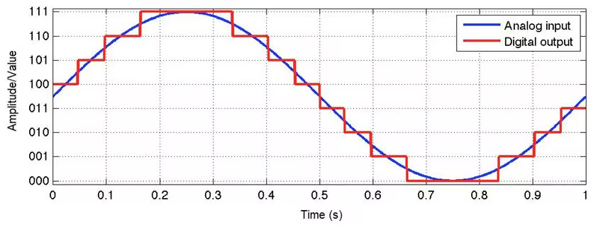
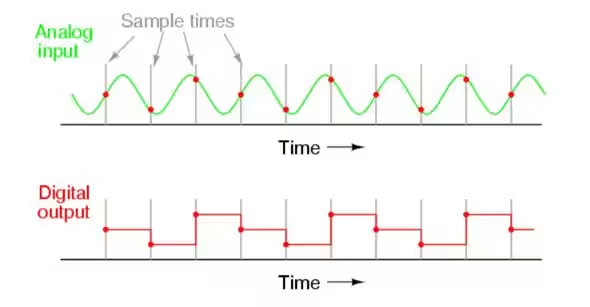
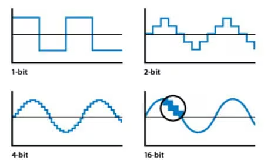

# Anatomy of the Motion Control of Mushibot

## 1. Objectives

In [the previous blog](./S06E04_anatomy_wheel_legged_mushibot.md), we studied how to wire the motors, servos, sensors and IMU modules together, 
to construct a wheel-legged robot, [Mushibot](https://github.com/MuShibo/Micro-Wheeled_leg-Robot), 
which is almost a mini version of ETH Zurich's Ascento, 
with some differences in the shape and structure of the leg linkages etc.

In this blog, we dive into the details how to control the motors and servos for desired motion, using the robot status information collected from 
the motor encoders, the IMU (gyro and accelerometer) modules and ADC (analog to digital converter). 
Later on, we will discuss how to use the environmental information retrieved from camera etc. 

&nbsp;
## 2. Analog to Digital Converter with ESP32 

The APIs of ADC with ESP32 changes dramatically from the previous versions to the latest v5.3.x. 

The general concept of ADC is quite straightward, 
according to [Wikipedia](https://en.wikipedia.org/wiki/Analog-to-digital_converter),

> An ADC provides an isolated measurement such as an electronic device that converts an analog input voltage or current
> to a digital number representing the magnitude of the voltage or current.

There are a few technical terms that we must understand in order to use the APIs of ESP32 ADC correctly.

&nbsp;
### 2.1 Terminology

[The purpose of ADC](https://www.arrow.com/en/research-and-events/articles/engineering-resource-basics-of-analog-to-digital-converters) 
is to convert a analog continuous signal into a digital signal, referring to the following picture. 

   

     
   

#### 1. [Sampling rate/Frequency](https://www.arrow.com/en/research-and-events/articles/engineering-resource-basics-of-analog-to-digital-converters)

The sampling rate or frequency of an ADC is explained in the following picture. 
The higher rate, the better accuracy. 

   

     
   

#### 2. [Resolution/Bitwidth](https://www.arrow.com/en/research-and-events/articles/engineering-resource-basics-of-analog-to-digital-converters)

The resolution of an ADC depends on the number of logic gates inside the ADC chip. 
The more logic gates, the higher resolution, the better accuracy. 

The resolution of an ADC is usually represented by *bitwidth*. 

Resolution of [ESP32 ADC](https://docs.espressif.com/projects/esp-idf/en/release-v4.4/esp32/api-reference/peripherals/adc.html#adc-conversion) raw results is 12-bit.

   

     
   

#### 3. [Vref vs Step size](https://eevibes.com/computing/discuss-the-characteristics-of-adc-in-detail/)

`Vref` stands for reference voltage. It is one of the input voltages. 

`Step size` is determined by reference voltage and resolution. In an 8-bit ADC, step size is Vref/256 because 2 to the power of 8 give us 256 steps. The larger reference voltage we give as input, we get larger value of step size.

#### 4. [Attenuation](https://docs.espressif.com/projects/esp-idf/en/release-v4.4/esp32/api-reference/peripherals/adc.html#adc-attenuation)

`Vref` is the reference voltage used internally by ESP32 ADCs for measuring the input voltage. 

The ESP32 ADCs can measure analog voltages from `0` V to `Vref`. Among different chips, the `Vref` varies, the median is 1.1 V. 

In order to convert voltages larger than `Vref`, input voltages can be attenuated before being input to the ADCs. 

There are 4 available attenuation options, the higher the attenuation is, the higher the measurable input voltage could be.

- `ADC_ATTEN_DB_0`: 100 mV ~ 950 mV
- `ADC_ATTEN_DB_2_5`: 100 mV ~ 1250 mV
- `ADC_ATTEN_DB_6`: 150 mV ~ 1750 mV
- `ADC_ATTEN_DB_12`: 150 mV ~ 2450 mV

#### 5. [Conversion](https://docs.espressif.com/projects/esp-idf/en/release-v4.4/esp32/api-reference/peripherals/adc.html#adc-conversion)

An ADC conversion is to convert the input analog voltage to a digital value. The ADC conversion results provided by the ADC driver APIs are raw data. 

~~~
adc1_get_raw()
adc2_get_raw()
~~~

Resolution of ESP32 ADC raw results under Single Read mode is 12-bit.

To calculate the voltage based on the ADC raw results, this formula can be used,

~~~
Vout = Dout * Vmax / Dmax 
~~~

- Dout: ADC raw digital reading result, i.e. the result of `adc1_get_raw()`.
- Vmax: Maximum measurable input analog voltage, i.e. `Vref`. 
- Dmax: Since the resolution of ESP32 ADC is 12-bit, 2^12 = 4096, the maximum of the output ADC raw digital reading result, Dmax = 4095.

#### 6. [Channel, ADC1 & ADC2](https://docs.espressif.com/projects/esp-idf/en/release-v4.4/esp32/api-reference/peripherals/adc.html#adc-channels)

The ESP32 integrates 2 SAR (Successive Approximation Register) ADCs, supporting a total of 18 measurement channels (analog enabled pins).

- `ADC1`, 8 channels: GPIO32 - GPIO39
  
- `ADC2`, 10 channels: GPIO0, GPIO2, GPIO4, GPIO12 - GPIO15, GOIO25 - GPIO27

The `ADC2` is mainly used by wifi, hence in most cases, we only use `ADC1`. 

#### 7. [One-shot vs Continuous ADC](https://docs.espressif.com/projects/esp-idf/en/v5.3.1/esp32/api-reference/peripherals/adc_oneshot.html#introduction)

ADC can be used in two scenarios, 

- Generate one-shot ADC conversion result

- Generate continuous ADC conversion results

Both of the ADC units support one-shot mode, which is suitable for low-frequency sampling operations.

#### 8. [Parallel vs Serial ADC](https://eevibes.com/computing/discuss-the-characteristics-of-adc-in-detail)

There are two types of ADC i.e. parallel and serial ADC. 

Parallel ADC gives output in chunks. They have 8 pins for output, D0-D7 gives output between ADC and the CPU in an 8 bit ADC. 

It is a faster way of getting digital values from analog signal. But it takes too much place on a circuit board. 

When circuit space is crucial, we use serial ADC. 

Serial ADC is a bit slower in giving output than parallel ADC, because it gives one bit at a time as output, 
hence we have only one pin for output. 

Due to this, serial ADCs are widely used in circuits. 

#### 9. [Calibration scheme](https://docs.espressif.com/projects/esp-idf/en/release-v4.4/esp32/api-reference/peripherals/adc.html#adc-calibration)

Even though the design value of the ADC reference voltage is 1100 mV, 
the true reference voltage can range from 1000 mV to 1200 mV amongst different ESP32 chips.

Calibration is to align the input voltage with the ADC reading, regardless the various true reference voltages of different ESP32 chips.

To align the input voltage with the ADC reading, we can use line-fitting or curve-fitting [calibration scheme](https://docs.espressif.com/projects/esp-idf/en/v5.3.1/esp32/api-reference/peripherals/adc_calibration.html#adc-calibration-line-fitting-scheme). 

The line or the curve of the input voltage with respect to the ADC reading, is called `characteristic curve`.

The following picture displays two ESP32 chips with different real reference voltages. 
With different reference voltages, the alignments of the input voltage with the ADC reading are different. 

The picture displays the two line-fittings with respect to the two different reference voltages. 

   

     
   

#### 10. [Calibration values](https://docs.espressif.com/projects/esp-idf/en/release-v4.4/esp32/api-reference/peripherals/adc.html#calibration-values)

Calibration values are used to generate the `characteristic curves` that account for the variation of ADC reference voltage of a particular ESP32 chip. 

For line-fitting scheme, its calibration values are used to generate the parameters `a` and `b` in the linear formular, `y = a * x + b`. 

There are currently 3 sources of calibration values on ESP32,

- Two Point values:

   They represent each of the ADCs’ readings at 150 mV and 850 mV. To obtain more accurate calibration results, these values should be measured by user and burned into eFuse `BLOCK3`.

- eFuse Vref:

  This value represents the true ADC reference voltage. It is measured and burned into eFuse `BLOCK0` during factory calibration.

- Default Vref:

  This value is an estimate of the ADC reference voltage, provided by the user as a parameter during characterization. If `Two Point` or `Vref` values are unavailable, `Default Vref` will be used.

#### 11. [eFuse for calibration values](https://docs.espressif.com/projects/esp-idf/en/v5.3.1/esp32/api-reference/peripherals/adc_calibration.html#adc-calibration-line-fitting-scheme)

In ESP32 chips, `eFuse` is a memory component to store important data safely, and perhaps permanently. 

One can use `adc_cali_scheme_line_fitting_check_efuse()` to check the eFuse bits. 

Normally, the line-fitting scheme eFuse value is `ADC_CALI_LINE_FITTING_EFUSE_VAL_EFUSE_TP` or `ADC_CALI_LINE_FITTING_EFUSE_VAL_EFUSE_VREF`. 
This means the Line Fitting scheme uses calibration parameters burned in the eFuse to do the calibration.

#### 12. [Characteristics](https://eevibes.com/computing/discuss-the-characteristics-of-adc-in-detail)

As mentioned above, `characteristic curve` refers to the line or the curve of calibration scheme, for the alignment of the input voltage with the ADC reading. 

However, `characteristics of an ADC` is a general term containing the following contents, 

- Resolution, 
- Conversion time, 
- Vref, 
- Digital data output, `Dout = Vin / Step_size`,
- Parallel versus serial ADC, 
- Analog input channels, 
- Start-conversion and end-of-conversion signals. 

&nbsp;
### 2.2 Workflow

