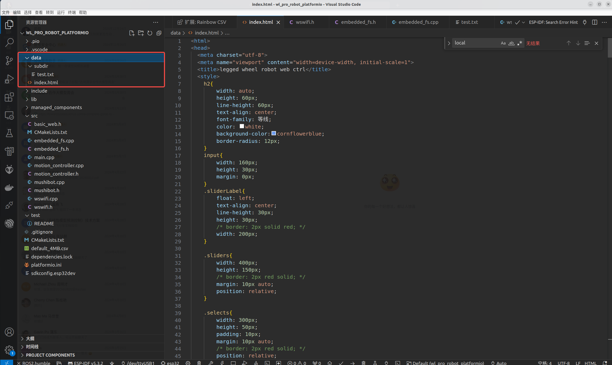
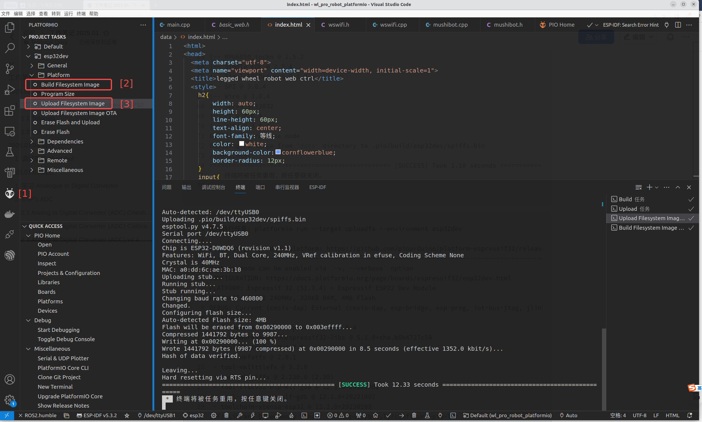

# Anatomy of Mushibot's Embedded File System

## 1. Objectives

The original Mushibot system doesn't use flash file system, we added a SPIFFS file system to Mushibot. 

The reason that we wrote this blog dedicated to the topic of embedded file system for ESP32 is that it is errorr-prone, 
especially because of the complicated and multiple configuration combination. 

&nbsp;
## 2. SPIFFS that works

This section provides a SPIFFS based file system implementation that works well with the Mushibot which uses a ESP32-WROOM-32 board. 

[LittleFS outperforms SPIFFS](https://www.techrm.com/file-management-on-esp32-spiffs-and-littlefs-compared/), and very likely to replace SPIFFS. 

| Feature                   | SPIFFS                  | LittleFS                            |
| ------------------------- | ----------------------- | ----------------------------------- |
| Directory support         | No                      | Yes                                 |
| Crash Resilience          | Limited                 | High                                |
| Memory Efficiency         | Good                    | Great                               |
| Implementation Complexity | Low                     | Average                             |
| Fragmentation Management  | Lower                   | Greater                             |
| Typical Applications      | Configuration File, Log | Critical Data, Complex Applications |

However, we didn't make LittleFS work properly in the Mushibot system, and the reason is unknown yet. 
In the later section of this blog, we took a record of how we used LittleFS in the Mushibot system, and what bugs we encountered. 

We tooks the following steps to make SPIFFS in the Mushibot system, 

1. Configure `platformio.ini`,
2. Create a partition table,
3. Make an image of the files, and upload to the ESP32 board, using Platformio tools,
4. Write C++ programs to manage the uploaded files,
5. Upload the programs to ESP32 board, and run them.   

&nbsp;
### 2.1 Configure platformio.ini

This [`platformio.ini`](https://github.com/housework-robot/main/blob/main/S06_robot_side/S06E06_src/src/Mushibot20250107/platformio.ini) works well. 

It contains quite some lines that were commented, so as to be disfuntioned. We have tried those commented lines, and they behaved either unexpected or unnecessary. 

Following lines in the `platformio.ini` are related to SPIFFS. 

~~~
[env:esp32dev]
platform = espressif32
board = esp32dev
framework = arduino
board_build.filesytem = spiffs
board_build.partitions = default_4MB.csv
;board_build.flash_mode = dio
;board_build.f_flash = 80000000L
~~~

* **env**, **platform** and **board**
  
  The Mushibot system uses a ESP32-WROOM-32 board.

  [The platformio official guide](https://docs.platformio.org/en/latest/boards/index.html)
  does provide many board options, but no one fits `ESP32-WROOM-32 board` well.

  After quite some trial and error, we found the follow configuration values worked well.

  ~~~
  [env:esp32dev]
  platform = espressif32
  board = esp32dev
  framework = arduino
  ~~~

  You can replace `platform = espressif32` with `platform = https://github.com/pioarduino/platform-espressif32/releases/download/51.03.04/platform-espressif32.zip`.

  But it doesn't work when using `platform = https://github.com/platformio/platform-espressif32.git`. 

* **board_build.filesytem**

  Referring to [the platformio official guide](https://docs.platformio.org/en/latest/platforms/espressif32.html#uploading-files-to-file-system),
  possible values for `board_build.filesystem` are `spiffs` (default), `littlefs` and `fatfs`.

  `littlefs` didn't work well in the Mushibot system, and we will discuss the bug in later section of this blog.

  So far, only `spiffs` works well for the Mushibot system.
  
* **board_build.partitions**

  We copied a partition table from the platformio official example repo, and pasted it as `default_4MB.csv`.

* **board_build.flash_mode** and **board_build.f_flash**

  Referring to [the platformio's official guide], we used the default values for these two parameters, and they worked well.

  ~~~
  ;board_build.flash_mode = dio
  ;board_build.f_flash = 80000000L
  ~~~

  `flash_mode` has 4 valid values, `qio`, `qout`, `dio` and `dout`. We tried `dio`, it behaved as expected.

  `f_flash` has 2 valid values, 80000000L for 80MHz frequency, and the default value is 40000000L for 40MHz.
  

&nbsp;
### 2.2 Create a partition table

We adopted [an official example partition table](https://github.com/espressif/arduino-esp32/blob/master/tools/partitions/default.csv), 
and renamed it to `default_4MB.csv`.  Following is its content,

| # Name  	| Type	 | SubType 	| Offset  	| Size    	| Flags |
|----------|-------|----------|----------|----------|-------|
| nvs     	| data 	| nvs      |	0x9000   |	0x5000   |      	|
| otadata	 | data	 | ota	     | 0xe000  	| 0x2000	  |       |
| app0    	| app  	| ota_0   	| 0x10000	 | 0x140000	|       |
| app1	    | app	  | ota_1   	| 0x150000	| 0x140000	|       |
| spiffs	  | data  | spiffs  	| 0x290000	| 0x160000 |	      |
| coredump	| data	 | coredump |	0x3F0000	| 0x10000  |	      |

Referring to [the official guide of partition table](https://docs.espressif.com/projects/esp-idf/en/stable/esp32/api-guides/partition-tables.html#subtype),
the `subtype` can be either `spiffs`, or `littlefs`, or `fat`.

We tried `littlefs`, and it failed. When using `spiffs`, it worked well.

&nbsp;
### 2.3 Upload to the ESP32 board

Using platformio, it is quite straightforward to upload files to ESP32 with SPIFFS and LittleFS file systems. 

Referring to these two articles, e. 
[ESP32 with VS Code and PlatformIO: Upload Files to LittleFS Filesystem](https://randomnerdtutorials.com/esp32-vs-code-platformio-littlefs/) 
and [ESP32 with VS Code and PlatformIO: Upload Files to SPIFFS Filesystem](https://randomnerdtutorials.com/esp32-vs-code-platformio-spiffs/), 
we can take the following steps to upload files and directories to ESP32 board, using platformio.

&nbsp;
#### 1. Put the files and directories in `/data` folder in your platformio project

   

     
   
   

   As shown in the above screenshot, you must create a folder in your platformio project, name it as `data`. The folder name must be `data`, other names are not allowed.

   The `data` folder must be at the same level as `src` folder in the project file structure. 

   After then, copy and paste your files and directories into the `data` folder.

&nbsp;
#### 2. Build filesystem image

   

     
   

   Click the `platformio` icon at the left side bar, as shown in the red `[1]` in the screenshot.

   Select `esp32dev` env, that is identical to the `env` setting in the `platformio.ini`.

   Expand the `Platform` cascade menu.

   Finally, click `Build Filesystem Image`, as shown in the red `[2]` in the screenshot.

   After then, in the terminal block of the VSCode, the platformio will print out the following messages.

   ~~~
     *  正在执行任务: platformio run --target buildfs --environment esp32dev 
    
    Processing esp32dev (platform: espressif32; board: esp32dev; framework: arduino)
    ---------------------------------------------------------------------------------------------------------------
    Verbose mode can be enabled via `-v, --verbose` option
    CONFIGURATION: https://docs.platformio.org/page/boards/espressif32/esp32dev.html
    PLATFORM: Espressif 32 (53.3.10) > Espressif ESP32 Dev Module
    HARDWARE: ESP32 240MHz, 320KB RAM, 4MB Flash
    DEBUG: Current (cmsis-dap) External (cmsis-dap, esp-bridge, esp-prog, iot-bus-jtag, jlink, minimodule, olimex-arm-usb-ocd, olimex-arm-usb-ocd-h, olimex-arm-usb-tiny-h, olimex-jtag-tiny, tumpa)
    PACKAGES: 
     - framework-arduinoespressif32 @ 3.1.0 
     - framework-arduinoespressif32-libs @ 5.3.0+sha.083aad99cf 
     - tool-esptoolpy @ 4.8.5 
     - tool-mklittlefs @ 3.2.0 
     - tool-riscv32-esp-elf-gdb @ 14.2.0+20240403 
     - tool-xtensa-esp-elf-gdb @ 14.2.0+20240403 
     - toolchain-xtensa-esp-elf @ 13.2.0+20240530
    LDF: Library Dependency Finder -> https://bit.ly/configure-pio-ldf
    LDF Modes: Finder ~ deep, Compatibility ~ soft
    Found 51 compatible libraries
    Scanning dependencies...
    Dependency Graph
    |-- ArduinoJson @ 7.3.0
    |-- WebSockets @ 2.6.1
    |-- MPU6050_tockn @ 1.5.2
    |-- Simple FOC @ 2.3.4
    |-- SimpleFOCDrivers @ 1.0.8
    |-- SPI @ 3.1.0
    |-- Wire @ 3.1.0
    |-- FS @ 3.1.0
    |-- SPIFFS @ 3.1.0
    |-- Servo_STS3032
    |-- WiFi @ 3.1.0
    Building in release mode
    Building FS image from 'data' directory to .pio/build/esp32dev/spiffs.bin
    /index.html
    /subdir/test.txt
    ========================================= [SUCCESS] Took 1.47 seconds =========================================
     *  终端将被任务重用，按任意键关闭。 
   ~~~

   Notice that, the entire file system, including the files, directories, and the files in the directories,
   are all burned into a binary image, `spiffs.bin`.

   ~~~
    Building FS image from 'data' directory to .pio/build/esp32dev/spiffs.bin
    /index.html
    /subdir/test.txt
   ~~~
   
&nbsp;
#### 3. Upload filesytem image

   Still referring to the previous screenshot, finally click `Upload Filesystem Image`, as shown in the red `[3]`.

   After then, in the terminal block of the VSCode, the platformio will print out the following messages.

   ~~~   
     *  正在执行任务: platformio run --target uploadfs --environment esp32dev 
    
    Processing esp32dev (platform: espressif32; board: esp32dev; framework: arduino)
    ---------------------------------------------------------------------------------------------------------------
    Verbose mode can be enabled via `-v, --verbose` option
    CONFIGURATION: https://docs.platformio.org/page/boards/espressif32/esp32dev.html
    PLATFORM: Espressif 32 (53.3.10) > Espressif ESP32 Dev Module
    HARDWARE: ESP32 240MHz, 320KB RAM, 4MB Flash
    DEBUG: Current (cmsis-dap) External (cmsis-dap, esp-bridge, esp-prog, iot-bus-jtag, jlink, minimodule, olimex-arm-usb-ocd, olimex-arm-usb-ocd-h, olimex-arm-usb-tiny-h, olimex-jtag-tiny, tumpa)
    PACKAGES: 
     - framework-arduinoespressif32 @ 3.1.0 
     - framework-arduinoespressif32-libs @ 5.3.0+sha.083aad99cf 
     - tool-esptoolpy @ 4.8.5 
     - tool-mkfatfs @ 2.0.1 
     - tool-mklittlefs @ 3.2.0 
     - tool-mkspiffs @ 2.230.0 (2.30) 
     - tool-riscv32-esp-elf-gdb @ 14.2.0+20240403 
     - tool-xtensa-esp-elf-gdb @ 14.2.0+20240403 
     - toolchain-xtensa-esp-elf @ 13.2.0+20240530
    LDF: Library Dependency Finder -> https://bit.ly/configure-pio-ldf
    LDF Modes: Finder ~ deep, Compatibility ~ soft
    Found 51 compatible libraries
    Scanning dependencies...
    Dependency Graph
    |-- ArduinoJson @ 7.3.0
    |-- WebSockets @ 2.6.1
    |-- MPU6050_tockn @ 1.5.2
    |-- Simple FOC @ 2.3.4
    |-- SimpleFOCDrivers @ 1.0.8
    |-- SPI @ 3.1.0
    |-- Wire @ 3.1.0
    |-- FS @ 3.1.0
    |-- SPIFFS @ 3.1.0
    |-- Servo_STS3032
    |-- WiFi @ 3.1.0
    Building in release mode
    Building FS image from 'data' directory to .pio/build/esp32dev/spiffs.bin
    /index.html
    /subdir/test.txt
    Looking for upload port...
    
    Warning! Please install `99-platformio-udev.rules`. 
    More details: https://docs.platformio.org/en/latest/core/installation/udev-rules.html
    
    Auto-detected: /dev/ttyUSB0
    Uploading .pio/build/esp32dev/spiffs.bin
    esptool.py v4.8.5
    Serial port /dev/ttyUSB0
    Connecting....
    Chip is ESP32-D0WDQ6 (revision v1.1)
    Features: WiFi, BT, Dual Core, 240MHz, VRef calibration in efuse, Coding Scheme None
    Crystal is 40MHz
    MAC: a0:dd:6c:ae:3b:10
    Uploading stub...
    Running stub...
    Stub running...
    Changing baud rate to 460800
    Changed.
    Configuring flash size...
    Auto-detected Flash size: 4MB
    Flash will be erased from 0x00290000 to 0x003effff...
    Compressed 1441792 bytes to 10055...
    Writing at 0x00290000... (100 %)
    Wrote 1441792 bytes (10055 compressed) at 0x00290000 in 8.0 seconds (effective 1438.3 kbit/s)...
    Hash of data verified.
    
    Leaving...
    Hard resetting via RTS pin...
    ======================================== [SUCCESS] Took 12.07 seconds ========================================
     *  终端将被任务重用，按任意键关闭。 
   ~~~

   Notice that,

   1. `Upload Filesystem Image` repeated the previous task `Build Filesystem Image`.
  
   2. It uploaded `spiffs.bin` by `esptool.py` via Serial.
  
      ~~~
      Auto-detected: /dev/ttyUSB0
      Uploading .pio/build/esp32dev/spiffs.bin
      esptool.py v4.8.5
      Serial port /dev/ttyUSB0
      Connecting....
      ~~~

   

&nbsp;
### 2.4 Write C++ programs to manage the uploaded files

&nbsp;
### 2.5 Upload the programs to ESP32 board, and run them

&nbsp;
## 3. LittleFFS failed

Similar to the previous section, we took 5 steps to use `LittleFS` in the Mushibot system. 

 

