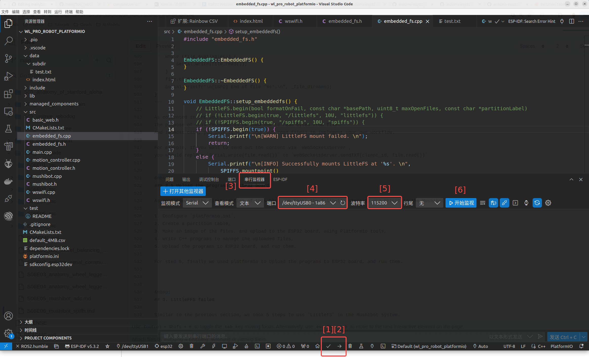

# Anatomy of Mushibot's Embedded File System

## 1. Objectives

The original Mushibot system doesn't use flash file system, we added a SPIFFS file system to Mushibot. 

The reason that we wrote this blog dedicated to the topic of embedded file system for ESP32 is that it is errorr-prone, 
especially because of the complicated and multiple configuration combination. 

&nbsp;
## 2. SPIFFS that works

This section provides a SPIFFS based file system implementation that works well with the Mushibot which uses a ESP32-WROOM-32 board. 

[LittleFS outperforms SPIFFS](https://www.techrm.com/file-management-on-esp32-spiffs-and-littlefs-compared/), and very likely to replace SPIFFS. 

| Feature                   | SPIFFS                  | LittleFS                            |
| ------------------------- | ----------------------- | ----------------------------------- |
| Directory support         | No                      | Yes                                 |
| Crash Resilience          | Limited                 | High                                |
| Memory Efficiency         | Good                    | Great                               |
| Implementation Complexity | Low                     | Average                             |
| Fragmentation Management  | Lower                   | Greater                             |
| Typical Applications      | Configuration File, Log | Critical Data, Complex Applications |

However, we didn't make LittleFS work properly in the Mushibot system, and the reason is unknown yet. 
In the later section of this blog, we took a record of how we used LittleFS in the Mushibot system, and what bugs we encountered. 

We tooks the following steps to use SPIFFS in the Mushibot system, 

1. Configure `platformio.ini`,
2. Create a partition table,
3. Build the filesystem image, and upload it to the ESP32 board, using Platformio tools,
4. Write C++ programs to manage the uploaded files,
5. Upload the programs to ESP32 board, and run them.   

&nbsp;
### 2.1 Configure platformio.ini

This [`platformio.ini`](https://github.com/housework-robot/main/blob/main/S06_robot_side/S06E06_src/src/Mushibot20250107/platformio.ini) works well. 

It contains quite some lines that were commented, so as to be disfuntioned. We have tried those commented lines, and they behaved either unexpected or unnecessary. 

Following lines in the `platformio.ini` are related to SPIFFS. 

~~~
[env:esp32dev]
platform = espressif32
board = esp32dev
framework = arduino
board_build.filesytem = spiffs
board_build.partitions = default_4MB.csv
;board_build.flash_mode = dio
;board_build.f_flash = 80000000L
~~~

* **env**, **platform** and **board**
  
  The Mushibot system uses a ESP32-WROOM-32 board.

  [The platformio official guide](https://docs.platformio.org/en/latest/boards/index.html)
  does provide many board options, but no one fits `ESP32-WROOM-32 board` well.

  After quite some trial and error, we found the follow configuration values worked well.

  ~~~
  [env:esp32dev]
  platform = espressif32
  board = esp32dev
  framework = arduino
  ~~~

  You can replace `platform = espressif32` with`platform = https://github.com/pioarduino/platform-espressif32/releases/download/51.03.04/platform-espressif32.zip`.

  But it doesn't work when using `platform = https://github.com/platformio/platform-espressif32.git`. 

* **board_build.filesytem**

  Referring to [the platformio official guide](https://docs.platformio.org/en/latest/platforms/espressif32.html#uploading-files-to-file-system),
  possible values for `board_build.filesystem` are `spiffs` (default), `littlefs` and `fatfs`.

  `littlefs` didn't work well in the Mushibot system, and we will discuss the bug in later section of this blog.

  So far, only `spiffs` works well for the Mushibot system.
  
* **board_build.partitions**

  We copied a partition table from the platformio official example repo, and pasted it as `default_4MB.csv`.

* **board_build.flash_mode** and **board_build.f_flash**

  Referring to [the platformio's official guide], we used the default values for these two parameters, and they worked well.

  ~~~
  ;board_build.flash_mode = dio
  ;board_build.f_flash = 80000000L
  ~~~

  `flash_mode` has 4 valid values, `qio`, `qout`, `dio` and `dout`. We tried `dio`, it behaved as expected.

  `f_flash` has 2 valid values, 80000000L for 80MHz frequency, and the default value is 40000000L for 40MHz.
  

&nbsp;
### 2.2 Create a partition table

We adopted [an official example partition table](https://github.com/espressif/arduino-esp32/blob/master/tools/partitions/default.csv), 
and renamed it to `default_4MB.csv`.  Following is its content,

| # Name  	| Type	 | SubType 	| Offset  	| Size    	| Flags |
|----------|-------|----------|----------|----------|-------|
| nvs     	| data 	| nvs      |	0x9000   |	0x5000   |      	|
| otadata	 | data	 | ota	     | 0xe000  	| 0x2000	  |       |
| app0    	| app  	| ota_0   	| 0x10000	 | 0x140000	|       |
| app1	    | app	  | ota_1   	| 0x150000	| 0x140000	|       |
| spiffs	  | data  | spiffs  	| 0x290000	| 0x160000 |	      |
| coredump	| data	 | coredump |	0x3F0000	| 0x10000  |	      |

Referring to [the official guide of partition table](https://docs.espressif.com/projects/esp-idf/en/stable/esp32/api-guides/partition-tables.html#subtype),
the `subtype` can be either `spiffs`, or `littlefs`, or `fat`.

We tried `littlefs`, and it failed. When using `spiffs`, it worked well.

&nbsp;
### 2.3 Upload to the ESP32 board

Using platformio, it is quite straightforward to upload files to ESP32 with SPIFFS and LittleFS file systems. 

Referring to these two articles, e. 
[ESP32 with VS Code and PlatformIO: Upload Files to LittleFS Filesystem](https://randomnerdtutorials.com/esp32-vs-code-platformio-littlefs/) 
and [ESP32 with VS Code and PlatformIO: Upload Files to SPIFFS Filesystem](https://randomnerdtutorials.com/esp32-vs-code-platformio-spiffs/), 
we can take the following steps to upload files and directories to ESP32 board, using platformio.

&nbsp;
#### 1. Put the files and directories in `/data` folder in your platformio project

   

     
   
   

   As shown in the above screenshot, you must create a folder in your platformio project, name it as `data`. The folder name must be `data`, other names are not allowed.

   The `data` folder must be at the same level as `src` folder in the project file structure. 

   After then, copy and paste your files and directories into the `data` folder.

&nbsp;
#### 2. Build filesystem image

   

     
   

   Click the `platformio` icon at the left side bar, as shown in the red `[1]` in the screenshot.

   Select `esp32dev` env, that is identical to the `env` setting in the `platformio.ini`.

   Expand the `Platform` cascade menu.

   Finally, click `Build Filesystem Image`, as shown in the red `[2]` in the screenshot.

   After then, in the terminal block of the VSCode, the platformio will print out the following messages.

   ~~~
     *  正在执行任务: platformio run --target buildfs --environment esp32dev 
    
    Processing esp32dev (platform: espressif32; board: esp32dev; framework: arduino)
    ---------------------------------------------------------------------------------------------------------------
    Verbose mode can be enabled via `-v, --verbose` option
    CONFIGURATION: https://docs.platformio.org/page/boards/espressif32/esp32dev.html
    PLATFORM: Espressif 32 (53.3.10) > Espressif ESP32 Dev Module
    HARDWARE: ESP32 240MHz, 320KB RAM, 4MB Flash
    DEBUG: Current (cmsis-dap) External (cmsis-dap, esp-bridge, esp-prog, iot-bus-jtag, jlink, minimodule, olimex-arm-usb-ocd, olimex-arm-usb-ocd-h, olimex-arm-usb-tiny-h, olimex-jtag-tiny, tumpa)
    PACKAGES: 
     - framework-arduinoespressif32 @ 3.1.0 
     - framework-arduinoespressif32-libs @ 5.3.0+sha.083aad99cf 
     - tool-esptoolpy @ 4.8.5 
     - tool-mklittlefs @ 3.2.0 
     - tool-riscv32-esp-elf-gdb @ 14.2.0+20240403 
     - tool-xtensa-esp-elf-gdb @ 14.2.0+20240403 
     - toolchain-xtensa-esp-elf @ 13.2.0+20240530
    LDF: Library Dependency Finder -> https://bit.ly/configure-pio-ldf
    LDF Modes: Finder ~ deep, Compatibility ~ soft
    Found 51 compatible libraries
    Scanning dependencies...
    Dependency Graph
    |-- ArduinoJson @ 7.3.0
    |-- WebSockets @ 2.6.1
    |-- MPU6050_tockn @ 1.5.2
    |-- Simple FOC @ 2.3.4
    |-- SimpleFOCDrivers @ 1.0.8
    |-- SPI @ 3.1.0
    |-- Wire @ 3.1.0
    |-- FS @ 3.1.0
    |-- SPIFFS @ 3.1.0
    |-- Servo_STS3032
    |-- WiFi @ 3.1.0
    Building in release mode
    Building FS image from 'data' directory to .pio/build/esp32dev/spiffs.bin
    /index.html
    /subdir/test.txt
    ========================================= [SUCCESS] Took 1.47 seconds =========================================
     *  终端将被任务重用，按任意键关闭。 
   ~~~

   Notice that, the entire file system, including the files, directories, and the files in the directories,
   are all burned into a binary image, `spiffs.bin`.

   ~~~
    Building FS image from 'data' directory to .pio/build/esp32dev/spiffs.bin
    /index.html
    /subdir/test.txt
   ~~~
   
&nbsp;
#### 3. Upload filesytem image

   Still referring to the previous screenshot, finally click `Upload Filesystem Image`, as shown in the red `[3]`.

   After then, in the terminal block of the VSCode, the platformio will print out the following messages.

   ~~~   
     *  正在执行任务: platformio run --target uploadfs --environment esp32dev 
    
    Processing esp32dev (platform: espressif32; board: esp32dev; framework: arduino)
    ---------------------------------------------------------------------------------------------------------------
    Verbose mode can be enabled via `-v, --verbose` option
    CONFIGURATION: https://docs.platformio.org/page/boards/espressif32/esp32dev.html
    PLATFORM: Espressif 32 (53.3.10) > Espressif ESP32 Dev Module
    HARDWARE: ESP32 240MHz, 320KB RAM, 4MB Flash
    DEBUG: Current (cmsis-dap) External (cmsis-dap, esp-bridge, esp-prog, iot-bus-jtag, jlink, minimodule, olimex-arm-usb-ocd, olimex-arm-usb-ocd-h, olimex-arm-usb-tiny-h, olimex-jtag-tiny, tumpa)
    PACKAGES: 
     - framework-arduinoespressif32 @ 3.1.0 
     - framework-arduinoespressif32-libs @ 5.3.0+sha.083aad99cf 
     - tool-esptoolpy @ 4.8.5 
     - tool-mkfatfs @ 2.0.1 
     - tool-mklittlefs @ 3.2.0 
     - tool-mkspiffs @ 2.230.0 (2.30) 
     - tool-riscv32-esp-elf-gdb @ 14.2.0+20240403 
     - tool-xtensa-esp-elf-gdb @ 14.2.0+20240403 
     - toolchain-xtensa-esp-elf @ 13.2.0+20240530
    LDF: Library Dependency Finder -> https://bit.ly/configure-pio-ldf
    LDF Modes: Finder ~ deep, Compatibility ~ soft
    Found 51 compatible libraries
    Scanning dependencies...
    Dependency Graph
    |-- ArduinoJson @ 7.3.0
    |-- WebSockets @ 2.6.1
    |-- MPU6050_tockn @ 1.5.2
    |-- Simple FOC @ 2.3.4
    |-- SimpleFOCDrivers @ 1.0.8
    |-- SPI @ 3.1.0
    |-- Wire @ 3.1.0
    |-- FS @ 3.1.0
    |-- SPIFFS @ 3.1.0
    |-- Servo_STS3032
    |-- WiFi @ 3.1.0
    Building in release mode
    Building FS image from 'data' directory to .pio/build/esp32dev/spiffs.bin
    /index.html
    /subdir/test.txt
    Looking for upload port...
    
    Warning! Please install `99-platformio-udev.rules`. 
    More details: https://docs.platformio.org/en/latest/core/installation/udev-rules.html
    
    Auto-detected: /dev/ttyUSB0
    Uploading .pio/build/esp32dev/spiffs.bin
    esptool.py v4.8.5
    Serial port /dev/ttyUSB0
    Connecting....
    Chip is ESP32-D0WDQ6 (revision v1.1)
    Features: WiFi, BT, Dual Core, 240MHz, VRef calibration in efuse, Coding Scheme None
    Crystal is 40MHz
    MAC: a0:dd:6c:ae:3b:10
    Uploading stub...
    Running stub...
    Stub running...
    Changing baud rate to 460800
    Changed.
    Configuring flash size...
    Auto-detected Flash size: 4MB
    Flash will be erased from 0x00290000 to 0x003effff...
    Compressed 1441792 bytes to 10055...
    Writing at 0x00290000... (100 %)
    Wrote 1441792 bytes (10055 compressed) at 0x00290000 in 8.0 seconds (effective 1438.3 kbit/s)...
    Hash of data verified.
    
    Leaving...
    Hard resetting via RTS pin...
    ======================================== [SUCCESS] Took 12.07 seconds ========================================
     *  终端将被任务重用，按任意键关闭。 
   ~~~

   Notice that,

   1. `Upload Filesystem Image` repeated the previous task `Build Filesystem Image`.
  
   2. It uploaded `spiffs.bin` by `esptool.py` via Serial.
  
      ~~~
      Auto-detected: /dev/ttyUSB0
      Uploading .pio/build/esp32dev/spiffs.bin
      esptool.py v4.8.5
      Serial port /dev/ttyUSB0
      Connecting....
      ~~~

   

&nbsp;
### 2.4 Write C++ programs to manage the uploaded files

We implemented [`embedded_fs.{h, cpp}`](./S06E06_src/src/Mushibot20250107/src) 
for SPIFFS file system, and its application in the Mushibot system. 

Following is the source code of `embedded_fs.h`.

~~~
/*
   Modified from:
   https://github.com/espressif/arduino-esp32/blob/master/libraries/LittleFS/examples/LITTLEFS_test/LITTLEFS_test.ino
*/

#ifndef EMBEDDED_FS_H_
#define EMBEDDED_FS_H_

#include <Arduino.h>
#include <FS.h>
#include <SPIFFS.h>

// Even though LittleFS is to replace SPIFFS, however, for unknown reason in our environment, 
// we can successfully upload directories and files in LittleFS with Platformio, 
// but we cannot use LittleFS to access the uploaded files. 
// #include <LittleFS.h>

class EmbeddedFS
{
public:
    EmbeddedFS();
    virtual ~EmbeddedFS();

    void setup_embeddedfs(); 
    void loop_embeddedfs();

    void list_dir(String dir_name, int level);
    void create_dir(String dir_path);
    void delete_dir(String dir_path);

    void read_file_to_serial(String file_dirname);
    void write_file(String file_dirname, String msg);
    void append_file(String file_dirname, String msg);
    void rename_file(String file_dirname1, String file_dirname2);
    void delete_file(String file_dirname);

private:
};

#endif
~~~ 

&nbsp;
#### 1. `setup_embeddedfs()` and `loop_embeddedfs()` 

These two functions are used to integrate the SPIFFS file system into the Mushibot system.

The usage of these 2 functions refer to [`wswifi.h`](./S06E06_src/src/Mushibot20250107/src/wswifi.h) and 
[`wswifi.cpp`](./S06E06_src/src/Mushibot20250107/src/wswifi.cpp),

~~~
class WsWifi
{
public:
    WsWifi();
    virtual ~WsWifi();

    // LittleFS wrapped as EmbeddedFS
    EmbeddedFS embedded_fs = EmbeddedFS();
    ...
~~~

~~~
void WsWifi::setup_wswifi() {
    // Setup the LittleFS.
    embedded_fs.setup_embeddedfs();
    ...
}

void WsWifi::loop_wswifi() {
    embedded_fs.loop_embeddedfs();    
    ...
} 
~~~

&nbsp;
#### 2. `setup_embeddedfs()`

`embedded_fs` is based on `SPIFFS`.
For example, `void setup_embeddedfs()` is implemented in the following way,

~~~
void EmbeddedFS::setup_embeddedfs() {
    // LittleFS.begin(bool formatOnFail, const char *basePath, uint8_t maxOpenFiles, const char *partitionLabel)
    // if (!LittleFS.begin(true, "/littlefs", 10U, "littlefs")) {
    // if (!SPIFFS.begin(true, "/spiffs", 10U, "spiffs")) {
    if (!SPIFFS.begin(true)) {
        Serial.printf("\n[WARN] LittleFS mount failed. \n");
        return;
    }
    else {
        Serial.printf("\n[INFO] Successfully mounts LittleFS at '%s'. \n",
            SPIFFS.mountpoint()
        );        
    }   

    // Verify that the SPIFSS file system works well.
    // List file directory with 3 levels. 
    list_dir("/", 3);
    write_file("/subdir/test.txt", "Hello: 20250106, 22:04");
    read_file_to_serial("/subdir/test.txt");
}
~~~

Notice that, 

1. It uses `SPIFFS.begin(true)` to mount the file system, instead of `LittleFS` or others.

2. `SPIFFS.begin()` has 4 input parameters, we used `true` for `formatOnFail`,
    which means that when mounting fails, it will format the related ESP32 memory space.

3. We used the default value, which is `"/spiffs"` for `basePath`,
   but actually you can use whatever name for the `basePath`, except that `"/"` is not allowed.

4. For `partitionLabel`, `"spiffs"` works well, but not `"littlefs"`. 

&nbsp;
#### 3. `list_dir()`

`list_dir(String dir_name, int levels)` is implemented in the following code, 

~~~
void EmbeddedFS::list_dir(String dir_name, int levels) {
    const char *_dir_name = dir_name.c_str();
    Serial.printf("\n[INFO] Listing directory: '%s'\n", dir_name);
    Serial.printf("-- Notice that SPIFSS doesn't recognize directories, but it can find the files inside subdirs. --\n\n");

    File root = SPIFFS.open(_dir_name);
    ...
    File file = root.openNextFile();
    while (file) {
        if (file.isDirectory()) {
            Serial.print("  DIR : ");
            Serial.println(file.name());
            
            if (levels) {
                list_dir(file.path(), levels - 1);
            }
        } else {
            Serial.printf("  FILE: '%s', SIZE: %d \n", file.name(), file.size());
        }
        file = root.openNextFile();
    }
}
~~~

The following is the running result of `list_dir()`,

~~~
[INFO] Listing directory: '/'
-- Notice that SPIFSS doesn't recognize directories, but it can find the files inside subdirs. --

  FILE: 'index.html', SIZE: 22430 
  FILE: 'test.txt', SIZE: 22 
~~~

Notice that file `test.txt` is actually under directory `/subdir`, 
but the directory name `subdir` didn't show up in the running result. 
The reason is that SPIFFS doesn't support directory, as mentioned above.

However quite strange, 

1. `list_dir()` can traverse the tree-like file system and enumerate all files,

2. `read_file_to_serial("/subdir/test.txt")` works fine to read the content of `test.txt` file.
   
&nbsp;
#### 4. `read_file_to_serial()`

`read_file_to_serial(String file_dirname)` is implemented in the following code, 

~~~
// The purpose of this function is to show how to read bytes from file.
// In most case, you have to write your own read_file() to implement your own workflow.
void EmbeddedFS::read_file_to_serial(String file_dirname) {
    const char *_file_dirname = file_dirname.c_str();

    File file = SPIFFS.open(_file_dirname);
    if (!file || file.isDirectory()) {
        Serial.printf("\n[WARN] Failed to open file '%s' for reading.\n", _file_dirname);
        return;
    }

    Serial.printf("\n[INFO] Read from file '%s': \n", _file_dirname);
    while (file.available()) {
        Serial.write(file.read());
    }
    file.close();
    Serial.printf("\n[INFO] End of file '%s'.\n", _file_dirname);
}
~~~

As commented in the source code, 
the purpose of this function is to show how to read bytes from file.
And in most case, you have to write your own read_file() to implement your own workflow.

For example, if you want to send out the content via `WebSocketsServer`, 
you should replace `Serial.write(file.read())` with `webSocketsServer.sendTXT(client_id, file.read())` 

     
&nbsp;
### 2.5 Upload the programs to ESP32 board

As mentioned in the first section of this blog, we tooks the following steps to use SPIFFS in the Mushibot system, 

1. Configure `platformio.ini`,
2. Create a partition table,
3. Build the filesystem image, and upload it to the ESP32 board, using Platformio tools,
4. Write C++ programs to manage the uploaded files,
5. Upload the programs to ESP32 board, and run them.  

At step 5, we used platformio to Upload the programs to ESP32 board, and run them. Let's elaborate on this step. 

&nbsp;
#### 1. Compile and upload programs

   

     
   
   

As shown in the above screenshot, in VSCode with platformio plugin, 
the check mark in the bottom menu bar is to compile all the programs, 
as the red `[1]` in the screenshot, 
and the right-arrow mark is to upload all the program to the board, as the red `[2]`.

When executing step [2], `uploading`, the platformio printed out the following log information in the terminal window. 

In case you encounted any bugs, compare with the correct log information as following, maybe you can find some hints to fix your bugs.

~~~
 *  正在执行任务: platformio run --target upload 

Processing esp32dev (platform: espressif32; board: esp32dev; framework: arduino)
---------------------------------------------------------------------------------------------------------------
Verbose mode can be enabled via `-v, --verbose` option
CONFIGURATION: https://docs.platformio.org/page/boards/espressif32/esp32dev.html
PLATFORM: Espressif 32 (53.3.10) > Espressif ESP32 Dev Module
HARDWARE: ESP32 240MHz, 320KB RAM, 4MB Flash
DEBUG: Current (cmsis-dap) External (cmsis-dap, esp-bridge, esp-prog, iot-bus-jtag, jlink, minimodule, olimex-arm-usb-ocd, olimex-arm-usb-ocd-h, olimex-arm-usb-tiny-h, olimex-jtag-tiny, tumpa)
PACKAGES: 
 - framework-arduinoespressif32 @ 3.1.0 
 - framework-arduinoespressif32-libs @ 5.3.0+sha.083aad99cf 
 - tool-esptoolpy @ 4.8.5 
 - tool-mkfatfs @ 2.0.1 
 - tool-mklittlefs @ 3.2.0 
 - tool-mkspiffs @ 2.230.0 (2.30) 
 - tool-riscv32-esp-elf-gdb @ 14.2.0+20240403 
 - tool-xtensa-esp-elf-gdb @ 14.2.0+20240403 
 - toolchain-xtensa-esp-elf @ 13.2.0+20240530
LDF: Library Dependency Finder -> https://bit.ly/configure-pio-ldf
LDF Modes: Finder ~ deep, Compatibility ~ soft
Found 52 compatible libraries
Scanning dependencies...
Dependency Graph
|-- ArduinoJson @ 7.3.0
|-- WebSockets @ 2.6.1
|-- MPU6050_tockn @ 1.5.2
|-- Simple FOC @ 2.3.4
|-- SimpleFOCDrivers @ 1.0.8
|-- SPI @ 3.1.0
|-- Wire @ 3.1.0
|-- FS @ 3.1.0
|-- SPIFFS @ 3.1.0
|-- Servo_STS3032
|-- WiFi @ 3.1.0
Building in release mode
Retrieving maximum program size .pio/build/esp32dev/firmware.elf
Checking size .pio/build/esp32dev/firmware.elf
Advanced Memory Usage is available via "PlatformIO Home > Project Inspect"
RAM:   [=         ]  14.9% (used 48792 bytes from 327680 bytes)
Flash: [========  ]  78.7% (used 1031832 bytes from 1310720 bytes)
Configuring upload protocol...
AVAILABLE: cmsis-dap, esp-bridge, esp-prog, espota, esptool, iot-bus-jtag, jlink, minimodule, olimex-arm-usb-ocd, olimex-arm-usb-ocd-h, olimex-arm-usb-tiny-h, olimex-jtag-tiny, tumpa
CURRENT: upload_protocol = esptool
Looking for upload port...

Warning! Please install `99-platformio-udev.rules`. 
More details: https://docs.platformio.org/en/latest/core/installation/udev-rules.html

Auto-detected: /dev/ttyUSB0
Uploading .pio/build/esp32dev/firmware.bin
esptool.py v4.8.5
Serial port /dev/ttyUSB0
Connecting.......
Chip is ESP32-D0WDQ6 (revision v1.1)
Features: WiFi, BT, Dual Core, 240MHz, VRef calibration in efuse, Coding Scheme None
Crystal is 40MHz
MAC: a0:dd:6c:ae:3b:10
Uploading stub...
Running stub...
Stub running...
Changing baud rate to 460800
Changed.
Configuring flash size...
Auto-detected Flash size: 4MB
Flash will be erased from 0x00001000 to 0x00006fff...
Flash will be erased from 0x00008000 to 0x00008fff...
Flash will be erased from 0x0000e000 to 0x0000ffff...
Flash will be erased from 0x00010000 to 0x0010cfff...
SHA digest in image updated
Compressed 23440 bytes to 15053...
Writing at 0x00001000... (100 %)
Wrote 23440 bytes (15053 compressed) at 0x00001000 in 0.8 seconds (effective 245.6 kbit/s)...
Hash of data verified.
Compressed 3072 bytes to 146...
Writing at 0x00008000... (100 %)
Wrote 3072 bytes (146 compressed) at 0x00008000 in 0.1 seconds (effective 344.6 kbit/s)...
Hash of data verified.
Compressed 8192 bytes to 47...
Writing at 0x0000e000... (100 %)
Wrote 8192 bytes (47 compressed) at 0x0000e000 in 0.1 seconds (effective 468.8 kbit/s)...
Hash of data verified.
Compressed 1032208 bytes to 650284...
Writing at 0x00010000... (2 %)
Writing at 0x0001d871... (5 %)
Writing at 0x0002941f... (7 %)
Writing at 0x00031077... (10 %)
...
Writing at 0x000fcaa1... (95 %)
Writing at 0x00102247... (97 %)
Writing at 0x00107d28... (100 %)
Wrote 1032208 bytes (650284 compressed) at 0x00010000 in 15.2 seconds (effective 544.3 kbit/s)...
Hash of data verified.

Leaving...
Hard resetting via RTS pin...
======================================== [SUCCESS] Took 23.25 seconds ========================================
 *  终端将被任务重用，按任意键关闭。 
~~~

&nbsp;
#### 2. Execution result

1. If the compiling and uploading are successful, next step is to click the `Serial monitor (串行监控器)`, as the red `[3]` in the screenshot.

   `Serial Monitor` is a plugin to the VSCode, developed by Microsoft.

2. In the window of `serial monitor`, configure `port` and `baud rate` as in the `[4]` and `[5]` in the screenshot,

   Once you have plugged in a serial cable to a USB port of you computer, the `port` dropdown list will contain this USB port, select it.

   Baud rate is defined in the [`main.cpp`](https://github.com/housework-robot/main/blob/main/S06_robot_side/S06E06_src/src/Mushibot20250107/src/main.cpp#L63),

   ~~~
    void setup()
    {
        Serial.begin(115200); 
        ...
    }
   ~~~

   To be more reliable, you can also add the following line into `platformio.ini`,

   ~~~
   monitor_speed = 115200
   ~~~

3. Finally, when clicking `Start monitoring (开始监控)` as in the `[6]` in the screenshot,
   the window of `serial monitor` printed out the log information we wrote in [our programs](https://github.com/housework-robot/main/tree/main/S06_robot_side/S06E06_src/src/Mushibot20250107), as the following,

   ~~~
    ��d��Ѱ��0�bl�Kʵ�!�+�:��0����b╹:�C!�
                                         ���4!�+�:��0���0��+�:���!�K�y��Ѱ�µXSH�
    [INFO] Successfully mounts LittleFS at '/spiffs'. 
    
    [INFO] Listing directory: '/'
    -- Notice that SPIFSS doesn't recognize directories, but it can find the files inside subdirs. --
    
      FILE: 'index.html', SIZE: 22430 
      FILE: 'test.txt', SIZE: 22 
    
    [INFO] Successfully write 'Hello...' to file '/subdir/test.txt'.
    
    [INFO] Read from file '/subdir/test.txt': 
    Hello: 20250106, 22:04
    [INFO] End of file '/subdir/test.txt'.
    
    [INFO] Scan wifi start:
       [0] Wifi-name: 'KanHome', Signal-strength: 55, Authentication:  without password.
       [1] Wifi-name: 'XuemeiHome', Signal-strength: 59, Authentication:  without password.
       [2] Wifi-name: 'KanHome', Signal-strength: 78, Authentication:  without password.
       [3] Wifi-name: 'Zeng1', Signal-strength: 83, Authentication:  with password.
       [4] Wifi-name: 'Zeng1', Signal-strength: 83, Authentication:  with password.
       [5] Wifi-name: '��?', Signal-strength: 85, Authentication:  without password.
       [6] Wifi-name: 'KanHome', Signal-strength: 85, Authentication:  without password.
       [7] Wifi-name: 'KanHome', Signal-strength: 91, Authentication:  without password.
    
    
    [EVENT] The mushibot is connected to wifi network 'KanHome', waiting for getting IP address.
    
    [EVENT] The mushibot is connected to 'KanHome', with '192.168.0.111' IP address.
    
    [INFO] connect_wifi(): The mushibot is connected to 'KanHome' wifi network, with '192.168.0.111' IP address.
    
    [INFO] setup_servo() is done. 
    
    [INFO] Calibration scheme is Line-fitting. 
    [INFO] Calibration succeed.
    
    [INFO] eFuse TwoPoint: Supported. 
    [INFO] eFuse Vref: Supported. 
    
    [INFO] setup_adc() is done. 
    
    ========================================
    Calculating gyro offsets
    DO NOT MOVE MPU6050...
    Done!
    X : -4.20
    Y : -0.64
    Z : 0.38
    Program will start after 3 seconds
    ========================================MOT: Monitor enabled!
    MOT: Monitor enabled!
    MOT: Init
    MOT: Enable driver.
    MOT: Align sensor.
    MOT: sensor_direction==CW
    MOT: PP check: OK!
    MOT: Zero elec. angle: 2.69
    MOT: No current sense.
    MOT: Ready.
    MOT: Init
    MOT: Enable driver.
    MOT: Align sensor.
    MOT: sensor_direction==CCW
    MOT: PP check: OK!
    MOT: Zero elec. angle: 3.34
    MOT: No current sense.
    MOT: Ready.
    
    [INFO] setup_mushibot() is done. 
    
    [INFO] speed: -0.00 
    
    [INFO] speed: -0.00 
    
    [INFO] status: 
    {"chartsname":["speed","angle"],"speed":{"robot_speed":"0.00","motor1_shaft_velocity":"0.00","motor2_shaft_velocity":"0.00"},"angle":{"motor1_shaft_angle":"3.97","motor2_shaft_angle":"-4.85"}}
    
    [INFO] speed: -0.00 
    ...
   ~~~

&nbsp;
## 3. LittleFFS failed

Similar to the previous section, we took 5 steps to use `LittleFS` in the Mushibot system, 
but we replaced `SPIFFS` with `LittleFS` in the configuration files and programs. 

1. Configure `platformio.ini`,
2. Create a partition table,
3. Build the filesystem image, and upload it to the ESP32 board, using Platformio tools,
4. Write C++ programs to manage the uploaded files,
5. Upload the programs to ESP32 board, and run them.  
 
&nbsp;
### 3.1 Modify platformio.ini and default_4MB.csv

1. We changed `board_build.filesytem` from `spiffs` to `littlefs` in `platformio.ini`,

    ~~~
    board_build.filesytem = littlefs
    ~~~

2. We replaced `spiffs` with `littlefs` in `default_4MB.csv`,

    ~~~
    # Name,   Type, SubType, Offset,  Size, Flags
    nvs,      data, nvs,     0x9000,  0x5000,
    otadata,  data, ota,     0xe000,  0x2000,
    app0,     app,  ota_0,   0x10000, 0x140000,
    app1,     app,  ota_1,   0x150000,0x140000,
    littlefs,   data, littlefs,  0x290000,0x160000,
    coredump, data, coredump,0x3F0000,0x10000,
    ~~~

&nbsp;
### 3.2 Build the filesystem image and upload it

We clicked the `Build Filesystem Image` and `Upload Filesystem Image` in the platformio bar on the left side of VSCode.

1. When building the filesystem image, the log included this line, 

    ~~~
     *  正在执行任务: platformio run --target buildfs --environment esp32dev 
    
    Processing esp32dev (platform: espressif32; board: esp32dev; framework: arduino)
    ---------------------------------------------------------------------------------------------------------------
    Verbose mode can be enabled via `-v, --verbose` option
    CONFIGURATION: https://docs.platformio.org/page/boards/espressif32/esp32dev.html
    PLATFORM: Espressif 32 (53.3.10) > Espressif ESP32 Dev Module
    HARDWARE: ESP32 240MHz, 320KB RAM, 4MB Flash
    DEBUG: Current (cmsis-dap) External (cmsis-dap, esp-bridge, esp-prog, iot-bus-jtag, jlink, minimodule, olimex-arm-usb-ocd, olimex-arm-usb-ocd-h, olimex-arm-usb-tiny-h, olimex-jtag-tiny, tumpa)
    PACKAGES: 
     - framework-arduinoespressif32 @ 3.1.0 
     - framework-arduinoespressif32-libs @ 5.3.0+sha.083aad99cf 
     - tool-esptoolpy @ 4.8.5 
     - tool-mklittlefs @ 3.2.0 
     - tool-riscv32-esp-elf-gdb @ 14.2.0+20240403 
     - tool-xtensa-esp-elf-gdb @ 14.2.0+20240403 
     - toolchain-xtensa-esp-elf @ 13.2.0+20240530
    LDF: Library Dependency Finder -> https://bit.ly/configure-pio-ldf
    LDF Modes: Finder ~ deep, Compatibility ~ soft
    Found 52 compatible libraries
    Scanning dependencies...
    Dependency Graph
    |-- ArduinoJson @ 7.3.0
    |-- WebSockets @ 2.6.1
    |-- MPU6050_tockn @ 1.5.2
    |-- Simple FOC @ 2.3.4
    |-- SimpleFOCDrivers @ 1.0.8
    |-- SPI @ 3.1.0
    |-- Wire @ 3.1.0
    |-- FS @ 3.1.0
    |-- SPIFFS @ 3.1.0
    |-- Servo_STS3032
    |-- WiFi @ 3.1.0
    Building in release mode
    Building FS image from 'data' directory to .pio/build/esp32dev/spiffs.bin
    /index.html
    /subdir/test.txt
    ========================================= [SUCCESS] Took 0.98 seconds =========================================
     *  终端将被任务重用，按任意键关闭。 
    ~~~
    
    Notice that the name of the filesystem image is `spiffs.bin`, rather than `littlefs.bin` as expected.

    ~~~
    Building FS image from 'data' directory to .pio/build/esp32dev/spiffs.bin
    /index.html
    /subdir/test.txt    
    ~~~   

2. When building the filesystem image, the log included this line, 
    
    ~~~
     *  正在执行任务: platformio run --target uploadfs --environment esp32dev 
    
    Processing esp32dev (platform: espressif32; board: esp32dev; framework: arduino)
    ---------------------------------------------------------------------------------------------------------------
    Verbose mode can be enabled via `-v, --verbose` option
    CONFIGURATION: https://docs.platformio.org/page/boards/espressif32/esp32dev.html
    PLATFORM: Espressif 32 (53.3.10) > Espressif ESP32 Dev Module
    HARDWARE: ESP32 240MHz, 320KB RAM, 4MB Flash
    DEBUG: Current (cmsis-dap) External (cmsis-dap, esp-bridge, esp-prog, iot-bus-jtag, jlink, minimodule, olimex-arm-usb-ocd, olimex-arm-usb-ocd-h, olimex-arm-usb-tiny-h, olimex-jtag-tiny, tumpa)
    PACKAGES: 
     - framework-arduinoespressif32 @ 3.1.0 
     - framework-arduinoespressif32-libs @ 5.3.0+sha.083aad99cf 
     - tool-esptoolpy @ 4.8.5 
     - tool-mkfatfs @ 2.0.1 
     - tool-mklittlefs @ 3.2.0 
     - tool-mkspiffs @ 2.230.0 (2.30) 
     - tool-riscv32-esp-elf-gdb @ 14.2.0+20240403 
     - tool-xtensa-esp-elf-gdb @ 14.2.0+20240403 
     - toolchain-xtensa-esp-elf @ 13.2.0+20240530
    LDF: Library Dependency Finder -> https://bit.ly/configure-pio-ldf
    LDF Modes: Finder ~ deep, Compatibility ~ soft
    Found 52 compatible libraries
    Scanning dependencies...
    Dependency Graph
    |-- ArduinoJson @ 7.3.0
    |-- WebSockets @ 2.6.1
    |-- MPU6050_tockn @ 1.5.2
    |-- Simple FOC @ 2.3.4
    |-- SimpleFOCDrivers @ 1.0.8
    |-- SPI @ 3.1.0
    |-- Wire @ 3.1.0
    |-- FS @ 3.1.0
    |-- SPIFFS @ 3.1.0
    |-- Servo_STS3032
    |-- WiFi @ 3.1.0
    Building in release mode
    Building FS image from 'data' directory to .pio/build/esp32dev/spiffs.bin
    /index.html
    /subdir/test.txt
    Looking for upload port...
    
    Warning! Please install `99-platformio-udev.rules`. 
    More details: https://docs.platformio.org/en/latest/core/installation/udev-rules.html
    
    Auto-detected: /dev/ttyUSB0
    Uploading .pio/build/esp32dev/spiffs.bin
    esptool.py v4.8.5
    Serial port /dev/ttyUSB0
    Connecting.....
    Chip is ESP32-D0WDQ6 (revision v1.1)
    Features: WiFi, BT, Dual Core, 240MHz, VRef calibration in efuse, Coding Scheme None
    Crystal is 40MHz
    MAC: a0:dd:6c:ae:3b:10
    Uploading stub...
    Running stub...
    Stub running...
    Changing baud rate to 460800
    Changed.
    Configuring flash size...
    Auto-detected Flash size: 4MB
    Flash will be erased from 0x00290000 to 0x003effff...
    Compressed 1441792 bytes to 10055...
    Writing at 0x00290000... (100 %)
    Wrote 1441792 bytes (10055 compressed) at 0x00290000 in 8.0 seconds (effective 1433.9 kbit/s)...
    Hash of data verified.
    
    Leaving...
    Hard resetting via RTS pin...
    ======================================== [SUCCESS] Took 12.20 seconds ========================================
     *  终端将被任务重用，按任意键关闭。 
    ~~~

    Notice that the name of the uploaded filesystem image is `spiffs.bin`, rather than `littlefs.bin` as expected.

    ~~~
    Auto-detected: /dev/ttyUSB0
    Uploading .pio/build/esp32dev/spiffs.bin
    esptool.py v4.8.5
    Serial port /dev/ttyUSB0
    Connecting.....  
    ~~~       

&nbsp;
### 3.3 Modify the C++ programs

We replaced `SPIFFS` with `LittleFS` in [`embedded_fs.cpp`](https://github.com/housework-robot/main/blob/main/S06_robot_side/S06E06_src/src/Mushibot20250107/src/embedded_fs.cpp#L12),  
~~~
#include <LittleFS.h>

void EmbeddedFS::setup_embeddedfs() {
    // LittleFS.begin(bool formatOnFail, const char *basePath, uint8_t maxOpenFiles, const char *partitionLabel)
    if (!LittleFS.begin(true, "/littlefs", 10U, "littlefs")) {
    // if (!SPIFFS.begin(true, "/spiffs", 10U, "spiffs")) {
    // if (!SPIFFS.begin(true)) {
        Serial.printf("\n[WARN] LittleFS mount failed. \n");
        return;
    }
    else {
        Serial.printf("\n[INFO] Successfully mounts LittleFS at '%s'. \n",
            LittleFS.mountpoint()
        );        
    }   

    // Verify that the LittleFS file system works well.
    // List file directory with 3 levels. 
    list_dir("/", 3);
}

void EmbeddedFS::list_dir(String dir_name, int levels) {
    const char *_dir_name = dir_name.c_str();
    Serial.printf("\n[INFO] Listing directory: '%s'\n", dir_name);
    Serial.printf("-- Notice that SPIFSS doesn't recognize directories, but it can find the files inside subdirs. --\n\n");

    // File root = SPIFFS.open(_dir_name);
    File root = LittleFS.open(_dir_name);
    if (!root) {
        Serial.printf("\n[WARN] Failed to open directory: %s.\n", _dir_name);
        return;
    }
    if (!root.isDirectory()) {
        Serial.printf("\n[WARN] '%s' not a directory. \n", _dir_name);
        return;
    }

    File file = root.openNextFile();
    while (file) {

        if (file.isDirectory()) {
            Serial.print("  DIR : ");
            Serial.println(file.name());
            
            if (levels) {
                list_dir(file.path(), levels - 1);
            }
        } else {
            Serial.printf("  FILE: '%s', SIZE: %d \n", file.name(), file.size());
        }
        file = root.openNextFile();
    }
}
~~~

&nbsp;
### 3.4 Compile the program, upload and run them

The following log fragmentation is extracted from the execution result,

~~~
[INFO] Successfully mounts LittleFS at '/littlefs'. 

[INFO] Listing directory: '/'
-- Notice that SPIFSS doesn't recognize directories, but it can find the files inside subdirs. --

[    64][E][vfs_api.cpp:23] open(): File system is not mounted

[WARN] Failed to open file '/subdir/test.txt' for writing.
[    74][E][vfs_api.cpp:23] open(): File system is not mounted

[WARN] Failed to open file '/subdir/test.txt' for reading.

~~~

Notice that,  

1. The mounting of LittleFS, `LittleFS.begin(true, "/littlefs", 10U, "littlefs")`, failed. 

    Hence, it failed to list the `/` directory, in consequence.

2. Even when we changed `LittleFS.begin(true, "/littlefs", 10U, "littlefs")` to `LittleFS.begin(true, "/littlefs", 10U, "spiffs")`, it still failed,

   And the error message in log was more severe,

   ~~~
    E (20) esp_littlefs: partition "spiffs" could not be found
    E (20) esp_littlefs: Failed to initialize LittleFS
    [    51][E][LittleFS.cpp:79] begin(): Mounting LittleFS failed! Error: 261
   ~~~

&nbsp;
### 3.5 Bug reports to communities

We reported these bugs to two communities, 

1. ESPRESSIF's [ESP32 Arduino forum](https://www.esp32.com/viewtopic.php?f=19&t=43810), with title "LittleFS for ESP32-WROOM". 

2. PLATFORMIO's [Development Platforms, with tag 'espressif32'](https://community.platformio.org/t/how-to-mount-littlefs-to-esp32-wroom-chip-using-platformio/45161), with title "How to mount LittleFS to ESP32 WROOM chip using Platformio?"

&nbsp;
## 4. Video of the entire process

Click the following image to view the video of the entire process to use SPIFSS for mushibot robot.  

   
   

