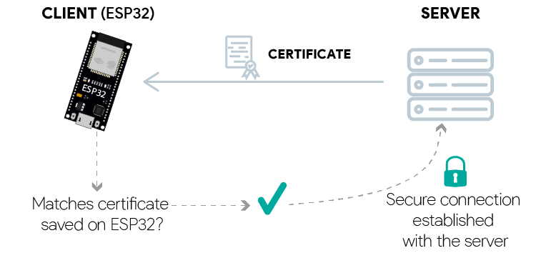

# Anatomy of Mushibot's Wifi, WebSocket, and Https

## 1. Objectives

One of the application scenarios of Mushibot is robot combat game, indoors or outdoors in the real world. 
Attract people to step out of their homes, head to the malls, or play outdoors.

Usually the human players are divided into two teams. Each human player remotely controls one or multiple robots. 
Each robot cooperates with the robots belonging to the same team, and fights against the other robots belongs to the other team. 

Let us focus on one robot, one human player scenario in this blog, and discuss the communication between the robot and the human player. 

The lifecycle of the communication between a Mushibot and a human player consists of the following steps, 

    1.1 A web server and a streaming server connect to the internet with public IP addresses. 

    1.2 A router running as an access point (AP) provides wifi network and connection to the internet.

    2.1 Assume a Mushibot knows the wifi network's ID and password, 
        it connects to the wifi in the station mode (STA mode), and gets its public IP address.

    2.2 The Mushibot starts up a WebSocket server, ready to communicate with WebSocket clients. 

    2.3 The Mushibot sends a http/s request to the web server, 
        provides its public IP address and registers itself as an available robot.

    3.1 A human player opens a Chrome browser in his computer, connects to the web server, 
        opens the web pages, and finds the available Mushibot.

    3.2 The human player's browser initializes a WebSocket connection with the Mushibot. 
        The human player's browser behaves as a WebSocket client.

    4.1 The Mushibot sends the video stream captured by its camera 
        continuously to the streaming server via RTMP protocol.

    4.2 The streaming server forwards the video stream to the human player's browser via WebRTC protocol. 

    4.3 The human player sends remote control commands continually from his browser to the Mushibot via WebSocket.

    4.4 The Mushibot sends its machine status, like its speed, its leg height, it steering yaw angle, etc, 
        periodically to the human player's browser via WebSocket.

    5.1 When the human player finishes the game, his browser disconnects the WebSocket connection to the Mushibot.

    5.2 When the Mushibot quits the game, it stops the connection to the streaming server,
        and then sends a http/s request to the web server, to deregister itself as a unavailable robot. 

For step 4.1 and 4.2, RTMP and WebRTC for video streaming, we have discussed this topic in our previous blog.
"[Video Streaming from Unitree Go2 to Web Browsers](https://github.com/housework-robot/main/blob/main/S05_communication/S05E02_go2_video_streaming.md)", 

Hence we skip the RTMP and WebRTC topic in this blog, and focus on Wifi, WebSocket and Http/s connections for Arduino-ESP32. 

&nbsp;
## 2. Wifi

We implemented a C++ class `WsWifi` in [`wswifi.h`](./S06E06_src/src/Mushibot20250107/src/wswifi.h) 
and [`wswifi.cpp`](./S06E06_src/src/Mushibot20250107/src/wswifi.cpp), 
following the example code in [the ESP32 official guide](https://docs.espressif.com/projects/arduino-esp32/en/latest/api/wifi.html#wi-fi-sta-example).

### 2.1 Construct a wifi station

The workflow to set up the connection to wifi is in [`WsWifi::setup_wswifi()`](./S06E06_src/src/Mushibot20250107/src/wswifi.cpp), 

~~~
void WsWifi::setup_wswifi() {
    ...
    // Set wifi mode to be WIFI_STA
    WiFi.mode(WIFI_STA);

    // Optionally, clear up the previous wifi. 
    WiFi.disconnect();
    delay(1000);

    // Hook the event handlers. 
    WiFi.onEvent(handle_wifiConnected, WiFiEvent_t::ARDUINO_EVENT_WIFI_STA_CONNECTED);
    WiFi.onEvent(handle_wifiGotIP, WiFiEvent_t::ARDUINO_EVENT_WIFI_STA_GOT_IP);
    WiFi.onEvent(handle_wifiDisconnected, WiFiEvent_t::ARDUINO_EVENT_WIFI_STA_DISCONNECTED);

    // Optionally, scan the available wifi's. 
    scan_wifi();

    // Connect to one wifi network, that we know ID and password beforehand.
    connect_wifi(sta_ssid, sta_password); 
    ...
}
~~~

Read the comment in the source code, that explains the purpose of each line of the source code. 

Notice that there are two wifi modes, one is the station mode (STA), the other is the access point (AP) mode. 
Here we use the station mode, that our ESP32 behaves as a client, connecting to an existing wifi network. 

The existing wifi network may be provided by a hard access point e.g. a router, 
or a soft access point e.g. a program running on a ESP32 chip. 

&nbsp;
### 2.2 Connect to wifi

~~~
void WsWifi::connect_wifi(String ssid, String password)
{
    int cnt = 0;
    WiFi.begin(ssid, password);
    delay(2000);

    // Wait for WiFi.begin(ssid, password) to come into effect.  
    while (WiFi.status()!=WL_CONNECTED) { 
        WiFi.begin(ssid, password);

        cnt += 1;
        if (cnt > 5) {
            break;
        }
        delay(2000);
    }

    if (cnt > 5) {
        Serial.printf("\n[WARN] connect_wifi(): The mushibot can NOT connected to '%s' wifi network.\n", 
            String(WiFi.SSID()));
    } 
    else {
        robot_ip = WiFi.localIP();
        Serial.printf("\n[INFO] connect_wifi(): The mushibot is connected to '%s' wifi network, with '%s' IP address.\n", 
            String(WiFi.SSID()), WiFi.localIP().toString());
    }
}
~~~

`WiFi.begin(ssid, password)` connects the station to the wifi network. 

But it doesn't guarantee that it always succeeds. If fail, try again. 

&nbsp;
### 2.3 Scan for available wifi APs

~~~
void WsWifi::scan_wifi() {
    Serial.printf("\n[INFO] Scan wifi start:\n");

    // WiFi.scanNetworks will return the number of networks found
    int num_wifi = WiFi.scanNetworks();
    delay(1000);

    if (num_wifi == 0) {
        Serial.printf("\t No wifi network is found.\n");
    } 
    else {  
        for (int i = 0; i < num_wifi; ++i) {
            Serial.printf("   [%d] Wifi-name: '%s', Signal-strength: %d, Authentication: ",
                i, String(WiFi.SSID(i)), abs(WiFi.RSSI(i))
            );
            Serial.println(
                (WiFi.encryptionType(i) == WIFI_AUTH_OPEN) ? " without password." : " with password."
            );
        }
    }
    Serial.println("");
}
~~~

Scanning for available wifi access points is optional. 

`WiFi.RSSI` is the wifi signal strength. The bigger RSSI the stronger wifi signal, no matter RSSI value is positive or negative.

&nbsp;
### 2.4 Wifi event handlers

The wifi event handlers are implemented in [`wswifi.cpp`](./S06E06_src/src/Mushibot20250107/src/wswifi.cpp), 

~~~
void handle_wifiConnected(WiFiEvent_t event, WiFiEventInfo_t info){
    Serial.printf("\n[EVENT] The mushibot is connected to wifi network '%s', waiting for getting IP address.\n", 
        String(WiFi.SSID()) );
}

void handle_wifiGotIP(WiFiEvent_t event, WiFiEventInfo_t info){
    Serial.printf("\n[EVENT] The mushibot is connected to '%s', with '%s' IP address.\n", 
        String(WiFi.SSID()), WiFi.localIP().toString());
}

void handle_wifiDisconnected(WiFiEvent_t event, WiFiEventInfo_t info){
    Serial.printf("\n[EVENT] The mushibot is disconnected from wifi network.\n" );
    // Serial.printf("\t Reason: %s \n", info.wifi_sta_disconnected.reason);
}
~~~

Notice that, 

1. The wifi event handlers can NOT be implemented as member functions of any custom class like `WsWifi`.

   Otherwise it violates the signature of [`WiFi.onEvent(WiFiEventFuncCb cbEvent, arduino_event_id_t event)`](https://github.com/espressif/arduino-esp32/blob/master/libraries/WiFi/src/WiFiGeneric.cpp#L895).

2. The handlers for wifi events, `ARDUINO_EVENT_WIFI_STA_CONNECTED`, `ARDUINO_EVENT_WIFI_STA_GOT_IP`, and `ARDUINO_EVENT_WIFI_STA_DISCONNECTED`
   only print out the related information.

   `WiFi.localIP()` provides the IP address of the ESP32 in the local network, it is NOT the public IP address.

   `info.wifi_sta_disconnected.reason` sometimes may throw core dump exception because `info` is a null pointer.

&nbsp;
## 3. Get public IP address

We implemented a function `get_public_IP_address()` in [`wswifi.h`](./S06E06_src/src/Mushibot20250107/src/wswifi.h) 
and [`wswifi.cpp`](./S06E06_src/src/Mushibot20250107/src/wswifi.cpp).

~~~
IPAddress WsWifi::get_public_IP_address() {
    HTTPClient http_client;
    String public_ip_str;
    const char* public_ip_chars;
    JsonDocument public_ip_json;
    IPAddress public_ip_address;
    int httpResponseCode;

    if (WiFi.status() == WL_CONNECTED) {
        http_client.begin(public_ip_api);
        httpResponseCode = http_client.GET();

        if (httpResponseCode > 0) {            
            deserializeJson(public_ip_json, http_client.getStream());

            serializeJson(public_ip_json, public_ip_str);
            Serial.printf("\n[DEBUG] The Mushibot's public IP address is: '%s' \n", public_ip_str.c_str());

            public_ip_chars = public_ip_json["ip"];
            // Serial.printf("public_ip_chars: '%s' \n", public_ip_chars);
            public_ip_address.fromString(public_ip_chars);
            // Serial.println(public_ip_address);
        }
        else {
            Serial.printf("\n[WARN] Cannot access '%s' to get public IP address, http code is: '%d'.\n", 
                public_ip_api, httpResponseCode);
        }

        http_client.end();
    }

    return public_ip_address;
}
~~~

Notice that, 

1. In `http_client.begin(public_ip_api)`,
  
   `public_ip_api` is a const char* defined in
   [`wswifi.h`](./S06E06_src/src/Mushibot20250107/src/wswifi.h),

   whose value is
   `const char *public_ip_api = "https://realip.cc/"`.

2. `https://realip.cc/` is the URL of a IP lookup service,
   referring to [ip-info-api](https://github.com/ihmily/ip-info-api?tab=readme-ov-file).

   Even though there are many IP lookup services in the list,
   some of them can not be accessed from a program,
   some of them are not reliable, sometimes works, sometimes not.

   Therefore, when `get_public_IP_address()` crashes,
   a quick solution is to change an IP address lookup service.

&nbsp;
## 4. Https client

"[ESP32 HTTPS Requests](https://randomnerdtutorials.com/esp32-https-requests/)"
is a good tutorial on how to implement a https client in ESP32 
to access a https website. 

### 4.1 Workflow

The following diagram illustrates the workflow that a https client in ESP32 
to send a request to a https website, and then receive a response from the website. 

   

     
   
  

    1.  We need to download the certificate manually beforehand, 
        from the https website, and store it in ESP32.
    
    2.  By calling `HTTPClient.begin(*store_cert, website_URL)`, 
        our programm tries to setup the connection from the esp32 to the https website.
       
      2.1  The arduino-esp32 `HTTPClient` library automatically downloads the certificate 
           from the website whose address is `website_URL`.
    
           The downloaded certificate consists many contents, 
           including a certificate which is used to prove its identity,
           and a public key to encrypt the messages between the https client in the esp32 and the https website. 
    
      2.2  The arduino-esp32 library automatically compares the downloaded certificate 
           with the trusted certificate that stored in our esp32 beforehand.
    
           If the two certificates are identical, 
           it means the `website_URL` is the true address of the https website, rather than a hijacked fake one.
    
    3.  Our program sends a secure request from the esp32 https client to the https website.
       
      3.1  The arduino-esp32 library automatically uses the public key of the https website in the downloaded certificate,
           to encrypt our request.
    
      3.2  When the https website receives our secure request, it uses its private key to decrypt the request.
    
    4.  The https website sends a response to the esp32 https client.
    
      4.1  The https website uses its private key to encrypt its response.
        
      4.2  When our https client receives the response the https website,
           the arduino-esp32 library automatically uses the public key of the https website in the downloaded certificate,
           to decrypt the response.

&nbsp;
### 4.2 Download the trusted certificate manually

&nbsp;
### 4.3 Https client

&nbsp;
## 5. WebSocket

We implemented a WebSocketServer in [`wswifi.h`](./S06E06_src/src/Mushibot20250107/src/wswifi.h) 
and [`wswifi.cpp`](./S06E06_src/src/Mushibot20250107/src/wswifi.cpp). 

### 5.1 Construct a WS server

1. First we initialized a WebSocketsServer instance in [`wswifi.h`](./S06E06_src/src/Mushibot20250107/src/wswifi.h), 
    with port `81`. 

    ~~~
    WebSocketsServer websocket = WebSocketsServer(81);
    ~~~

2. Then in the [`WsWifi::setup_wswifi()`](./S06E06_src/src/Mushibot20250107/src/wswifi.cpp#L33), 
    we started up the WebSocket server, by `websocket.begin()`. 

    Also, we hooked a handler to the WebSocket server to handle the WS events, by `websocket.onEvent(webSocketEventCallback)`.
    
    ~~~
    void WsWifi::setup_wswifi() {
        ...
        // Setup the websocket. 
        websocket.begin();
        websocket.onEvent(webSocketEventCallback);
    }
    ~~~

3. Finally, we executed [`websocket.loop()`](./S06E06_src/src/Mushibot20250107/src/wswifi.cpp#L55)
   
    ~~~
    void WsWifi::loop_wswifi() {
        ...
        websocket.loop();
    }
    ~~~

    in ESP32's main [`loop()`](./S06E06_src/src/Mushibot20250107/src/main.cpp#L78).
    
    ~~~
    void loop()
    {
        ...
        wswifi.loop_wswifi();
    }
    ~~~
   

&nbsp;
### 5.2 WS event handler

In [`wswifi.cpp`](./S06E06_src/src/Mushibot20250107/src/wswifi.cpp), 
`webSocketEventCallback` is disclaimed as an external function. 

`webSocketEventCallback()` is implemented in [`main.cpp`](./S06E06_src/src/Mushibot20250107/src/main.cpp#L47). 

~~~
void webSocketEventCallback(uint8_t num, WStype_t type, uint8_t *payload, size_t length)
{
    if (type == WStype_CONNECTED)
    {
        printf("[EVENT] %s connected to %s\n", wswifi.robot_ip, wswifi.sta_ssid);
    }
    if (type == WStype_TEXT)
    {
        JsonDocument status_json = mushibot.get_status();

        String status_string;
        serializeJson(doc, status_string);
        doc.clear();

        wswifi.websocket.broadcastTXT(status_str);
    }
}
~~~

`mushibot.get_status()` cannot be accessed in [`wswifi.cpp`](./S06E06_src/src/Mushibot20250107/src/wswifi.cpp).

Therefore, we implemented `webSocketEventCallback()` in [`main.cpp`](./S06E06_src/src/Mushibot20250107/src/main.cpp#L47).

&nbsp;
## 6. Future work

Secure Websockets

Referring to [the arduinoWebSocket github repo](https://github.com/Links2004/arduinoWebSockets/?tab=readme-ov-file#wss--ssl),  
>  `arduinoWebSockets wss/SSL` library supports:
>   * wss/SSL for ESP32 in client mode
>   * wss/SSL is not natively supported in WebSocketsServer,
>     however it is possible to achieve secure websockets by running the device behind an SSL proxy.

We will implement a secure websocket communication between the Mushibots and the web server.

